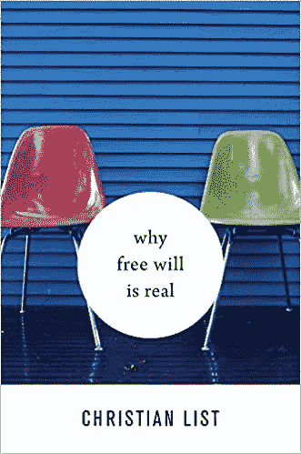

# 自由意志战争重燃

> 原文：<https://medium.com/swlh/the-free-will-wars-reignite-b77b1d3f6c61>

哲学家克里斯蒂安·李斯特写了一本新书，为自由意志的存在辩护。他设法破解了这个古老的谜语了吗？

与流行的自由意志否认者如[山姆·哈里斯](https://www.amazon.com/Free-Will-Deckle-Edge-Harris/dp/1451683405)和[杰里·科因](https://www.chronicle.com/article/Jerry-A-Coyne-You-Dont-Have/131165)、李斯特教授的书 [*为什么自由意志是真实的*](https://www.amazon.com/Free-Will-Real-Christian-List/dp/0674979583) *，*认为人类确实享有这种独特而深刻的能力。