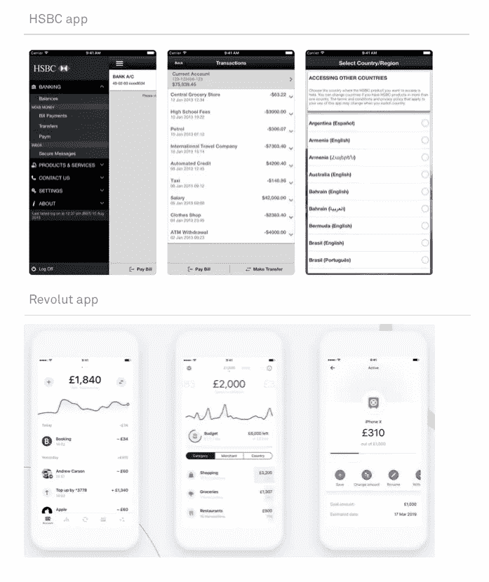
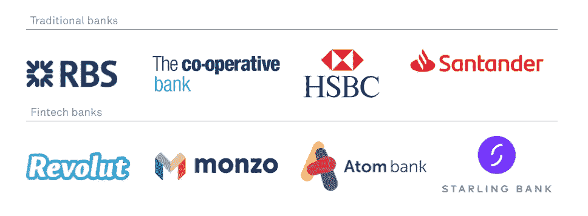
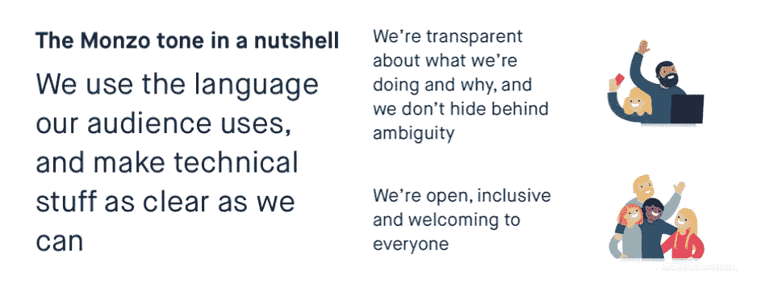
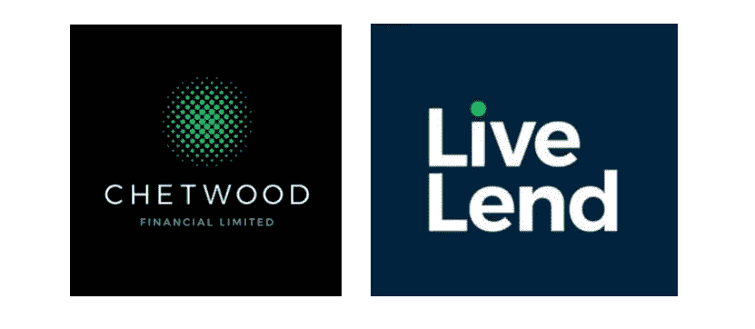

# Fintech 的友好面孔

> 原文：<https://medium.com/swlh/the-friendly-face-of-fintech-709fe2fdb9a9>

**以人为本的品牌如何让 fintech 占据优势。**

除了极少数人——金融时报的读者、投资银行家、我的父亲——之外，金融是一个枯燥的话题。

对我们大多数人来说，这是一场引发压力、充满行话的噩梦。它是电子表格，利率和百分比似乎是凭空产生的，然后应用于我们的生活储蓄，没有太多解释。

这就是 fintech 初创公司的开始。

带着这个问题。

他们将客户放在业务的中心，将目光投向金融领域之外的以用户为中心的品牌，比如亚马逊和苹果，寻求灵感。

通过这样做，他们将金融服务人性化，而不必露面。

它以最好的方式打造品牌，平衡解决问题与直观设计，从沟通到品牌标识的每个方面都捕捉到了他们是谁，以及他们是如何不同的。

让我们看看他们是如何管理它的……

# 解决问题

古老的格言“爱上问题”可能被过度使用，但有充分的理由。它不仅关注产品设计，还从一开始就确定了一个清晰的市场。

Fintech 初创公司做得非常好。他们意识到人们想要容易获得、容易理解的金融服务。Monzo、Starling、Revolut 和 Atom 等企业将这些问题视为机遇，并首先通过构建用户友好的数字产品来解决。

# 用户体验

下面是两个移动界面——一个用于汇丰，一个用于 fintech 初创公司 Revolut。

汇丰银行的界面被他们传统的银行品牌所停滞，看起来复杂、乏味且难以操作。

另一方面，Revolut 的应用程序色彩丰富，简单，有圆形按钮、图标和大量空白，更像苹果产品的布局，而不是银行产品。Revolut 作为一家“完全更好”的银行的品牌被带入了他们所有的身份中。它更智能、更清晰，更适合移动使用。

他们还意识到，拥有传统银行的人很难跟踪他们的日常支出。那么，Revolut 做了什么？他们每天都向客户提供存钱罐更新、快速转账和简单的储蓄技巧。他们把另一个问题变成了一个机会！

# BRANDMARK

企业的另一项重要资产是品牌。把它当成生意上的捷径。它象征着他们是谁，他们做什么，他们有什么不同，这也是客户逐渐认可的。

传统银行有相当标准化的标志。红色和蓝色用来显示权威和可信度，而单纯色和几何符号传达了一种秩序感。你经常会发现他们的名字很字面或者和他们的原籍国有联系，比如苏格兰皇家银行和桑坦德银行。

初创金融科技银行打破了这种模式。他们有令人兴奋的、丰富多彩的品牌标志，反映了他们包容、友好的品牌主张。例如，Monzo 将自己称为“所有人的银行”，因此他们的视觉识别更加柔和，颜色柔和，字体圆润，小写。Atom 遵循类似的公式，使用中性颜色和柔和的字体。

值得记住的是，83%的英国消费者对金融科技公司感到紧张。由于没有传统的实体分支机构，这些企业不得不寻找以数字化方式建立信任的方法。为了获得这种信任，金融科技银行不会像苏格兰皇家银行或汇丰银行那样强调自己的僵化或保守，而是强调自己的包容性，明白谁是他们的客户，他们需要什么。正是这种友好的设计帮助他们透过屏幕，让他们的客户放心。

# 通信

企业与客户交流的方式就像所有漂亮的设计一样，是他们身份的一部分。没有一家金融科技公司比 Monzo 做得更好。

他们说话开诚布公，用最简单的术语解释一切，让客户明白，他们使用缩写(我们是，他们是，不要)来模仿客户自己说话的方式。他们说话不像银行家和金融大腕，他们说话像真人。

蒙佐意识到，要建立信任，他们需要创造一种友好的语气。通过这样做，他们消除了对数字银行的恐惧。

我们采访了 Monzo 自己的首席文案哈利·阿什布里奇，他说…

> “当你真正坚持你所说的信念时，信任就来了。大多数银行在试图向你推销某些东西时写得很好，但在其他地方就不那么好了……我们试图从网站的首页到 Ts&Cs 的最后一行听起来都一样，所以人们希望看到我们真的相信透明和包容。你写作的方式是你行动价值的有形证据。如果你真的关心别人，你最起码应该做的就是让事情变得容易让他们理解。”

通过避免行话和废话，客户感觉对自己的财务有了更多的控制，并将其与传统银行区分开来。

# 友好的面孔

可能不是字面意思的脸。但金融科技有一张友好的脸。

凭借丰富多彩的界面、商标、图片和文字，他们创造了一些真正具有颠覆性的东西。

他们建立了品牌，给顾客安全感，就像一个人坐在店内的玻璃后面，数着你的假日现金。

它们更清晰、更聪明，解决了传统银行业的所有问题，现在这些银行正在迎头赶上。

但随着每一项金融业务都在排队，提供更多以人为本的服务，友好可能会失去其差异化优势。

因此，他们必须找到一个新的问题来解决，以及新的，创新的解决方案。这就是我们对金融科技市场的新玩家切特伍德所做的。

他们希望改善银行服务，并要求我们提供帮助。我们从第一天起就与他们合作，首先将他们的组织理念定义为一家银行，希望通过利用技术让人们过得更好来改变生活。

自从我们开始与 Chetwood 合作以来，他们已经推出了他们的第一款金融产品 LiveLend，并获得了金融服务领域最知名的投资者之一 Elliot 的 1.5 亿美元投资。最重要的是，它们是 2018 年唯一获得英国银行牌照的零售银行。

想了解更多？阅读我们完整的[案例研究](https://3lam1xokbuc2zhqug1uimcu1-wpengine.netdna-ssl.com/wp-content/themes/fkv/pdf/FKV-Chetwood-Case-Study.pdf)。

总的来说，这是一个令人兴奋的金融时代。令人兴奋的是，不仅仅是对《金融时报》的读者、投资银行家或我的父亲来说，对我这个用户来说也是如此。

他们越努力回答问题，我们的体验就越好。

— — — — — — — — — — — — — — — — — — — — — — — — — — — — — —

**作为一家品牌公司，我们很高兴在为期 12 周的** [**最小可行品牌项目**](https://www.futurekingsventures.co.uk) **中，与许多金融科技初创公司一起应对这一新挑战。**

**如果你想获得帮助，让你的创业品牌焕发生机，请联系我们。**

[https://www . real wire . com/releases/83-percent-of-UK-consumers-uncertainty-of-fin tech-据调查](https://www.realwire.com/releases/83-percent-of-UK-consumers-unsure-of-fintech-according-to-survey)，

## 这篇文章发表在 [The Startup](https://medium.com/swlh) 上，这是 Medium 最大的创业刊物，拥有+428，678 名读者。

## 在这里订阅接收[我们的头条新闻](https://growthsupply.com/the-startup-newsletter/)。

