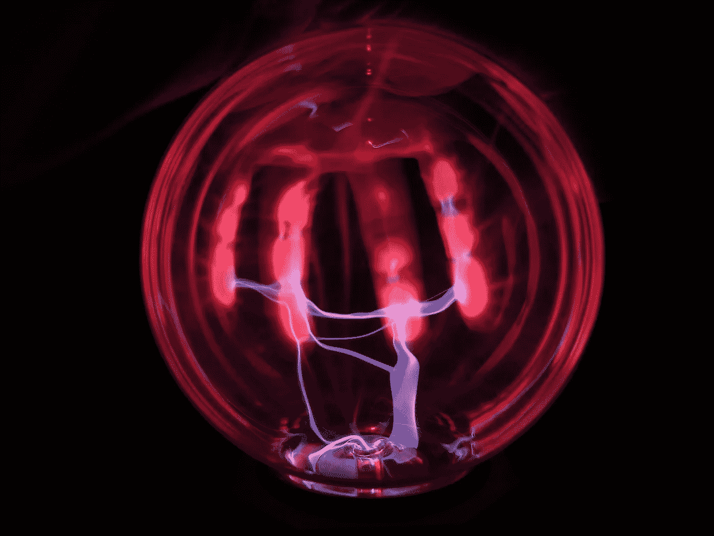
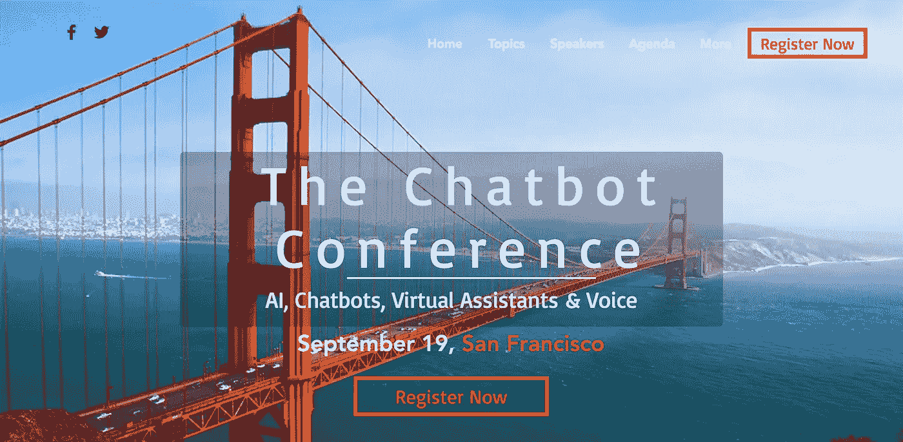

# 人工智能的未来:人类部分第 1 部分

> 原文：<https://medium.com/swlh/the-future-of-ai-the-human-component-part-1-38e8af2cd9dd>

专家、科学家和百万富翁都在大谈人工智能有多棒，以及它将如何在不久的将来成为我们生活中不可或缺的一部分，有一种设备可能会被一些人认为是对你隐私的侵犯。

解读自己内心声音的能力。可能吗？是的。但是当我*说*“内心的声音”，我的意思是它可以解读你*认知的*想法。
* *阅读下文关于靶向神经可塑性的更多信息*

Photo by [Bas Emmen](https://unsplash.com/photos/J5Vl1LNmkn8?utm_source=unsplash&utm_medium=referral&utm_content=creditCopyText) on [Unsplash](https://unsplash.com/search/photos/electric?utm_source=unsplash&utm_medium=referral&utm_content=creditCopyText)

**增强现实应用——沉浸其中**

麻省理工学院的增强现实智能手机应用程序，[**ubiquity 6**](https://www.technologyreview.com/s/610948/ubiquity6-lets-your-friends-visit-your-augmented-reality/)**，**允许访问者访问朋友的世界，同时将物理“真实”与“不真实”分层参观者看到的是[线性视野](https://gopro.com/help/articles/Question_Answer/What-is-Linear-Field-Of-View-FOV)。

美国宇航局于 2018 年 5 月 5 日星期六分享了首次西海岸太空发射(从范登堡空军基地)。通过 [**纽约时报**](https://www.nytimes.com/interactive/2018/05/01/science/mars-nasa-insight-ar-3d-ul.html) 应用程序观看了 [**洞察号**](https://www.space.com/40067-mars-insight-lander.html) **着陆器**飞船发射(计划于 11 月 26 日在火星第二大火山区*极乐世界*着陆)。它将探索这颗红色星球并记录地震。

脸书在 2017 年 12 月为开发者推出了他们的[相机特效 AR 平台](https://www.facebook.com/fbcameraeffects/home/)。已经为漫威的“ [**《复仇者联盟-无限战争》**](https://mobile-ar.reality.news/news/marvels-avengers-infinity-war-gets-full-range-new-ar-treats-facebook-0184529/https://mobile-ar.reality.news/news/marvels-avengers-infinity-war-gets-full-range-new-ar-treats-facebook-0184529/) **”推出了特效(仅适用于 iOS 和 Android)**它显示了一系列具有这些增强现实效果的头像。

[Magic Leap 魔法版](https://magic-leap.reality.news/news/price-pre-order-ship-date-for-magic-leap-one-creator-edition-0181766/)已经暗示将于今年发布，然而如果你是开发者，你可以下载 [**创作者门户 SDK**](https://www.magicleap.com/) 。它运行在一个 NVIDIA Tegra 处理器上。最近，它受到了一些批评

[**麻省理工学院媒体/流体界面实验室**](https://www.media.mit.edu/) 一直致力于一个非侵入式、[智能增强](https://m.slashdot.org/story/339357)设备、*[**AlterEgo**](https://www.media.mit.edu/projects/alterego/overview/)的项目。它基本上有四个电极，从外周躯体系统读取你的神经肌肉信号。它通过自然语言进行处理。它适合你的脸，类似于纹身(*我不确定它如何与皮肤上的化妆品配合使用*)。*

# *最受欢迎的 3 篇人工智能文章:*

> *[1。从感知器到深度神经网络](https://becominghuman.ai/from-perceptron-to-deep-neural-nets-504b8ff616e)*
> 
> *[2。求解微分方程的神经网络](https://becominghuman.ai/neural-networks-for-solving-differential-equations-fa230ac5e04c)*
> 
> *[3。把你的树莓皮变成自制的谷歌主页](https://becominghuman.ai/turn-your-raspberry-pi-into-homemade-google-home-9e29ad220075)*

*在阅读了 **AlterEgo** 的[FAQ](https://www.media.mit.edu/projects/alterego/frequently-asked-questions/)之后，相当多的道德和伦理问题开始出现。其中之一是这项技术是否会落入坏人之手。肯定有足够多的不道德的人会把它作为一种精神控制人类行为和本能的手段。这篇文章包括“有意”提到 **AlterEgo** 是非侵入性的，然而语音搜索和人工智能将继续扩展。有*可能在不久的将来成为一种[侵入性](http://fluid.media.mit.edu/sites/default/files/p43-kapur.pdf)植入大脑的语言运动皮层。**

> **早在 2003 年，加州大学的一组科学家，包括张智威在内，给癫痫患者植入了电极，因为他们想更多地了解癫痫发作及其影响。大脑的最大部分，即大脑，包含额叶、顶叶、枕叶和颞叶。由于神经可塑性，那些患有[创伤性脑损伤](https://www.neuroskills.com/brain-injury/brain-function.php)的患者取得了一些成功。* [有针对性的神经可塑性训练计划](https://www.darpa.mil/program/targeted-neuroplasticity-training)侧重于使外周神经突触的外周神经放电的认知技能。**

**麻省理工学院的一个项目， **Dormio** ( *意大利语*睡眠)，由一组科学家开发的[开源](https://github.com/tomasero/openSleep)软件和硬件电路主板组成([亚当·哈尔·霍洛维茨](https://motherboard.vice.com/en_us/article/ywxjvg/steel-ball-control-dreams-dormio-mit-hypnagogia)、伊桑·格罗弗、佩德罗·雷诺兹-库埃拉尔、奥斯卡·罗塞罗、托马斯·维加和阿比·杰恩霍)，通过一个带有两个独立的有线中指带的有线腕带记录“清醒”(*清醒做梦*)、**催眠状态**这种手套是一种进入创造过程的手段，允许探索头脑的意识。这款手套是一款基于 [*Arduino*](https://learn.sparkfun.com/tutorials/what-is-an-arduino) 的力传感器，用于监控/测量肌肉控制和检测生物信号(肌肉张力丧失、心率和皮肤电导变化)。 [**HRI**](http://r.search.yahoo.com/_ylt=AwrJ3V9btetaIn0AU2EPxQt.;_ylu=X3oDMTBybGY3bmpvBGNvbG8DYmYxBHBvcwMyBHZ0aWQDBHNlYwNzcg--/RV=2/RE=1525425627/RO=10/RU=https%3a%2f%2fwww.nrl.navy.mil%2fitd%2faic%2fcontent%2fcognitive-robotics-and-human-robot-interaction/RK=2/RS=e1TZNZSe_mqZl6ObNAkVhG25FuM-) (人机交互)早在 2011 年就已经被用来实现人类与机器人的行为交互。使用方法[提醒和记录](http://recording any audio of sleep-talking as well as muscular and EEG data.)的过程使用 [**Jibo**](https://www.jibo.com/) **，**由先锋科学家[Cynthia Breazeal](https://www.ted.com/talks/cynthia_breazeal_the_rise_of_personal_robots)博士开发的社交智能机器人提供了记录数据的方法，然而，这已被一个应用程序取代。**

**由人工智能开发人员拉吉夫·杜特(Rajeev Dutt)领导的华盛顿州贝尔维尤市(Bellevue)初创公司 DimensionalMechanics 证明是引领这项竞争技术的强大力量。该公司最近获得了更多资金用于他们的*新脉冲框架*，其中包括他们自己的自然语言处理和一个[人工智能工作室](https://www.bizjournals.com/seattle/prnewswire/press_releases/Washington/2018/04/09/SF59556)，被称为“甲骨文”借助其针对深度学习神经网络(包括媒体、音频、文本等)的改进超参数优化，开发人员现在可以在正常情况下花费的一小部分时间内建立模型。图灵是完全的:一些人认为图灵的理论一直是量子理论的标准。**

**一个恰当的例子如下:**

*   **[D .多伊奇。量子理论，丘奇-图灵原理和通用量子计算机。*伦敦皇家学会会议录* A，400:97–117，1985 年](http://rspa.royalsocietypublishing.org/content/400/1818/97.short)**

**备用 5，更名为[**Mighty AI**](https://mty.ai/)**，**由埃森哲风险投资(Accenture Ventures)、Foundry Group、Google Ventures、英特尔投资(Intel Capital)、Madrona Venture Group 共同出资。它以 Mighty Studio(自动驾驶汽车)、Mighty 工具和其他集成为特色。**

**微软加速器现更名为“ScaleUp”，由 12 家初创公司组成，具体如下:**

> **AppICE、Appiyo Technologies 的 Twixor、Avanseus Technologies、电子政府基金会、Gaia 智慧城市解决方案、GrowthEnabler、Karo Sambhav、Kogence、MachineSense、SmartVizX、Sprinkle Data 和 Xurmo Technologies。**

**[人工智能、虚拟现实、物联网、](https://www.criteo.com/insights/ai-vs-ml/)等。是过去几年中出现的主要技术，埃森哲风险投资公司已联手资助 B2B 初创企业，更重要的是，大数据分析通过首个面向移动的微洞察平台为提供商的大数据问题提供解决方案。**

**Raincor 依赖于 [Simba](https://www.simba.com/case-studies/rainstor/) ，Simba 为第三方供应商提供 Simba 的数据连接解决方案。**

**另一个例子: [Clickfox](https://www.clickfox.com/) 为他们的旅程引擎 fox 收集任何可用的数据，以将接收这些数据的受众置于上下文中。 [Splunk](https://www.splunk.com/) 具有深度学习、异常检测、自适应阈值和预测分析功能。**

**一款名为 [**灯塔**](https://www.light.house/) 的人工智能相机，具有 3D 传感功能，可以检测你的面部、宠物以及夜视，并不是一夜成名。这项技术也用在了第一辆自动驾驶汽车斯坦利[上，这要归功于 DARPA 设计的](https://cs.stanford.edu/group/roadrunner/stanley.html)[斯坦福车队大挑战赛](https://cs.stanford.edu/group/roadrunner/stanley.html)。斯坦利于 2006 年退休，来到 DC 华盛顿州的史密森尼国家美国历史博物馆。感谢 [**安迪鲁宾的游乐场孵化器**](http://playground.global/team/crew/andy-rubin) **。****

**由于缺乏对认识论的理解，人类知识纲要不是一种意识形态或伦理全景。我们需要鼓舞士气吗？我们寻求的答案是凝视。**

**英特尔有一个名为 [OpenVINO](http://https:www.software.intel.com/en-us/blogs/2018/05/16/openvino-toolkit-accelerates-cv-development-across-intel-platforms) (开放视觉推理&神经网络优化)的开发者工具包，允许开发者在机器学习模型中编码。深度学习反过来提取数据片段。**

**根据一些报道:**

*   **到 2025 年，物联网预计深度学习的财务增长将达到 350 亿美元。**
*   **高通已经与谷歌联手开发一款 AR 耳机。它是一个 Android P 版本。**
*   **NVIDIA 的 [SmartThings](http://https:www.smartthings.com/products/samsung-smartthings-link-for-nvidia-shield-tv) 链接，连接到“智能”设备，即谷歌助手或 Alexa。(它需要一台 NVIDIA SHIELD TV，一个带有可用 USB 端口的互联网连接，以及适用于 Android (4.0 &以上)或 iPhone (iOS 9.0)的免费 SmartThings 应用程序。**

**人工智能偏见依然存在。微软的[命运](http://https:www.microsoft.com/en-us/research/group/fate)(公平、问责、透明、道德)由此诞生。这是源于对可能做出错误决定的恐惧。我们很有限。**

**艾萨克·阿西莫夫列出了“机器人三定律”，但今天的社会已经改变了我们如何消费、如何满足我们的需求以及在某些情况下我们变得有多懒的路线图。**

**我们强加恐惧，甚至没有意识到，导致这种偏执狂横行。**

**有些担心是有道理的，但我们不能基于性别、种族主义等进行限制。**

> **-第二部分待续**

****

## **这篇文章发表在[《创业](https://medium.com/swlh)》上，这是 Medium 最大的创业刊物，拥有+405，714 人关注。**

## **订阅接收[我们的头条新闻](http://growthsupply.com/the-startup-newsletter/)。**

****