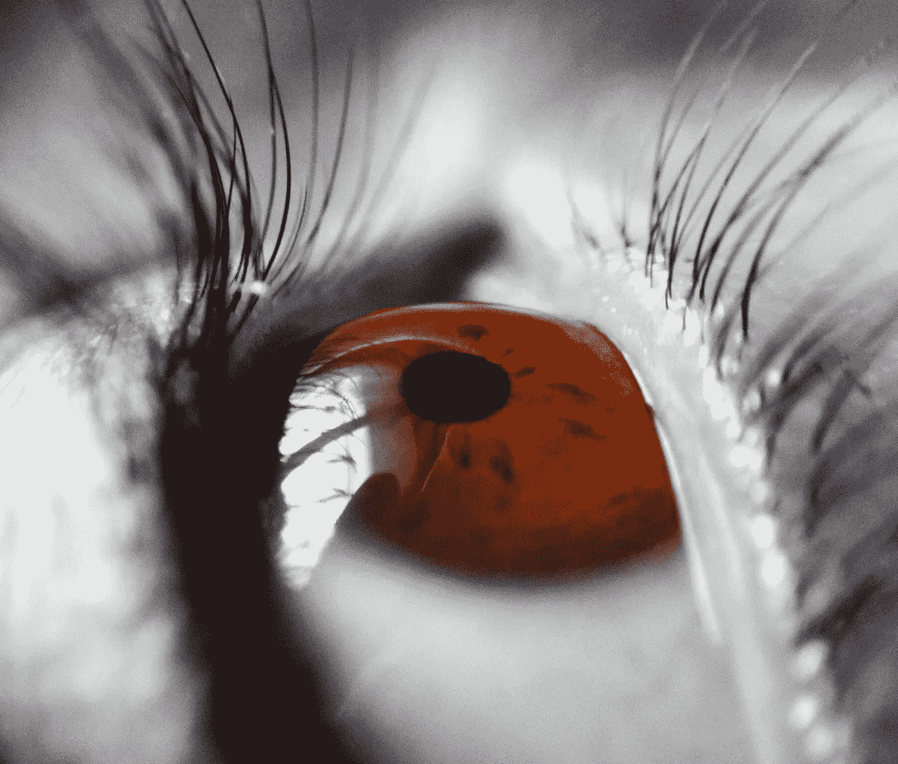

# 人工智能的未来:人类部分第 2 部分

> 原文：<https://medium.com/swlh/the-future-of-ai-the-human-component-part-2-52a70a998f26>

# 内部/外部世界

增强现实正在冲击几乎每个行业。它的效果显示了增长潜力和营销创新、财务收益的巨大演变，以及我们如何在家里、在路上和我们的工作环境中整合该技术的整体平衡。

[**亚马逊 Lab126**](https://gopro.com/help/articles/Question_Answer/What-is-Linear-Field-Of-View-FOV) 正在研发一款名为 [**灶神星**](https://www.geekwire.com/2018/amazon-reportedly-working-home-robots-top-secret-vesta-project/) 的家用机器人。监管这个项目的是负责研发的 Greg Zehr。这个项目不同于亚马逊仓库中使用的机器人，但是预计到 2023 年，消费机器人市场将价值 150 亿美元。

*镜头*、[、**谷歌的**、](https://www.theverge.com/2018/5/8/17320672/google-lens-update-new-camera-features-pixel-2-google-io-2018)视觉搜索工具，与你的手机配合使用可以识别任何图像。

AR 视频游戏的未来预计到 2025 年将达到 116 亿美元。

*   [Lumus](https://lumusvision.com/) 是使用反射波导技术的 AR 护目镜的制造商。
*   爱普生设计了 [**MOVERIO**](https://epson.com/moverio-augmented-reality) AR 眼镜，提供 55 度角的微型投影。使用这项技术。Moverio 在整体 AR 沉浸式体验方面处于领先地位。
*   你甚至可以通过与爱普生合作的 [**罗切斯特光学**](https://rochesteroptical.com/epson/) 订购处方镜片。

# 热门人工智能文章:

[1。我如何使用机器学习作为物理绘画的灵感](https://becominghuman.ai/digital-processes-inspiring-analog-paintings-a358eb7801a0)

[2。MS 还是创业工作——走哪条路才能在深度学习领域建立职业生涯？](https://becominghuman.ai/ms-or-startup-job-which-way-to-go-to-build-a-career-in-deep-learning-2d62a5b10f9e)

[3。人工智能相关媒体文章前 100 名](https://becominghuman.ai/top-100-medium-com-c2695ab3270c)

[**RoboFly**](https://www.washington.edu/news/2018/05/15/robofly/) 是一种机器人飞行无人机，拥有薄纱般的翅膀，由激光束提供动力。由华盛顿大学自主昆虫机器人实验室创造的这个微型 190 毫克昆虫无人机(使用压电效应)并不是唯一的一个。

哈佛的 [**Wyss 研究所**](http://robotics.sciencemag.org/content/2/11/eaao5619) 一直在研究 [**RoboBees**](https://wyss.harvard.edu/technology/autonomous-flying-microrobots-robobees/) ，自主空中-水上飞行微型机器人。除了飞行之外，它们还能在水中潜水、游泳和在水中推进。

**微型飞行器实验室**(MAV lab)**荷兰代尔夫特理工大学与**瓦格宁根大学&研究所**合作，正在测试一种飞行机器人 [**DelFly Nimble**](https://www.tudelft.nl/en/2018/tu-delft/novel-flying-robot-mimics-rapid-insect-flight/) ，它像蜂鸟一样盘旋。它每秒扇动翅膀 17 次。该机器人最高时速为 25 公里。**

**瓦赫宁根的收割机器人，[**扫地机**](http://www.sweeper-robot.eu/11-news/48-sweeper-demonstrated-its-harvesting-robot-for-the-first-time) **，**能在 24 秒内收割成熟的果实，成功率 62%。这个园艺机器人可能是未来收获农作物的答案。**

****MEMS** (微机电传感器)是依靠[压电效应](https://www.newswise.com/doescience/?article_id=583451&returnurl=aHR0cHM6Ly93d3cubmV3c3dpc2UuY29tL2FydGljbGVzL2xpc3Q=)(电能转化为机械能)并具有集成电路板(硅片)的装置。为了保持有趣，想象一下[陀螺仪](https://learn.sparkfun.com/tutorials/gyroscope/all)是如何旋转的。**

**2001 年，作者 Brett Warneke 博士在 [IEEE](https://ieeexplore.ieee.org/document/906552/authors#authors) 的*技术文摘*上发表了他关于自主双向通信尘粒传感器的发现。Warneke 博士和 Kristofer Pister 教授(加州大学伯克利分校，电气工程和计算机科学)参与了 [**智能灰尘项目**](http://Cubic-Millimeter Computer) **。它的独特潜力在于它可以通过光、加速度、位置、应力、压力、湿度、声音和振动来检测和测量许多东西。最隐蔽的用途是监视，但传感器可以探测生化战、辐射等。在未来的某个时候，这可能会派上用场。****

**军方已经在测试算法来帮助电子战军官(空军空中导航员)。人工智能和机器学习原型正在被插入[电子战系统](https://www.army.mil/article/215226/army_integrates_artificial_intelligence_and_machine_learning_for_electronic_warfare)中，为陆军的[战术电子战系统](https://www.c4isrnet.com/electronic-warfare/2018/12/20/new-army-ai-is-cutting-through-data-choked-battlefields/)收集数据。**

# **医学突破**

> **纳米技术是医学中最迷人和最惊人的技术突破的一部分。**

****智能灰尘** — [MEMS](https://link.springer.com/chapter/10.1007/978-0-387-76540-2_20) (微机电传感器)和光学激光发射二极管可以插入注射器。[纳米机器人](https://www.sciencedaily.com/releases/2016/08/160815134945.htm)(想想 XMen 中的“万磁王”)已经被用于靶向癌细胞，然后在血液中给药。“神经尘埃”被植入大脑，就像一个光学背负装置，以了解更多关于大脑如何工作的信息。**

**强生&强生通过传授给谷歌*助手*、亚马逊 *Alexa* 等的技能，给过敏症患者提供花粉计数的最新消息。约翰逊还利用这个营销机会将过敏药物、Zyrtec 的 AllergyCast 应用程序和预测工具纳入其中。**

**[**纳米机器人**](https://www.nbcnews.com/mach/science/these-tiny-robots-could-be-disease-fighting-machines-inside-body-ncna861451) 正被用于可能对抗癌症。它们不仅可以用来输送药物，真正独特的重要性是能够检测和治疗如此多的疾病。**

****(发育中的视网膜细胞)迷你大脑缺乏氧气供应，但使用它们的诀窍是将婴儿大脑球嵌入营养凝胶中。这种“血管化”被吹捧为生物工程的突破。****

****多伦多大学将皮肤移植技术提升到了一个新的水平，该技术使用病人自己的干细胞，然后通过手持 3D 皮肤打印机[复制而来](https://www.google.com/amp/s/www.engadget.com/amp/2018/05/07/handheld-skin-printer-could-help-heal-burn-victims/)。这对烧伤患者来说是一个巨大的突破。****

****[**电子皮肤或者 e-skin**](https://steemit.com/steemstem/@samminator/unleashing-the-electronic-skin-that-can-control-objects-virtually) ，从 2005 年就有了。它可以测量温度、触摸灵敏度、压力等。同时它显示人的心跳(EKG 心电图)。乔雄·萨默亚教授已经将它与虚拟现实技术结合在一起。****

****AI 和皮肤癌筛查- [**黑兹尔医生**](http://www.doctorhazel.com) 项目是能够使用图像识别作为区分良性病变和皮肤癌的手段。彼得·马(Peter Ma)和迈克·博罗兹丁(Mike Borozdin)都是英特尔的员工，他们使用大功率内窥镜摄像头(来自亚马逊)和英特尔至强处理器以及 [Movidius 神经学习计算棒](https://developer.movidius.com)创建了这个原型。****

****亚马逊的 [**Rekognition**](https://www.nytimes.com/2018/05/22/technology/amazon-facial-recognition.html) 是一项主要用于面部识别的技术。它被推销给执法机构来寻找罪犯。[残差深度学习神经网络](https://blog.init.ai/residual-neural-networks-are-an-exciting-area-of-deep-learning-research-acf14f4912e9) (ResNets)是微软研究院资助的研究项目，旨在了解[视觉图像识别](https://blog.waya.ai/deep-residual-learning-9610bb62c355)。然而，亚马逊正处于美国公民自由联盟的水深火热之中。美国公民自由联盟声称，他们通过提供执法机构的摄像机已经成为一项监视业务，这些摄像机可以用来监视移民、种族骚乱等。****

****[**SFootBD**](http://www.manchester.ac.uk/discover/news/ai-footstep-recognition-system-could-be-used-for-airport-security/) 使用与亚马逊相同的识别技术，除了行为生物识别信号依赖于你确切的[*步态*](https://newatlas.com/gait-recognition-system/54782/)/你走路的方式。****

****我再次认为这侵犯了我们的隐私权。****

****然而，还有一个更重要的问题:我们对技术上瘾。就人类的条件而言，我们*能训练* AI 分辨善恶吗？根据最近 **Quartz** 一篇题为“ [*我们可以训练人工智能识别善恶，然后用它来教我们道德*](https://qz.com/1244055/we-can-train-ai-to-identify-good-and-evil-and-then-use-it-to-teach-us-morality/)”Ambarish Mitra 说，道德是关于人类条件对我们遭受的任何困境的反应。****

******永旺的**文章标题为，*“[机器人认知需要既能思考又能感觉的机器，](https://aeon.co/ideas/robot-cognition-requires-machines-that-both-think-and-feel)”描述了我们如何需要情感来区分个人的意义或价值。****

******Luiz Pessoa，作者，马里兰神经影像中心主任，认知和情绪实验室首席研究员，马里兰大学心理学教授。*****

# ****增强现实的感官/沉浸式体验****

****接下来我们有" [**智能墙**](http://www.cs.cmu.edu/) "卡耐基梅隆大学和迪士尼研究所共同创造了“**Wall ++ T21”，一种电容感应和电磁(EM)感应触摸屏/触摸板。******

******谷歌的**[**tacotron 2**](https://www.leyton.com/blog/?p=2440-revolutionary-breakthrough-synthesised-yet-human-like-voice)**是新的人性化女声。******

****[**感官现实**](https://www.digitalbodies.net/) 在一个电话亭环境中又名感官吊舱，由总部位于阿姆斯特丹的初创公司 [**Sensiks**](http://www.sensiks.com/) 开发，带有一个名为[“树”的虚拟现实应用程序。它提供了一种沉浸在*亚马逊雨林的方式。*](https://www.treeofficial.com/)****

****解决精神健康问题，如毒瘾、多动症、抑郁症、精神病、自闭症以及减少对止痛药的依赖等。只是 AR/VR 耳机的一些用途。斯坦福大学教育主任、副教授、医学博士 Alan K. Louie 认为，这将变得负担得起，并将为正在经历情绪困扰的患者提供一种平静自己的方式。****

****我们已经进入了你无法想象的领域。对于那些不知道水凝胶是什么的人来说:它在水中会膨胀。中国东南大学的一位名叫范范的学生和他的同事们研发出了一款“ [***【蝴蝶】***](https://www.the-scientist.com/?articles.view/articleNo/52225/title/Image-of-the-Day--Colorful-Butterfly-Bot/) ”会扇动翅膀并变色的机器人。标有 [**纳米晶体**](https://www.researchgate.net/publication/47381757_Application_of_rod-shaped_cellulose_nanocrystals_in_polyacrylamide_hydrogels) 的水凝胶允许研究人员测量心脏细胞对某种降低心率的药物的反应。****

****有一种生物“自我修复”弹性体(聚合物型)液态金属材料，它可以作为密封剂，在机器人可能出现损坏的地方重新布线。[卡内基梅隆大学](https://www.extremetech.com/extreme/269670-new-material-heals-like-biological-tissue-to-maintain-electrical-conductivity)eir 软材料实验室，已经开发出[水滴](https://newatlas.com/bio-inspired-self-healing-elastomer-gallium-alloy/54711/)(类似于*终结者*电影)镓合金。****

****[剩余深度学习神经网络](https://blog.waya.ai/deep-residual-learning-9610bb62c355)是由**微软研究院**资助的研究项目。****

****[**NeuralEye**](http://www.neuraleye.com/technology/)**将引领面部识别。******

************

******courtesy [Cesar Balbuena](http://twenty20.com/cesarb) via ReShot******

******我再次认为这侵犯了我们的隐私权。然而，还有一个更重要的问题:我们沉迷于技术。******

******请继续关注第 3 部分！******

************

## ******这篇文章发表在 [The Startup](https://medium.com/swlh) 上，这是 Medium 最大的创业刊物，拥有+406，714 名读者。******

## ******订阅接收[我们的头条](http://growthsupply.com/the-startup-newsletter/)。******

************