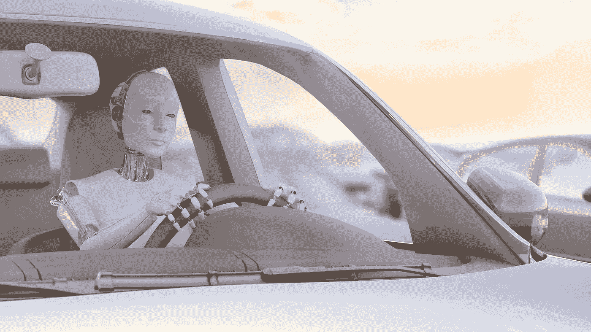

# 人工智能自动驾驶的未来

> 原文：<https://medium.com/swlh/the-future-of-autonomous-driving-with-artificial-intelligence-4aa2a85e8072>

在英伟达于 2017 年 10 月宣布推出世界上第一台支持完全自动驾驶汽车的人工智能计算机后，汽车行业对数字颠覆的时机已经成熟。这一天标志着人工智能(AI)的扩散，并在去年给汽车行业带来了地震般的变化。