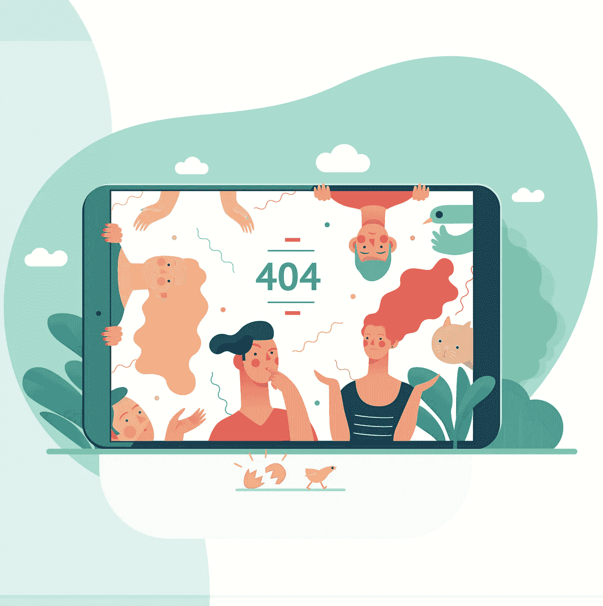

# 是时候让数码产品开始赋予我们力量了

> 原文：<https://medium.com/s/user-friendly/the-future-of-digital-product-design-is-about-human-empowerment-6a025bc330a>

## 我们接受了以失去权力为交换的效用。这不是公平交易。

Credit: grivina/iStock/Getty Images Plus

我们设计的数字世界正在耗尽我们的精力。我们使用的产品和服务就像需要帮助的朋友:不顾一切，要求苛刻。然而我们不能放弃。我们是相互依赖的关系。我们的产品似乎永远不够用，而且…