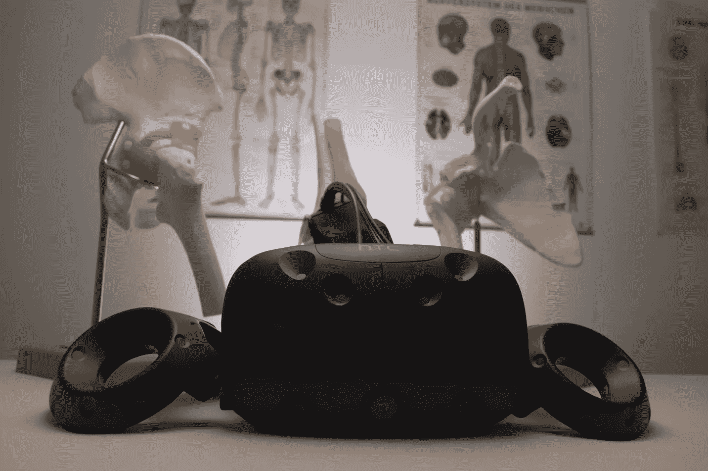

# 虚拟现实的未来在医学领域

> 原文：<https://medium.com/swlh/the-future-of-virtual-reality-is-in-medicine-94523d47b8b1>

## 互动娱乐转变为医疗创新。

在过去的十年里，虚拟现实越来越受欢迎。这在很大程度上要归功于软件和硬件的进步。随着这些产品的不断开发，用户体验变得更加逼真，并具有更强的交互响应能力。