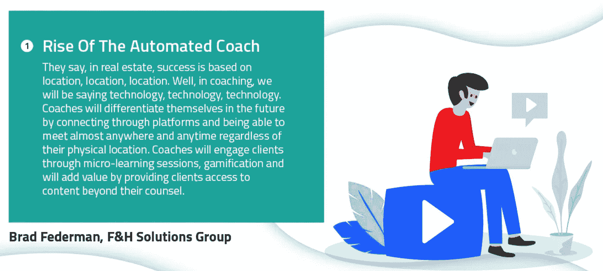
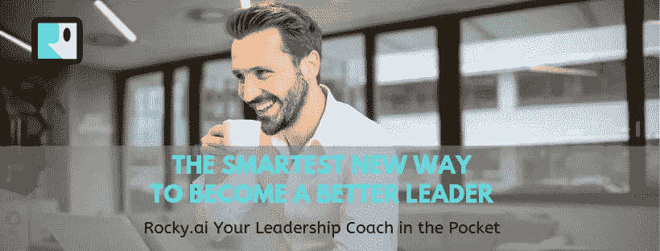

# 人工智能和自动化数字教练助理的未来

> 原文：<https://medium.com/swlh/the-future-with-ai-and-automated-digital-coaching-assistants-e0ccf7072c54>

AI Coach in the pocket — Fulfill your commitment

**一系列关于 15 种趋势的文章，这些趋势将重新定义领导力培训的未来。**

***趋势一:自动化教练的崛起***

远程教练和你面对面遇到的教练一样有用和强大。然而，这并不总是方便的，而且由于缺乏地理限制，教练们花更多的时间通过网络和视频电话与他们的客户见面。它永远不会降低或减少教练的有效性。

福布斯教练委员会[成员](https://www.forbes.com/sites/forbescoachescouncil/)[布拉德·费德曼](https://twitter.com/bfederman)表示，教练将通过微型学习课程、游戏化来吸引客户，并通过向客户提供咨询之外的内容来增加价值。

**人工智能教练**

人工智能或 AI 是镇上的新 her，现在它也可以用作在线教练。它可以像一个传统的教练一样工作，可以帮助你清楚自己想要什么，设定清晰、有说服力的目标，制定实现目标的行动计划，支持你采取行动，并让你负起责任。

随着智能手机的普及，移动应用程序成为解决一切问题的工具，你将能够找到一款适用于一切的移动应用程序。支持生产力和自我提高的服务也变得越来越受欢迎。Alexa 和 Siri 等基于语音的工具也在激励开发者将人工智能用于移动应用。这些虚拟教练应用程序也使用人工智能来使这些应用程序更加逼真。人工智能将把你的设备变成一个栩栩如生的教练，他将与你互动，并作为一种个人和虚拟的心理治疗师。

**激励和鼓舞人心的应用**

随着大规模的全球化和工业化，人们变得更加孤独。所以自强行业增长很快，但是没有实际数据。这无疑是蓬勃发展的，因为传统的心理健康咨询师预计到 2020 年将增加 36%。
对心理治疗的需求&自我发展辅导正在增长，数字化服务正在市场上出现。例如，有一个名为“Mindbloom”的移动应用程序，社交用户可以相互激励，以改善他们的行为。这种社交游戏平台还使用户能够互相帮助，以达到他们的生活目标，通常在生活中更成功。使用 Mindbloom，你可以发送鼓舞人心的信息，跟踪和比较进展，也可以祝贺他人的成就。这些成就可以是一份新工作或一段新关系。Mindbloom 的创始人克里斯·休伊特认为，社会支持可以改善一个人的生活，这也是最有效的方式。社交游戏 Mindbloom 旨在让社交变得更有趣。因此，我们可以将 Mindbloom 视为一种生活指导服务。

**与人工智能一起发展社交技能**

由于社交媒体的发展趋势，研究人员也被鼓励为智能手机开发治疗程序。这些移动应用程序帮助用户应对焦虑和抑郁。应用程序现在被设计成帮助用户建立他们的生活方式。Sosh 就是这种应用的一个例子，它旨在帮助儿童和成人发展他们的社交技能。这个应用程序是专门为患有阿斯伯格综合症的人设计的。这个应用程序上的练习可以帮助用户管理行为模式，了解他们的感受，并轻松地与他人联系。

**艾营养辅导**

根据研究，很明显虚拟教练对用户非常有用。互联健康中心最近研究了超重的人。那些使用虚拟教练参与项目的人比那些没有任何虚拟帮助的人减肥效果显著。虚拟帮助帮助他们在一段时间内保持锻炼状态。那些使用虚拟教练的人遵循了指导方针，当他们错过网上预约时也会感到内疚。该研究的合著者、东北大学计算机和信息科学学院的副教授 Timothy Bickmore 表示，虚拟教练在健康和福祉方面发挥了重要作用。他还认为，随着婴儿潮一代的不断老龄化和专业人员的短缺，虚拟教练可以成为激励人们保持健康的解决方案。虚拟教练系统仍处于早期阶段，谷歌已经展示了人工智能的进步程度。他们向人工智能展示了与人互动的生活和使用普通人的话。因此，我们不久就会看到人工智能超越一般的语音命令。人工智能还可以被开发来感知用户的情绪&它将帮助应用程序检测用户的情绪，并根据他们的情绪与他们互动。不远的将来，有一天我们的智能设备会通过帮助和交互来获得更好的生活。它将帮助我们度过生活中的起起落落，让我们准备好面对对我们来说至关重要的东西，我们的激情、梦想和目标。

**艾的心理治疗辅导**

研究表明，即使简单的人工智能也可以有效地充当心理治疗教练。早在 1960 年，麻省理工学院的一个名叫伊莱扎的聊天机器人就进行了这样一项研究。伊莱扎有一个简单的界面，只根据特定的关键字或短语通过一些预先确定的输出进行交互。尽管如此，它还是取得了成功，用户在情感上融入了计算机程序。有些人甚至认为电脑程序是真正的治疗师，曾经和聊天机器人呆上几个小时。如果一个人工智能可以达到那种质量，理解用户，并可以互动，它将在不同的应用中有用。

**领导辅导艾**

对于 21 世纪的领导者来说，许多挑战接踵而至，敏捷的思维是重中之重。许多成功书籍如[T2 的《高绩效习惯——非凡的人如何成为那样的人》](https://www.amazon.com/High-Performance-Habits-Extraordinary-People/dp/1401952852)描述了成功人士采取的方法。Brandon Burchard method 描述了一个有规律的早晨启动，确定每天的目标，晚上反思这些目标。这同时也改善了 6 个习惯类别，带来了更好的自我。

[Rocky.ai](http://bit.ly/2WEIfb4) 口袋里的领导力教练正在帮助实施这些习惯，通过聊天机器人利用上面提到的方法，让你为一天做好准备，确定每天的优先事项，并为你履行主要承诺提供一些建议。结合晚上关于你一天的反思聊天，你还会收到一份自动日志，帮助你可视化你的进展，并获得提示和进一步的知识。

[Your leadership Coach in the Pocket](http://bit.ly/2WEIfb4)

同样重要的是，如果我们的智能设备变得更智能，并开始作为虚拟教练与我们互动，它将成为积极塑造我们行为和身份的工具。对技术的情感依恋也会急剧增加，我们与系统的关系也会更加牢固。“无手机恐惧症”(一种害怕与手机分离的综合症)正在迅速蔓延。如果智能手机拥有智能人工智能，并开始与你的生活方式互动，后果可能会很严重。这些“活的”技术将成为我们的朋友、伴侣、向导和一切。

无论结果如何，基于人工智能的虚拟援助将是下一个技术进步，而且已经开始了。问题是，未来这些 AI 会有多聪明，我们的数据会有多安全。

## 这篇文章发表在 [The Startup](https://medium.com/swlh) 上，这是 Medium 最大的创业刊物，拥有+439，678 读者。

## 订阅接收[我们的头条新闻](https://growthsupply.com/the-startup-newsletter/)。

