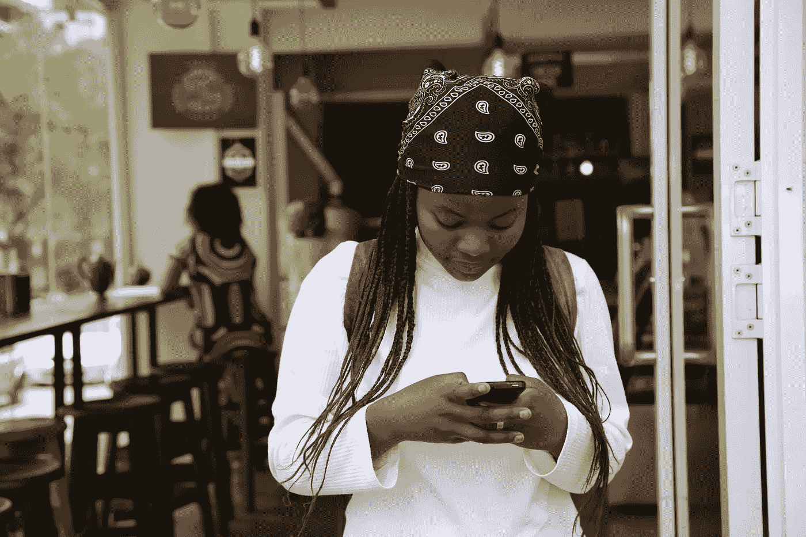

# 游戏计划:社交媒体健康解决方案

> 原文：<https://medium.com/swlh/the-game-plan-d647fce11691>

Photo by [Angelo Moleele](https://unsplash.com/photos/s2WxsnxeRc4?utm_source=unsplash&utm_medium=referral&utm_content=creditCopyText) on [Unsplash](https://unsplash.com/?utm_source=unsplash&utm_medium=referral&utm_content=creditCopyText)

“有时很难知道我们的生活发生了什么变化，除非我们停下来，看看它与十年前甚至五年前有多大的不同。近年来，社交媒体比其他任何东西都更显著地影响了我们的大多数日常生活。”

社交媒体已经成为我们交流、收集和分享信息的主要方式之一。