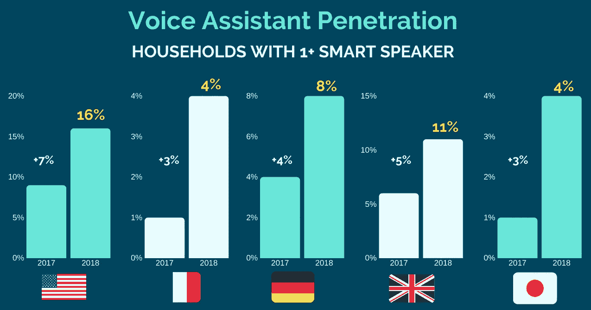

# 语音搜索的全球角色[演示]

> 原文：<https://medium.com/swlh/the-global-role-of-voice-search-presentation-4649684ea023>

我们听到很多关于语音搜索的炒作，但它是如何真正改变消费者和品牌的互动方式的？它是创造新的行为，还是仅仅通过新的媒介促进现有的行为？

本次演讲旨在超越宣传，探讨语音搜索在不同领域发挥的作用，明确品牌可以做哪些不同的事情来获得更好的结果。

Voice Search Trends

## 这篇文章发表在 [The Startup](https://medium.com/swlh) 上，这是 Medium 最大的创业刊物，有+431，678 人关注。

## 订阅接收[我们的头条新闻](https://growthsupply.com/the-startup-newsletter/)。

