# React & Redux 的利与弊:以及为什么鸭子可能是解决方案

> 原文：<https://medium.com/swlh/the-good-the-bad-of-react-redux-and-why-ducks-might-be-the-solution-1567d5bdc698>


在我深入 React 和 Redux 的世界之前，请允许我提供一些背景信息:

如果你愿意的话，我的科技之旅是非传统或非传统的。我在大学里没有学过计算机科学，但在开始学习编程之前，我实际上做了 7 年的英语老师。

在教室里的那些年里，我花了大量时间讲授结构。我的意思是:

*   5 段短文
*   写提纲的艺术
*   语法规则
*   &正确的句子结构

> *谈到高中文学课，基本上所有的东西都是结构和组织。*

结合我也是处女座的事实，这意味着我真的很喜欢*这样的结构。*明确地说，有组织的结构。**

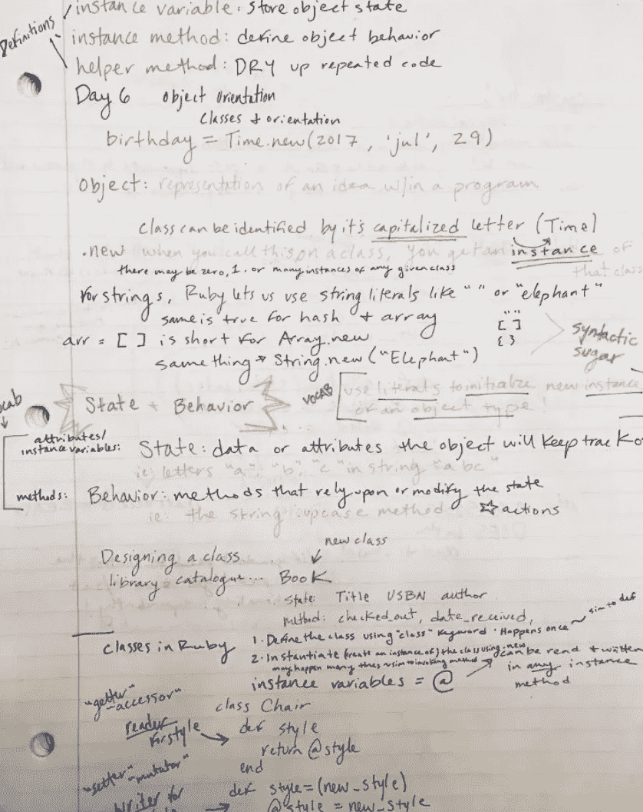

Hi, my name is Lauren & I’ll never not color code my notes

Ada Developers Academy 是一个为期一年的免费项目，旨在培训华盛顿州西雅图的女性和不同性别的人编写代码，我的同事们经常在我的彩色编码笔记上给我出难题。

但是在我的辩护中，我刚刚辞去了我的工作，冒着巨大的风险学习编码，这种东西适合我！它带给我平静、快乐和理智。

在学习编码的时候，就像我以前的教室一样，我喜欢一切都有自己的位置。

我喜欢精心组织的代码库，它真的能让我微笑。

所以，毫不奇怪，后来当我成为亚马逊的一名软件工程师时，我真的深深地爱上了 React。

我相信很多读者可能已经知道了，但是 React 有许多强大的功能，包括:

*   虚拟世界
*   本机兼容性
*   相对较快的学习曲线
*   有用的开发工具

***但最重要的是:***

*   模块化组件的可重用性

自从了解它之后，我就一直被组件驱动架构深深吸引，这是 React 的基础。

> **TL；** React 博士的模块化组件非常棒，但有时国家管理会变得疯狂


有大量的文章/资源提供了关于 [React 的令人敬畏的特性](https://tylermcginnis.com/reactjs-tutorial-a-comprehensive-guide-to-building-apps-with-react/)的细节，所以我不会在这里深入探讨这些特性，但是我会暂停一下，以确保我们在模块化和可重用组件方面达成一致。

当你用 React 构建一个应用时，你创建了一堆独立的、隔离的、可重用的组件。

然后将它们组合在一起，构建复杂的用户界面。

我以前是一个沉迷于语法规则遵循的老师，我喜欢这种暗示的鼓励组织和划分的方式。我发现组件的可重用性对工程师很有帮助。另外，在代码中查找东西总是很容易。

为了形象化这个概念，这里有一个 React 应用程序的截图，它聚合了观看数据来创建一个“最疯狂的电视节目”应用程序:


应用程序本身可以分为几个部分:

*   导航
*   展示项目
*   该显示列表全部在一起

该应用的架构非常简单，但正如我们*所有人*所知，事情可能会变得复杂和棘手，并且很快就会从这个变成这个:

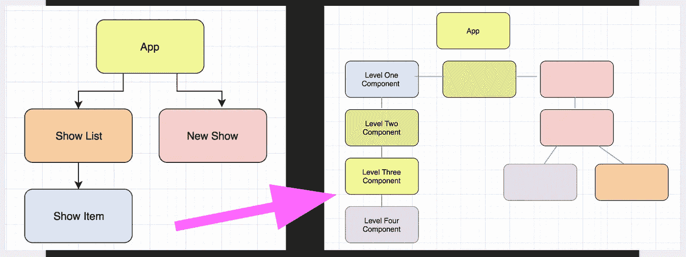

因此，开发人员在这一点上被迫发现 React 的粘性或*不那么迷人的*部分。

开发人员经常想在应用程序中传递状态作为道具。React 提倡单向流，当两个(或更多)组件共享相同的数据时，如果您希望保持数据“同步”,事情会变得混乱。

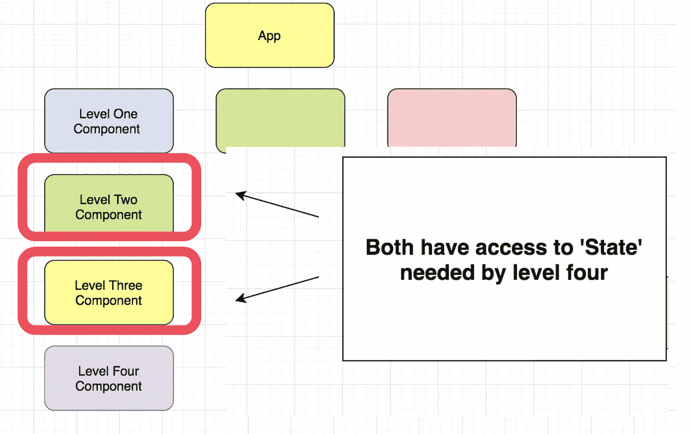

理想情况下，数据的真实来源只在一个地方。如果你有两个孩子需要访问相同的数据，React 文档鼓励你[“提升状态”](https://reactjs.org/docs/glossary.html#state)。这意味着将数据放在这两个组件的最近的祖先中。但是如果这两个组件在树中相距很远，那么“最近的祖先”组件可能位于组件树的顶层。

让事情变得更加复杂的是，中间的组件可能完全没有被传递的道具的用途，只是刚好卡在中间，不得不传递。*不用了谢谢。*

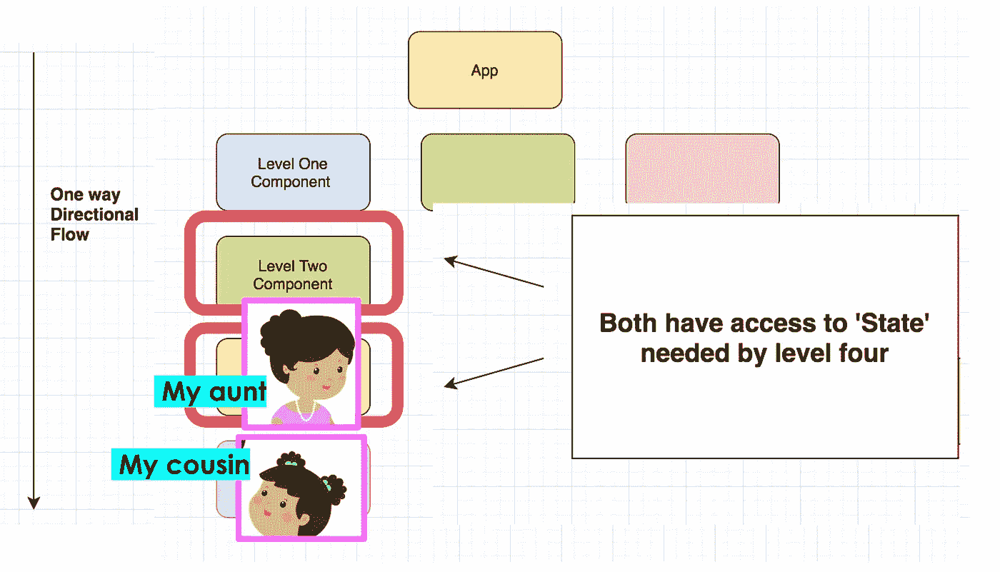

对于这个概念，我最喜欢的类比是我想给我的表弟讲一个故事。但是我不能直接告诉她这个故事，我还需要告诉我的阿姨。如果这是一个小的，不尴尬的故事，这很好，但如果是关于一些我不一定想让我阿姨知道的事情呢？

好吧，扫兴的家伙，不管怎样我还是得通过她。

因此，顶级祖先必须通过几个中间组件向下传递数据，才能到达正确的组件，就像我们小时候玩的游戏电话一样，这为未来的用户创造了一百万个不同的开发人员错误或不明确的机会。原始故事可能会变得混乱，当有人试图在许多组件之间传递道具时，他们很容易混淆。

> -也就是不好意思-

换个角度来看，一旦状态在组件树之间来回传递，很容易想象事情会变得非常复杂。

雪上加霜的是，我的女儿[桑迪·梅茨](https://www.poodr.com/)教我**害怕耦合**，这在每个组件及其父组件之间发生了很长时间。所以试着移动一个部件会变得非常复杂。在组件和它的父组件之间，以及在组件的子组件之间，都存在着耦合。

因此，毫不奇怪，这会影响性能，因为每次数据更新都会导致所有子节点重新渲染——这会导致严重的性能和速度问题！

> 🤷🏼‍So:这真的是一种平衡行为。🤷🏼‍

React 带来了许多*好东西*，但是正如你所看到的，如果你希望构建比任务列表更复杂的东西，找到一个管理应用程序状态的解决方案是很重要的！

## 当你处于项目的设计阶段时，通常有几件事是至关重要的:

*   为了让应用程序能够扩展
*   能够创造出在未来几个月或几年都可以维护的东西
*   我敢说，在国家管理方面，保持头脑清醒是件好事！

# 这让我想起了 Redux——拯救世界的国家集装箱超级英雄！


所以，还记得在组件之间传递数据的混乱吗？这就是 Redux 成功帮助你理解的。

Redux 是一个针对 JavaScript 应用的 ***状态管理工具*** 。这意味着我可以把数据*(或者关于我最近糟糕的约会出轨的尴尬故事)*传给我的表妹，而不必告诉我的阿姨。也就是说，我可以避免这个故事在所有组件(*或我的许多疯狂的叔叔们*)之间跳跃的混乱，只是为了更新或改变其中的一个。

# 这一切之所以成为可能，是因为 Redux 最重要的原则:全球商店！

让我们来谈谈这个。需要记住的重要一点是，应用程序的整个状态存储在一个中心位置 ，称为存储。


这意味着 React 应用程序的每个组件都可以直接访问应用程序的状态,而不必将道具发送给子组件，或者使用回调函数将数据发送回父组件！这很梦幻。

Redux 提供了一个中央存储，可以保存应用程序中任何地方的数据。

换句话说，Redux 完全消除了当您将数据从父组件向下传递到许多不同的子组件并在所有这些地方操作它时可能发生的这种混乱的隧道效应。

# 现在，这是这一切是如何发生的图表:

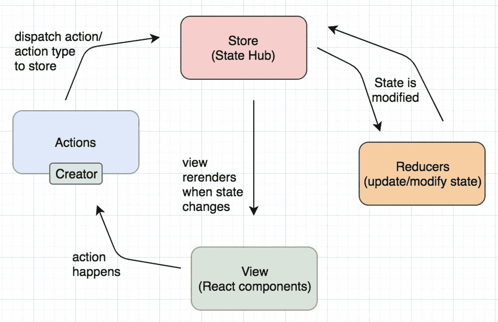

我将展示如何将它的每一部分添加到 React 应用程序中，以说明它们是如何一起工作的。

因此，对于我之前展示的应用程序，您可以想象这里的每种颜色都是不同的 React 组件。

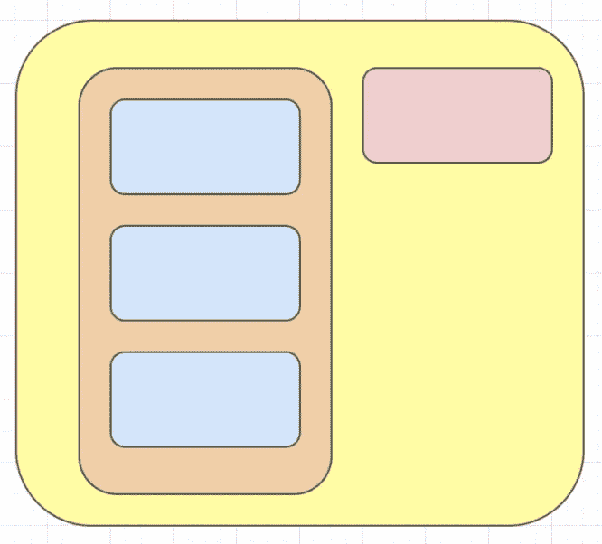

目前，通过 just React，该应用中的数据流向如下:

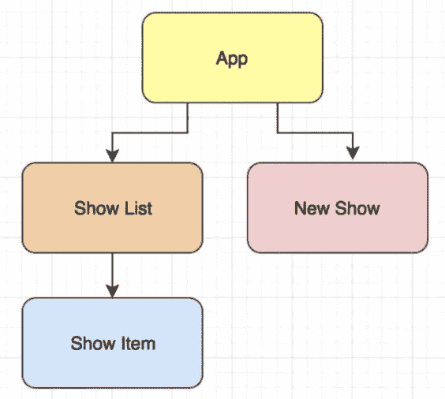

但是我想添加 redux，以便状态和数据传输看起来更像这样:

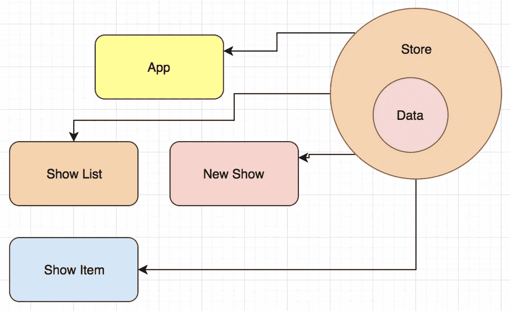

要做到这一点，首先要做的是建立商店。

# **如何将 REDUX 添加到 REACT 应用中**

> **商店**

关键是要记住 Redux 中的商店就像是**人类的大脑**。这是绝对基本的:*整个应用程序的状态存在于存储中*。因此，首先，您应该创建一个用于包装状态的存储。

在 src 文件夹中为 redux 创建一个目录:

```
src/redux/
```

在以下位置创建一个存储文件夹:

```
src/redux/store/
```

然后创建一个名为`index.js`的新文件，最后初始化存储:

```
// src/redux/store/index.js import { createStore } from ”redux”;
import rootReducer from “../reducers/index”;const store = createStore(rootReducer);export default store;
```

`createStore()`是创建 Redux 存储的函数，虽然您也可以将一个初始状态传递给`createStore()`，但大多数时候您不必这样做。虽然传递一个初始状态对于服务器端的渲染很有用，但是传统上，**状态来自 reducers** ，这就是我在这里所做的——它将一个 reducer (rootReducer)作为第一个参数。

> 但是等等。我还没有真正解释减速器是做什么的！

记住，**状态来自于** *。现在重要的是理解减速器做什么。*

> **减速器**

让我们回到我们的图表。


在 Redux 中，**减速器产生状态**。国家不是你亲手创造的。

Reducers 指定应用程序的状态如何改变。Redux 的一个原则是状态是不可变的，不能原地改变。

> 在 plain React 中，本地状态通过函数`setState()`就地改变。

# 但是在 Redux 中，你不能这样做。

reducer 只是一个 Javascript 函数——它接受两个参数:当前状态和一个动作，这就是为什么 reducer 必须是纯的——这意味着它为给定的输入返回完全相同的输出。

创建一个减速器实际上非常简单。

## 方法如下:

在 redux 中为根 reducer 创建一个目录:

```
src/redux/reducers/
```

在该文件夹中创建一个新的`index.js`文件。

在该文件中:

```
// src/redux/reducers/index.jsconst initialState = {
  shows: []
};const rootReducer = (state = intitialState, action) => state;export default rootReducer;
```

这个减速器有点傻，因为它不做任何事情就返回初始状态。

但是一定要注意初始状态是如何作为[默认参数](https://developer.mozilla.org/en-US/docs/Web/JavaScript/Reference/Functions/Default_parameters)传递的。

## 现在，减速器无疑是 Redux 中最重要的概念。我再说一遍，**减速器产生应用状态**。

> 但是这应该引出一个问题，**减速器如何知道*何时*产生下一个状态**？

> **动作**

这就是行动的由来！

Redux 的一个原则是，改变状态的唯一方法是向商店发送信号。**这个信号是一个动作。**

**“调度一个动作”**就是发出一个信号的过程。

你如何改变一个不变的状态？*嗯，你没有。*结果状态是当前状态加上新数据的副本。

> 你可能会想，哇，劳伦，要知道的数据太多了。

不过让人放心的是 **Redux 动作无非就是 Javascript 对象**！这是一个可能的例子:

```
{
  type: 'ADD_SHOW';
  payload: { title: 'Marvelous Mrs. Maisel', rank: 1, picture: 'https://image.jpg' } 
}
```

## 所以让我们开始行动吧

为操作创建一个目录:

```
src/redux/actions/
```

在该文件夹中创建一个新的`index.js`文件

在该文件中:

```
// src/redux/actions/index.jsexport const addShow = show => ({ type: “ADD_SHOW”, payload: show });
```

每个**动作都需要一个类型属性**来描述状态应该如何变化(它实际上只是一个字符串)。缩减器将使用该字符串来确定如何计算下一个状态。如果你愿意，你可以像我一样指定一个有效载荷。

回到图中，因为`types`只是字符串，字符串容易出现拼写错误和重复，最好将动作类型声明为常量。

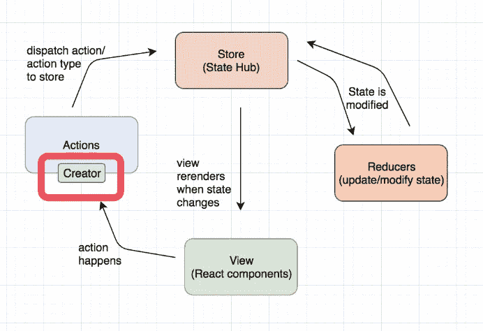

> **动作类型**

最佳实践是将每一个动作包装在函数中，这无疑有助于避免难以调试的错误。

所以让我们也构建一个简单的动作创建器。

在 redux 中为常量创建一个目录:

```
src/redux/constants/
```

在该文件夹中创建一个新的`action-types.js`文件。

在该文件中:

```
// src/redux/constants/action-types.jsexport const ADD_SHOW = “ADD_SHOW”;
```

然后打开`src/redux/actions/index.js`并更新动作以使用动作类型:

```
// src/redux/actions/index.jsimport { ADD_SHOW } from “../constants/action-types”;export const addShow = show => ({ type: ADD_SHOW, payload: show });
```

## 等等，让我登记一下。读者们，你们还和我在一起吗？？

没有吗？好吧，在继续之前，如果我回顾一下主要的 Redux 概念和刚刚发生的一切，可能会有所帮助:

*   Redux 商店负责协调所有移动部件
*   所有的状态都作为一个单一的、不变的对象存在
*   只要商店收到一个动作，它就会触发一个缩减器
*   减速器返回下一个状态

# 顺序大概是这样的:

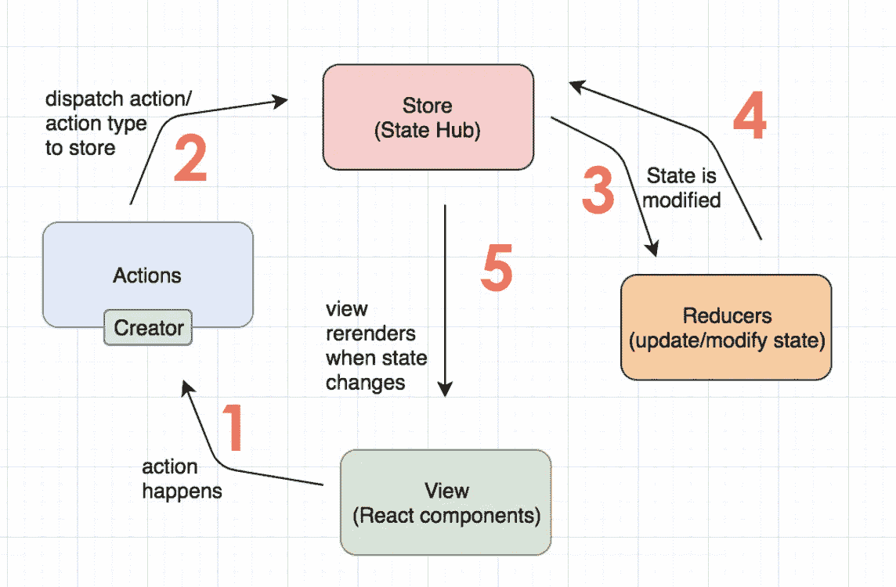

1.  一个动作首先发生在一个组件中，比如有人试图添加一个节目、过滤视图、查看组件的细节、甚至删除一个组件等等。
2.  然后调用动作和动作类型
3.  然后获取将更新或修改状态的特定缩减器
4.  一旦状态改变，视图就会被重新呈现

> 嘣！现在你知道了！Redux 就是这么工作的！

恭喜你。你现在知道了*关于如何将 Redux 添加到一个简单的应用程序中的一切*，并且应该准备好将其扩展到你自己的应用程序中。
除此之外，*等等*，你可能已经注意到，当我刚刚开始搭建 Redux 架构的时候，我不得不创建一堆**额外的文件夹和文件。**

现在**想象一下添加传统应用**的所有功能。如果我继续沿着这条路走下去，很容易想象事情会变得多么混乱和/或令人困惑。

您必须在一个文件中编辑常量，然后在另一个文件中编辑 reducer，然后在另一个文件中编辑动作，最后在另一个文件中编辑动作创建者。

> 这就像一场没人愿意看的无聊的网球比赛！

这意味着，即使只是添加一个小功能，也可能等同于编辑和添加几个不同的文件！这是一个令人头疼的问题。

Me bouncing back and forth between all of the different folders and files!

这种组织 Redux 的方式是最常见的，也是最基本的。

但是正如刚才演示的那样，您最终会在文件之间来回跳转以获得一个相关的功能，因为常量、动作和动作创建者被导入到 reducer 文件中，而动作创建者也被导入到容器中进行调度。所有这些都变得有点烦人，你同意吗？

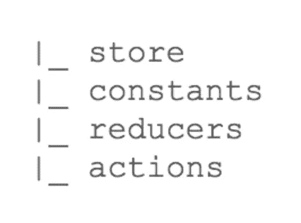

我发现真正疯狂的是，实际上没有一种规定的方式来组织你的 Redux 文件。这种`By Type`方法非常普遍，在很多教程中都有教授，但是很明显，它有点缺陷。

我的理论是，当你学习 Redux 以及动作和 Redux 的角色时，你通常会从非常简单的例子开始。大多数教程都不会带你进入下一个阶段。但是如果你正在用 Redux 构建比待办事项列表更复杂的东西，你会很快意识到，随着时间的推移，你可能需要一种更智能的方式来扩展你的代码库。

这些动作、常量和缩减器都是相关的，但处于不连续状态，老实说，从一个文件切换到下一个文件不仅需要几秒钟，而且会让你的头脑有点模糊，我觉得这真的降低了我的生产效率。

> 简单来说就是很难维持！🙅🏼

所以很明显，当我第一次学习 React 并以这种方式心不在焉地建立一个应用程序的架构时，我对此感到沮丧。

我所有的英语老师组织习惯都在我脑海中闪现。我知道有一种方法可以对代码库架构的组织进行战略性和深思熟虑。

我一头扎进研究和媒体的文章中，知道一定有什么东西会给我一些启发。我是对的，有很多关于它的想法。

一些人在网上建议，解决这一问题的方法可能是**按照特性组织你的代码。**如在:

*   封装组件(容器)
*   其状态(商店)
*   和它的行为(动作)放在一个文件夹中

*全部遵循 React 的组件概念。*

但是这意味着您必须**将 Redux 存储的一部分绑定到一个容器**上，这与 Redux 推广的核心内容完全违背直觉！

> 所以我不会向你们提倡这种模式。

所以我回到绘图板，进一步的研究让我最终发现…

# 你们期待已久的时刻到了，根据本文的标题，*鸭子来了！*

> 但是鸭子是什么呢？

创造了术语的 Erik Rasmussen 意识到他经常一次创建和编辑一个功能。

他一直需要为每个用例添加`{actionTypes, actions, reducer}`元组。正如我一样，他将这些保存在单独的文件和文件夹中，然而，95%的时间里，只有一个`reducer/action`对需要它们的相关动作。

因此，将这些部分捆绑在一个独立的模块中更有意义，这个模块是自包含的，甚至可以很容易地打包到一个库中。

> Ducks 本质上是一个将 reducers、动作类型和动作捆绑到同一个文件中的提议。

但是**为什么**这个组织结构会是这个架构问题的解决方案呢？

## 或者说，为什么要对鸭子感到兴奋？

除了他们的可爱因素😉

嗯，Ducks 试图解决按类型组织的反复性问题。对于 Ducks，我可以将其打包成 redux 模块，而不是拆分所有相关代码！

## 因此，让我们重构您刚刚创建的 React 应用程序，并将我们的 Redux 转换为 DUCKS。

记住，前面的例子创建了添加一个节目的功能，现在您需要将`actionTypes, actions,`和`reducers`全部移动到一个文件中！

# 如何将你的 REDUX 转换成鸭子

1.  在 redux 中为鸭子创建一个目录:

```
src/redux/ducks/
```

2.在该文件夹中创建一个新的`index.js`文件:

3.从`constants`文件夹中抓取`actionTypes`并放入新的`ducks`文件中:

```
// src/redux/ducks/index.jsexport const actionTypes = {
  addShow: {
    ADD_SHOW = “ADD_SHOW”
  }
};
```

4.开始删除并删除整个`constants`文件夹！

5.接下来是`actions`文件。抓住行动:

```
// src/redux/actions/index.jsaddShow = show => ({ type: “ADD_SHOW”, payload: show });
```

6.并将其放入`ducks`文件中:

```
// src/redux/ducks/index.js...export const actions = {
   addShow = show => ({type: ADD_SHOW, payload: show});
};
```

7.继续乐趣，删除整个`actions`文件夹！

8.最后，解决`reducers`。

9.首先抓住这个减速器:

```
// src/redux/reducers/index.jsconst initialState = {
  shows: []
};
```

10.实际上，让我们改变一下`reducer`，因为第一个例子中的 T5 除了返回初始状态之外什么也不做，这很容易通过将它变成一个 switch 语句来解决。

11.在`ducks`文件中添加:

```
// src/redux/ducks/index.js...export const rootReducer = (state = initialState, action) => {
  switch (action.type) {
    case ADD_SHOW:
    return { …state, shows: […state.shows, action.payload] };
    default:
    return state;
  }
}**;**
```

12.当然，不要忘记删除`reducer`文件夹！

# 13.哒哒！您刚刚创建了一个模块化的 Ducks 文件！

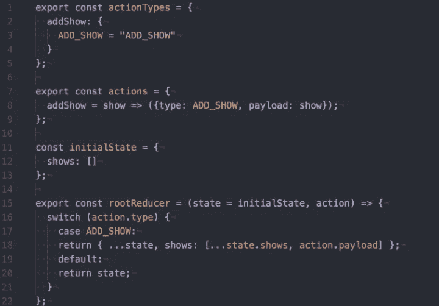

Your Ducks file should look a little something like this!

这个文件现在正式包含了在之前构建的所有功能。它以完全相同的方式运行，但现在，它被**模块化为一个干净、易于理解的文件，*或鸭*** *，*用于优化状态管理。

## 为了真正把东西带回家，还记得当你创建所有这些文件夹和所有这些文件时，你把它们彼此分开并分成碎片吗？


好吧，比较一下这个新文件，它以清晰的方式包含了所有相同的功能，我称之为胜利！

> 另外，创建它非常容易，而且没有痛苦。

因此，鸭子的艺术是一种构建应用程序变得更加模块化的方式，*是的，这是软件工程世界中一个真正性感的时髦词*，但这真的很棒，因为现在已经变得非常明显，哪个 Redux 处理哪个功能。

在完全实用的层面上，你不再需要在找到你需要处理的文件之前滚动大量的文件。

# 但这只是 ***构建 redux 的一种方式*** 。还有很多其他选择。

事实上，我鼓励读者探索创造性地定义什么可能最适合你的方法，这可能意味着我曾经是一个痴迷于结构的人，现在正在成为一个接受模糊性的人，并且发现有时你可以定义自己的规则，做任何对你的代码和团队最有利的事情，最终都是正确的选择！

## 我最喜欢鸭子的是它的干净和清澈。

它删除了许多不必要的样板文件，你可以通过改变一个文件轻松地添加一个简单的动作，甚至是一个应用程序的全部功能。

我所在的团队采用了这种结构，我们对此非常满意。

> 也许你也会？！


Presenting at CascadiaJS 2018

> 试一试，让我知道你的想法。

在 Twitter- **@LoLoCoding** 上联系我，告诉我所有关于你自己的 quacky 架构解决方案！

请务必查看[拉斯姆森的](https://github.com/erikras/ducks-modular-redux)原始提案，了解更多信息！

此外，如果你是一名视觉/听觉学习者，这里有一个我在 2018 年的 [**卡斯卡迪亚斯**](https://2018.cascadiajs.com/) **展示这些信息的[视频](https://www.youtube.com/watch?v=jr7D4VAzNig&t=3s)。**

[](https://medium.com/swlh)

## 这篇文章发表在 [The Startup](https://medium.com/swlh) 上，这是 Medium 最大的创业刊物，拥有+413，678 名读者。

## 在这里订阅接收[我们的头条新闻](http://growthsupply.com/the-startup-newsletter/)。

[](https://medium.com/swlh)