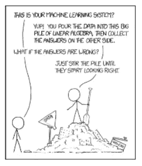

# 人工智能大辩论:可解释性

> 原文：<https://medium.com/swlh/the-great-ai-debate-interpretability-1d139167b55>

深度学习(DL)已经悄悄进入*几乎*人工智能的所有部分。DL 方法构成了图像处理、自然语言处理、推荐系统等领域几乎所有任务的最新技术。因此，随着越来越多的这些模型被部署，这些模型的可解释性开始受到质疑。深度学习是一种基于分层学习的机器学习形式