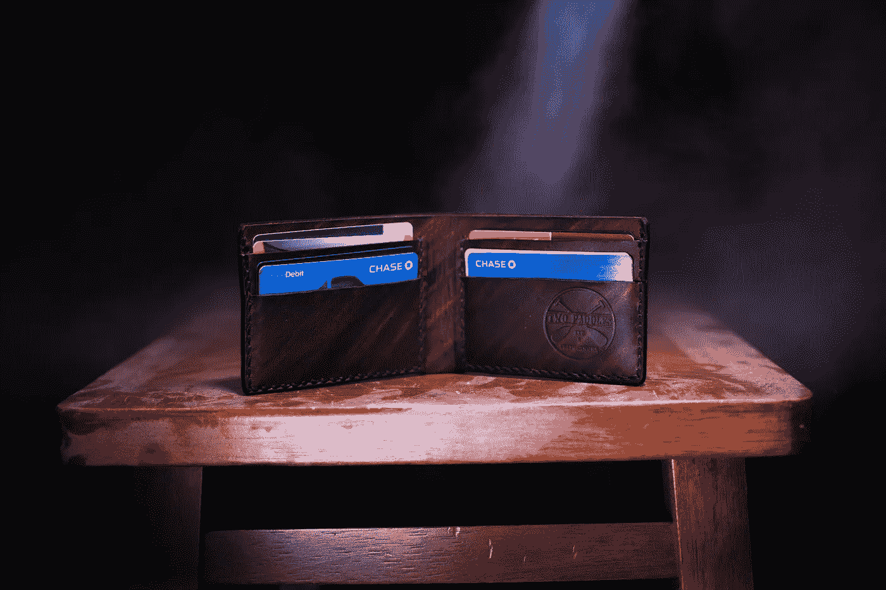

# 本世纪最大的资本主义骗局——为什么信用评分让我们无所适从

> 原文：<https://medium.com/swlh/the-greatest-capitalist-scam-of-the-century-why-credit-scores-are-screwing-us-all-over-7f6b607e745d>

Photo by [Two Paddles Axe and Leatherwork](https://unsplash.com/@twopaddles?utm_source=unsplash&utm_medium=referral&utm_content=creditCopyText) on [Unsplash](https://unsplash.com/search/photos/credit-cards?utm_source=unsplash&utm_medium=referral&utm_content=creditCopyText)

信用评分是笼罩着我们所有人的阴影。如果你想要任何形式的贷款，你需要一个信用评分来支持它。不在乎信用评分的贷方会向你收取高利率。

令人震惊的是，如今你甚至可以让房东进行信用检查。那是…