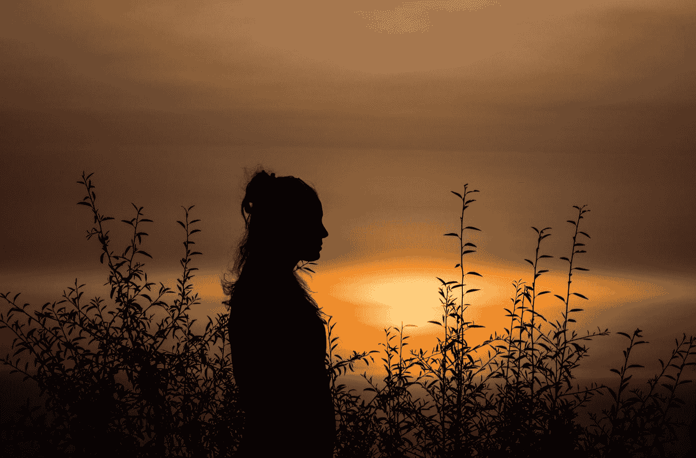

# 作为作家，你最大的天赋是什么

> 原文：<https://medium.com/swlh/the-greatest-gift-you-have-as-a-writer-d17b89eede0c>

## 或者任何一种创造者。

Photo by [Jason Blackeye](https://unsplash.com/@jeisblack?utm_source=medium&utm_medium=referral) on [Unsplash](https://unsplash.com?utm_source=medium&utm_medium=referral)

信不信由你，所有人类都是有创造力的。我们建立社会、结构和与他人的联系，我们足智多谋。如果这不是包裹在辉煌中的创造力，那么我不知道什么是。

那么，作为创造者，我们能从最悲惨的结局中拿走的东西是什么呢…