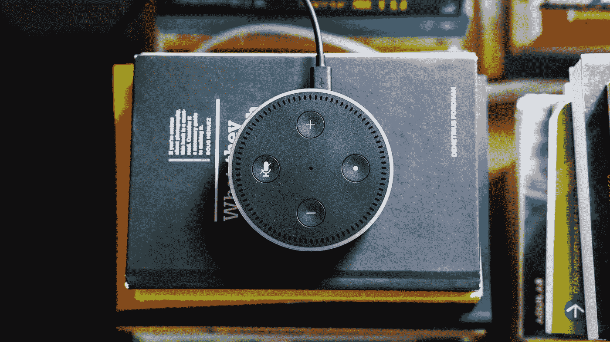

# 为什么技术的早期采用者选择退出

> 原文：<https://medium.com/s/story/the-growing-cost-of-early-adoption-75050e80b004>

## 早期采用总会有财务成本。如今，还有潜在的隐私成本。

Photo: [Andres Urena](https://unsplash.com/photos/39MVKfRm3TA?utm_source=unsplash&utm_medium=referral&utm_content=creditCopyText) on [Unsplash](https://unsplash.com/search/photos/alexa?utm_source=unsplash&utm_medium=referral&utm_content=creditCopyText)

我最近在家里安装了一个 Nest 恒温器。Nest 已经有一段时间了，但我一直在犹豫要不要买一个。我不会详细解释为什么我们最终扣动了扳机，但是有更多的证据是有意义的…