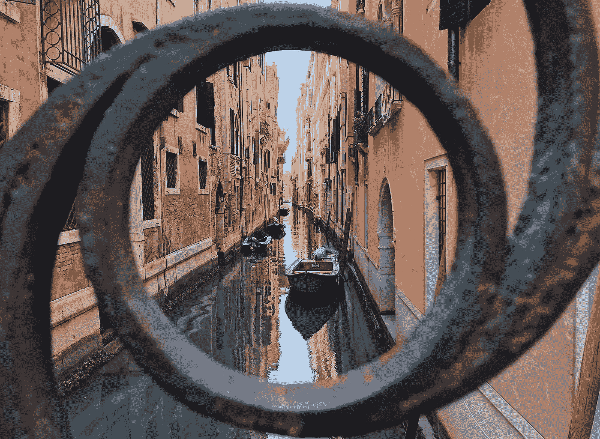

# 光环效应(为什么我们如此虚荣)

> 原文：<https://medium.com/swlh/the-halo-effect-aka-why-were-so-fucking-vain-missbethcan-f4c2b5c99fd0>

Venice, Italy | Photo by [Beth Caniglia](https://medium.com/u/b54ebebadf47?source=post_page-----f4c2b5c99fd0--------------------------------)

这是能让你一天快乐的最小的事情。一杯好咖啡。陌生人的微笑。或者更好，下面的话(伴以微笑！)来自一个陌生人:

> 很抱歉打断你们，我希望这不算无礼，但我只是想告诉你，你是我见过的最漂亮的女孩之一，你太迷人了，我不得不告诉你。我希望你有一个伟大的 …