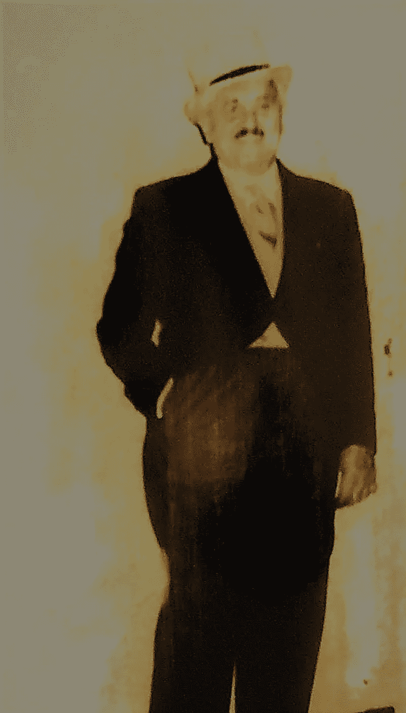

# 我认识的最快乐的人

> 原文：<https://medium.com/swlh/the-happiest-man-ive-ever-known-a5d002f59d13>

多年来，我最喜欢的纽约邻居是一位温文尔雅、白发苍苍的法国老人，名叫阿曼德·切尼。几年前，切尼先生在 99 岁时心脏衰竭，很快就去世了，显然没有痛苦。他大声叫他的妻子，倒在地板上，等她赶到时，他已经失去了知觉。这是一个完美匹配他生活方式的退出策略——没有抱怨，没有巨大的遗憾，没有…