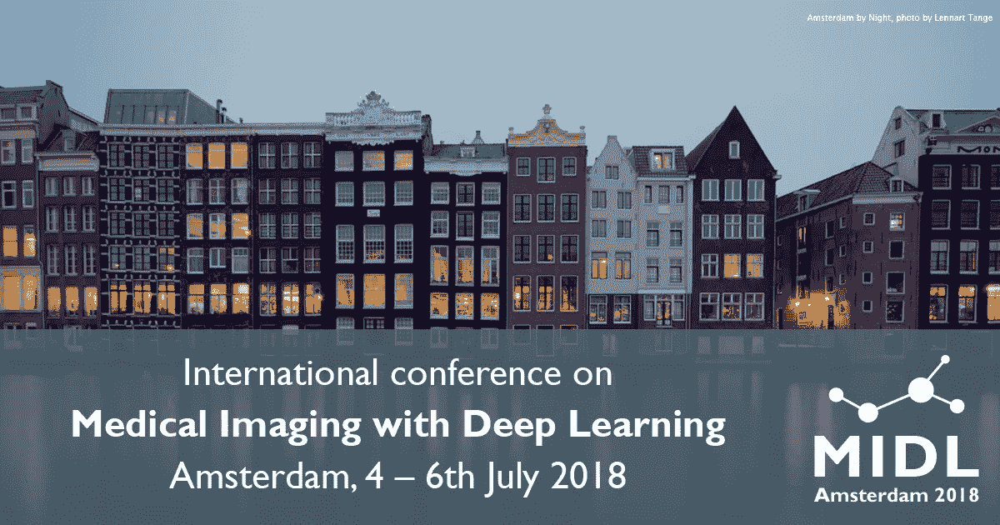

# 医疗保健人工智能热潮是真实的

> 原文：<https://medium.com/swlh/the-healthcare-artificial-intelligence-rush-is-for-real-9185543eaf09>

Photo by [Brandon Holmes](https://unsplash.com/@brankotsu?utm_source=medium&utm_medium=referral) on [Unsplash](https://unsplash.com?utm_source=medium&utm_medium=referral)

RSNA 2018

2018 年，医疗保健行业筹集了 2.56 亿美元的巨额资金，成为欧洲票房最高的行业。人工智能和数据驱动技术在医疗保健领域的融合正在以不确定的速度进行。2018 年，由北美放射学会，又名 [**RSNA 2018**](https://rsna2018.rsna.org/) ，以*北美放射学会第 104 届科学大会为名的最大放射会议，历时 ***06*** 天。一个由领先的科学家和医学研究人员、智库和医疗保健初创公司组成的多元化团体聚集在一起，提出创新而可行的解决方案，以遏制对健康和安全日益增长的担忧。本次会议的口号是*【今日放射学的明天】*，参会人数超过**参展人数超过 ***80*** 初创企业、 ***431*** 专题讲座、 ***44* 首次观察到使用*生成对抗网络(GANs)* 的高级数据增强应用于异常脑 MRI 图像的生成。此外，观察到使用三维自动分割诊断脑瘤的更快、更准确的方法，使得能够更好地治疗致命疾病。*****

**

*MICCAI 2018*

*第*21 届国际医学图像计算会议&计算机辅助介入* [**(MICCAI 2018)**](https://www.miccai2018.org/en/) ，于 9 月 **16 日至 9 月**20 日在西班牙格拉纳达市举行，为期 5 天，与会者包括顶尖的生物医学工程师、科学家和临床专家。2018 年的会议记录了 33% 的代表团注册人数，其前身在 2017 年有超过 ***1400*** 名注册代表。为期两天的卫星赛事共有超过 ***1600*** 人参加。论文接受率至少为***37%****373 篇论文被接受，共有*261 篇论文入选艾，来自各种*1000 余篇论文。大会还包括 ***79*** 海报、 ***40*** 工作坊、 ***14*** 教程、 ***12*** 挑战赛和 ***04*** 主题演讲环节。为肺叶自动分割演示的技术，平均运行时间为 ***2000*** 毫秒，因赢得*最佳论文奖*而备受瞩目。****

****

**MIDL 2018**

**第一次，一个名为 [**MIDL 2018**](https://midl.amsterdam/) 的*深度学习医学成像国际会议在荷兰首都举行，时间是七月，通常是阿姆斯特丹一年中最温暖的月份。会议迎合了 DL 研究人员，临床专家和卫生保健公司。首届大会见证了约 300 位*与会者，04 位来自*美国国立卫生研究院(NIH)、脸书艾研究、Open AI 和加拿大圭尔夫大学*、 ***21 篇*** 口头报告、 ***61 篇*** 海报报告和一篇 ***41%的论文接受率*******

**

## *这篇文章发表在 [The Startup](https://medium.com/swlh) 上，这是 Medium 最大的创业刊物，拥有+435，678 名读者。*

## *订阅接收[我们的头条](https://growthsupply.com/the-startup-newsletter/)。*

**