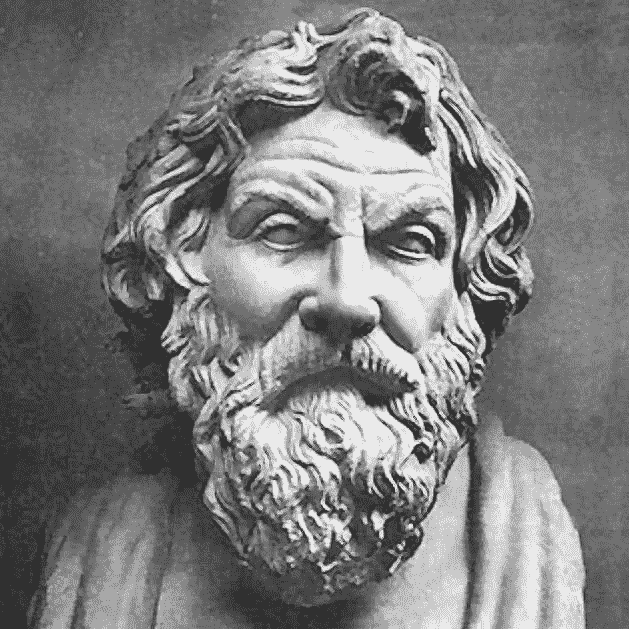

# 我是英雄还是愤世嫉俗者？

> 原文：<https://medium.com/swlh/the-hero-or-the-cynic-in-me-e7877b0f8146>

**Antisthenes — pupil of Socrates, c. 445-c.365 BC**

“你们来到这里，是为了让这个世界生活得更充实，更有远见，更有希望和成就的精神。你是来丰富世界的，如果你忘记了使命，你就会使自己变得贫穷。”伍德罗·威尔逊

在他去世前不久，我最信任的一个朋友发现我变得愤世嫉俗。它像一吨重的砖块一样落下来。“我？绝不！我不是那样的人。承认我们的许多选举被窃取有什么好愤世嫉俗的？”

从哲学的角度来看，Mich 恭维了我一句，虽然不是有意的。最早的犬儒主义者，在古代雅典，认为生活的目的是与自然和谐相处，拥抱美德。他们认为，幸福只能通过拒绝对财富、名誉和权力的欲望，培养一种对人类来说自然的生活方式来实现——简单地拥有很少的财产。这些早期的愤世嫉俗者是苏格拉底的学生，很像同时代的贵格会教徒和阿米什人。从这个角度来看，我的朋友是对的。我渴望像愤世嫉俗者一样生活。

但是 Mich 几乎没有奉承我的意思。相反，他指出，每次我为选举舞弊叫屈，揭露一个政客的黑暗动机，或者提醒人们我们国家的土著大屠杀、奴隶制、暗杀和阴谋的历史——而什么都不做，我就传播了犬儒主义和绝望。

我的个人英雄会怎么做？是什么激励了甘地和金？是愤怒吗？是绝望吗？从佛陀到达赖喇嘛，最伟大的禅修者都提倡慈悲。他们提倡慷慨和感恩。耶稣呼吁宽恕和同情。表现出接受和谦逊需要勇气。分析这份名单，我发现既没有愤怒也没有愤慨。我发现的是积极参与——过符合原则的生活。

我与癌症的正面碰撞，加上 Mich 无情的同情心，揭示了我的中心悖论。我的日子屈指可数，每个人的也是。我想如何度过剩下的时光？一方面，我渴望激发希望，推动解决方案，成为一个赋予自己和他人力量的人，为建设一个更加和平美好的世界而努力。矛盾的是，愤怒和沮丧的感觉仍然被锁在不确定和无所作为的容器中。很多时候，我发现自己没有采取行动，而是在被动的愤怒中获得反常的快乐。

是时候重新审视犬儒主义和英雄主义了。我们的许多文化英雄都是愤怒的人，像兰博一样，倾向于暴力，在通往胜利的道路上夺取生命。一些“英雄式”的愤怒存在于我体内。当不采取行动时，它助长了我的愤世嫉俗。此外，还有另一种英雄——那些推动生活的男男女女。怀着同情，他们倾听无声者的心声，并为他们大声疾呼。他们以宽容的姿态和对包容性未来的充满希望的愿景激励着他人。最重要的是，他们采取行动，尽管是非暴力的。这两个原型都吸引了我的注意力。以米歇尔的名义，是时候把我愤世嫉俗的内在兰博送到门口了。