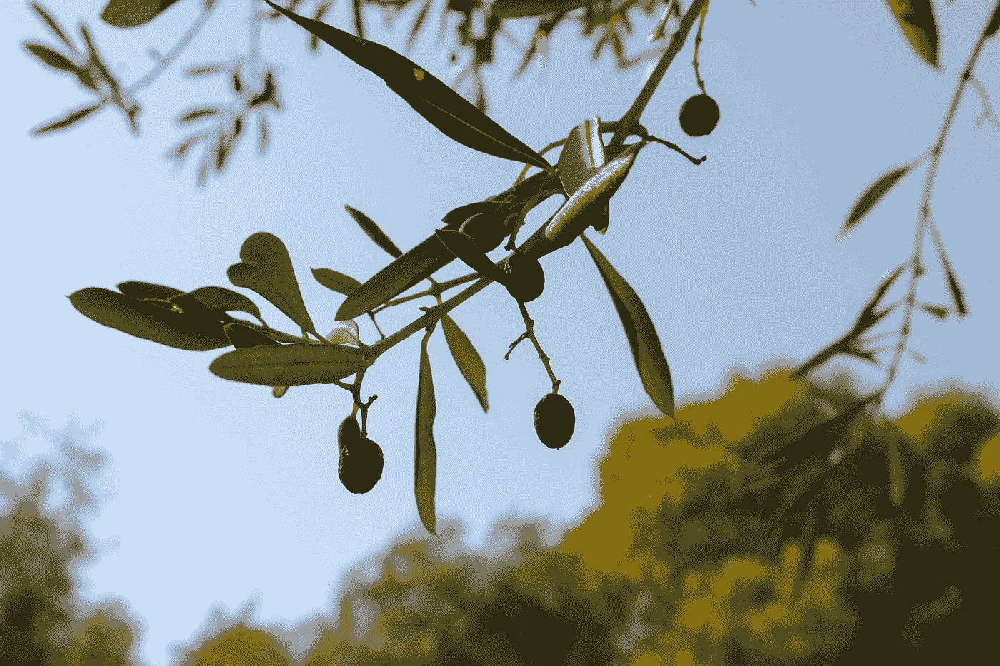

# 生活不按计划进行的潜在好处

> 原文：<https://medium.com/swlh/the-hidden-benefit-of-life-not-working-out-as-planned-9ded4a040ef0>

Photo by [Fiona Pearse](https://unsplash.com/@mwc_uk?utm_source=medium&utm_medium=referral) on [Unsplash](https://unsplash.com?utm_source=medium&utm_medium=referral)

从前，有一个葡萄园主，他有一大片橄榄树。一天，他注意到他的一些树开始腐烂。为了防止他心爱的树木死亡，他修剪和滋养它们。

过了一段时间，新的小树枝开始生长，但是葡萄园的主人注意到树顶开始腐烂。