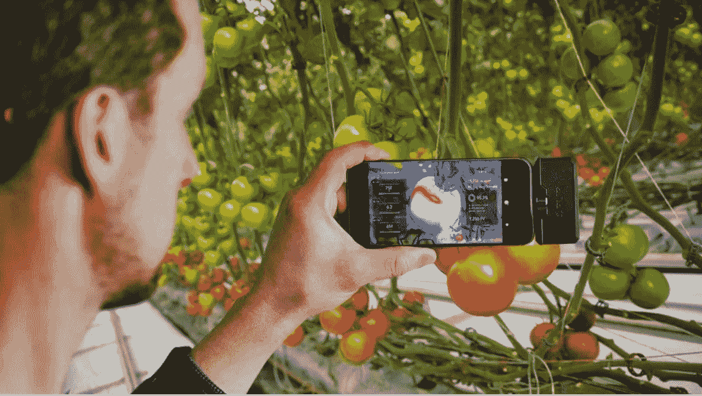

# 增强现实的隐藏潜力

> 原文：<https://medium.com/swlh/the-hidden-potential-of-augmented-reality-995c824bc67f>

增强现实(AR)是抓住公众思维的最新潮流。去年有太多的 AR 产品发布——包括 Mozilla 的 Firefox Reality (一款 AR/VR 浏览器)和 Snapchat 的[lenses*Studio*](https://www.adweek.com/digital/snapchat-is-opening-the-floodgates-for-augmented-reality-lenses/)让用户可以创建自己的滤镜。科技巨头都发布了 AR 开发工具(苹果的、脸书的 [*Spark AR Studio*](https://developers.facebook.com/blog/post/2018/05/01/ar-studio-create-distribute/) 和谷歌的)，并宣布计划 [*推出 AR*](https://www.cnbc.com/2018/11/14/huawei-augmented-reality-ar-glasses.html) …