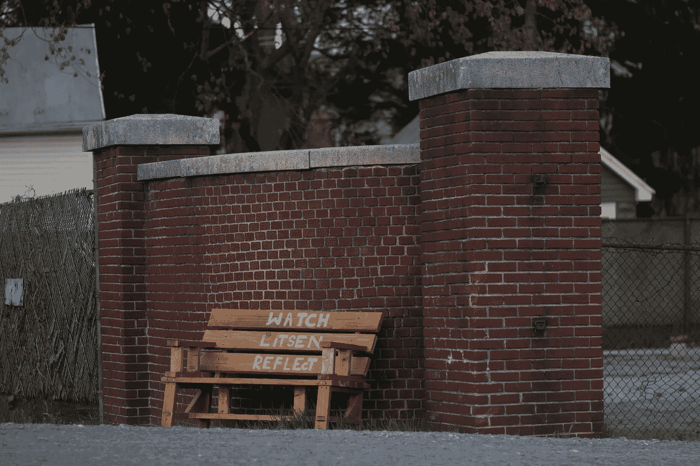

# 平凡事物的隐藏故事

> 原文：<https://medium.com/swlh/the-hidden-story-of-ordinary-things-d3877274d362>

## 因为这不是我的问题，而是你的问题。)

对一个痛苦哭泣的孩子、一只被遗弃的饥饿的狗或一个坐在公园里的孤独老人不感同身受几乎是不可能的。但通过正确的故事讲述，也有可能让任何人在情感上与广场上的一张空长椅、厨房里的一个脏水槽或架子上一把积满灰尘的小提琴联系在一起。

Photo by [Meghan Schiereck](https://unsplash.com/@meghanschiereck?utm_source=unsplash&utm_medium=referral&utm_content=creditCopyText) on [Unsplash](https://unsplash.com/?utm_source=unsplash&utm_medium=referral&utm_content=creditCopyText)