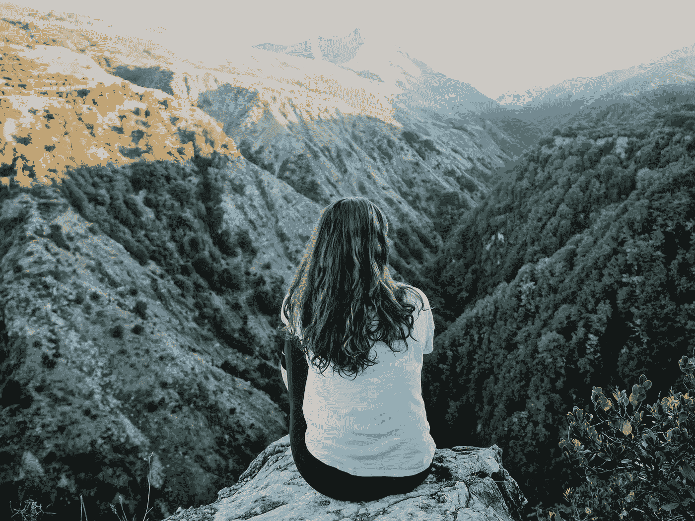

# 追逐梦想的高潮和低谷

> 原文：<https://medium.com/swlh/the-highs-and-lows-of-chasing-your-dreams-cf3c6049a781>

## 因为自由伴随着你必须承受的负担

Unsplash

我们的“梦想”就像我们的指纹一样独特。但是从普遍意义上来说，它们构成了生活的最高层次。总的来说，它们要求我们鼓起勇气去识别什么才是真正重要的(不管别人希望我们做什么，也不管我们习惯于走什么样的路)。拿着…