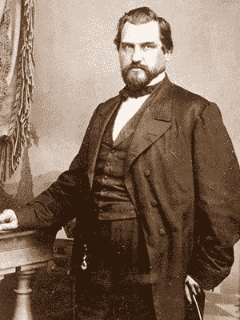
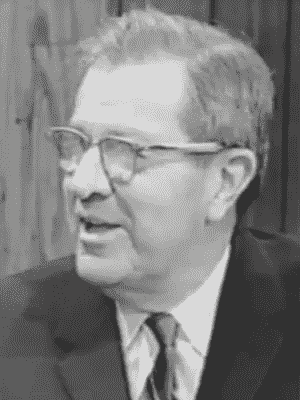
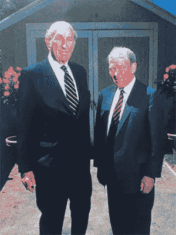

# 硅谷的历史——一个简要的总结(第 1/3 部分)

> 原文：<https://medium.com/swlh/the-history-of-silicon-valley-a-brief-summary-part-1-3-5a7ffcae9e71>


By [Richard Reis](https://twitter.com/richardreeze)

有趣的是，我发现大多数成功的创始人都对历史有浓厚的兴趣:

*   在《硬盘:比尔·盖茨和微软帝国的形成》一书中，传记作家詹姆斯·华莱士和金·埃里克森说，盖茨会“阅读大量传记，包括富兰克林·罗斯福和拿破仑的传记，以了解历史上的伟大人物是如何思考的。”
*   朱利安·格思里在她的书《亿万富翁和机械师》中写道*“拉里·埃里森是一个如饥似渴的读者，他花了大量时间研究科学和技术，但他最喜欢的科目是历史。他通过阅读历史比阅读商业书籍更了解人性、管理和领导力。”*
*   在马克·扎克伯格的脸书简介的[图书部分](https://www.facebook.com/zuck/books)中，他将“[智人:人类简史](https://www.amazon.com/dp/0062316095/?tag=richardreeze-20)”列为他最喜欢的书之一，还有几本传记，如“[罗斯柴尔德家族](https://www.amazon.com/dp/0140240845/?tag=richardreeze-20)”
*   在纪录片《史蒂夫·乔布斯:有远见的企业家》中，采访他的人约翰·麦克劳克林谈到乔布斯时说，“我惊讶地发现史蒂夫·乔布斯对硅谷的了解以及硅谷的来源。”
*   埃隆·马斯克在推特上提到的两本书是传记:[本杰明·富兰克林:一个美国人的生活](https://www.amazon.com/dp/B000FBJG4U/?tag=richardreeze-20)；和[叶卡捷琳娜二世:一个女人的肖像](https://www.amazon.com/dp/B004J4X9L0/?tag=richardreeze-20)

这并不奇怪。了解过去让我们对自己和未来有了更多的了解。

> "那些没有从历史课中学到东西的人注定要重蹈覆辙."Reddit 上的某个人

因此，我决定用三篇短文来总结硅谷的历史。我敢肯定，许多创业者会提供宝贵的经验。

所以，拿一杯你最喜欢的饮料(我要咖啡)，坐下来，享受这短暂的过去之旅…

## 1849 年:持续了 170 年的淘金热

1849 年的淘金热将大批人带到了加利福尼亚。

一个人是利兰·斯坦福。向金矿工人出售镐和铲而发家的商人。1862 年，他成为加州第八任州长。



Leland Stanford (1824–1893)

1884 年，斯坦福的独子小利兰·斯坦福在他 16 岁生日前死于伤寒。

这场悲剧摧毁了斯坦福和他的妻子[简·拉斯罗普](https://en.wikipedia.org/wiki/Jane_Stanford)。

为了纪念他们的儿子，他们决定将他们的全部财产用于建造一所大学。一个努力教授**实用知识**的地方。

**1885 年，** [**斯坦福大学**](https://en.wikipedia.org/wiki/Stanford_University) **开学了。**

…而且早些年学费是免费的！

## 弗雷德·特曼:硅谷之父

> 附注:那时，这个地区还不叫“硅谷”它的主要吸引力是沿路美丽的果树。所以这个地方被称为“心之欢乐谷”(Aww！)

斯坦福大学的毕业生之一是弗兰德里克·特曼，他后来去了麻省理工学院，获得了电子工程的博士学位。

1925 年，特曼回到斯坦福，成为工程学院的一员。

特曼设计了一门课程，创建了一个真空管实验室，写了关于电气和无线电工程的最重要的书之一，并在二战后成为工程学院的院长。



Fred Terman (1900–1982)

不过，可以说，他最大的成就是鼓励他的学生留在加州建立自己的公司。而且，他投资了他们。

为什么我觉得这是他最大的成就？因为他的学生建立了一些令人印象深刻的公司:

*   1939 年，[比尔·休利特](https://en.wikipedia.org/wiki/Bill_Hewlett)和[戴夫·帕卡德](https://en.wikipedia.org/wiki/David_Packard)在帕卡德和他妻子露西尔的车库里开了一家店，创立了他们的公司。他们投资 538 美元，通过抛硬币选择名字 [**惠普**](https://en.wikipedia.org/wiki/Hewlett-Packard) ，正式建立了合作关系。他们的第一批产品之一是卖给华特·迪士尼的音频振荡器，用于拍摄电影《幻想曲》(1940)。

**

*David Packard (left) and Bill Hewlett (right) in front of 367 Addison Ave, Palo Alto, CA 94301, also known as “The HP Garage”*

*   *瓦里安兄弟，拉塞尔和齐格鲁德，于 1948 年创建了 T21 瓦里安联合公司。他们研制出绝密的[速调管](https://en.wikipedia.org/wiki/Klystron)，可以放大微波频率的电磁波。这是什么意思？它被安装在英国的战斗机上，能够定位并摧毁 90%以上的目标。！)的敌人纳粹 u 型潜艇在大西洋。这使得美国军队可以被运送到英国参加诺曼底登陆。*

> *有趣的小事实:瓦里安公司还雇佣了一个年轻的簿记员，名叫克拉拉·乔布斯(史蒂夫·乔布斯的母亲)。*

*斯坦福大学的创业政策(由弗雷德·特曼领导)、二战的结束、比尔·休利特、戴夫·帕卡德和瓦里安兄弟的成功(当然还有令人惊叹的气候)，成为硅谷花园生长的沃土。*

# *第 1 部分结束*

*接下来→ [**硅谷的历史——简要概述(第 2/3 部分)**](/swlh/the-history-of-silicon-valley-a-brief-summary-part-2-3-9c93f81be218)*

```
**Thanks for reading!* 😊*If you enjoyed it, test how many times can you hit* 👏 *in 5 seconds. It’s great cardio for your fingers AND will help other people see the story.*You can follow me on Twitter at [@**richardreeze**](https://twitter.com/richardreeze)to find out whenever others just like it come out.📚 Do you like books? If so you might enjoy my latest obsession: 
[**Most Recommended Books**](https://mostrecommendedbooks.com/).📚*
```

*[](https://medium.com/swlh)*

## *这篇文章发表在 [The Startup](https://medium.com/swlh) 上，这是 Medium 最大的创业刊物，拥有+424，678 名读者。*

## *在这里订阅接收[我们的头条新闻](https://growthsupply.com/the-startup-newsletter/)。*

*[](https://medium.com/swlh)*