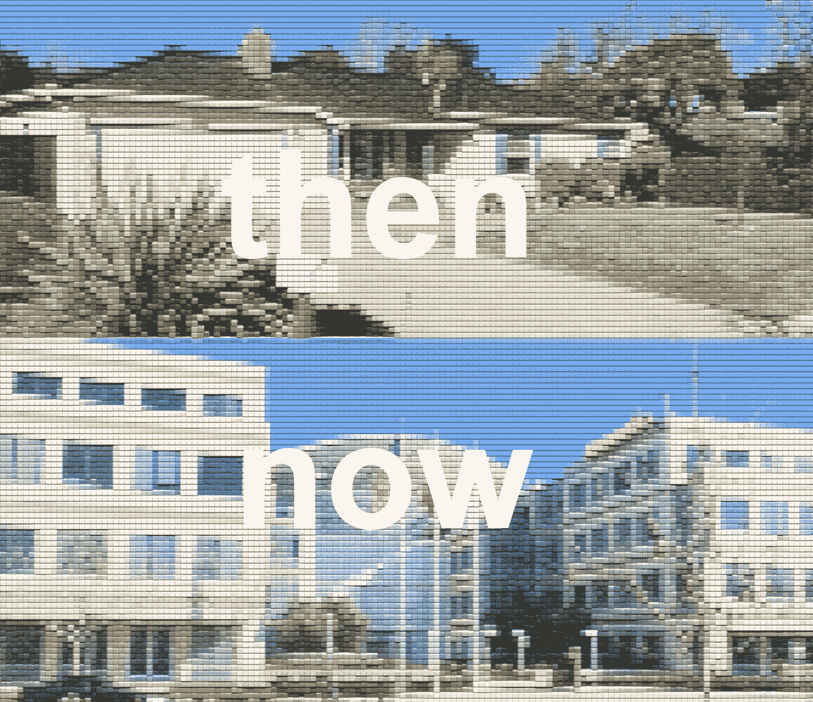

# 硅谷的历史——简要概述(下)

> 原文：<https://medium.com/swlh/the-history-of-silicon-valley-a-brief-summary-part-2-3-9c93f81be218>

这是我的硅谷历史系列的第二部分。如果你没看过 part 1，可以在这里**。**

## *开始第 2 部分*

## *威廉姆·肖克利和肖克利半导体实验室*

*从加州理工学院和麻省理工学院获得工程学位后，英国发明家[威廉姆·肖克利](https://en.wikipedia.org/wiki/William_Shockley) …*