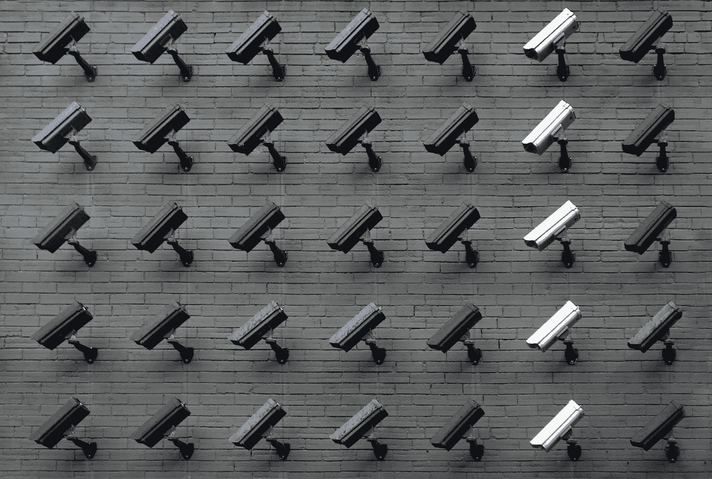

# “我没什么好隐瞒的”神话

> 原文：<https://medium.com/swlh/the-i-have-nothing-to-hide-myth-a4b3eb8d1231>

与我的汽车修理工的谈话不知何故把我们引向了在线隐私的话题:

> -我没什么好隐瞒的；我每天都很努力，没有违反任何法律！

Photo by [Lianhao Qu](https://unsplash.com/photos/LfaN1gswV5c?utm_source=unsplash&utm_medium=referral&utm_content=creditCopyText)

——他用比平时更大的声音说，显然是希望在权威人士确实在听的情况下赢得一些“额外加分”。这很有趣；但是说真的，你为什么要…