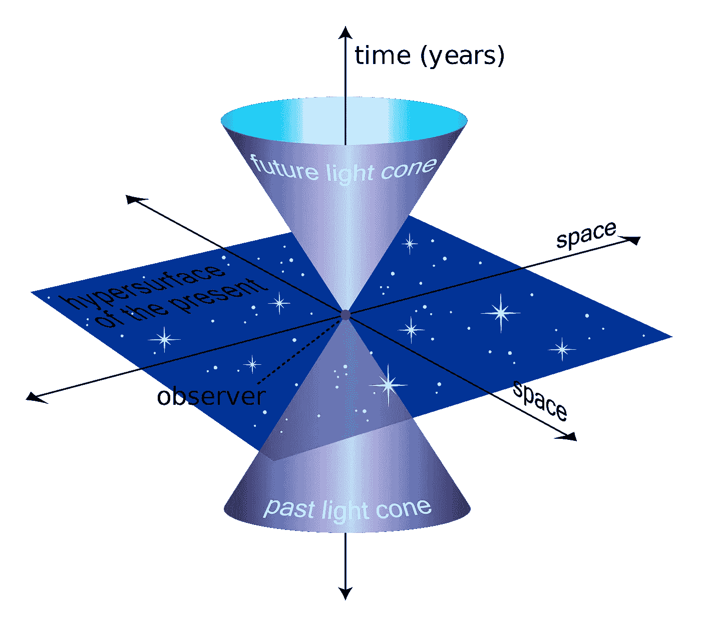

# 时间的幻觉

> 原文：<https://medium.com/swlh/the-illusion-of-time-b882bceaf470>

## 过去、现在和未来之间真的有区别吗？或者这一切都存在于头脑中？

Photo by [Aron Visuals](https://unsplash.com/photos/BXOXnQ26B7o?utm_source=unsplash&utm_medium=referral&utm_content=creditCopyText) on [Unsplash](https://unsplash.com/search/photos/time?utm_source=unsplash&utm_medium=referral&utm_content=creditCopyText)

## 这里讨论的观点表面上可能会挑战你的直觉，但是请原谅我，在整篇文章中暂停你的怀疑，去体验完全的沉浸。

作为一名大学生，我上过的最引人注目的课程之一叫做*爱因斯坦，空间和时间*。这种研讨会式的课程让我接触到了现代物理学中一些最反直觉的概念。也许，对我的理解挑战最大的想法是时间的流动可能是一种幻觉。当我看到爱因斯坦的一句话时，我几乎退缩了，这句话当时在我看来是块宇宙中最奇怪的暗示。

当你听到时间的时候，你经常会想到这个无形的概念向未来推进。随着月球围绕地球，地球围绕太阳的圆周运动，时间不断在我们控制之外流逝的想法几乎是不言而喻的。

我们用来测量时间的工具已经变得如此复杂，持续时间现在被如此精确地记录下来，以至于人们很难怀疑时间在不断前进的事实。然而，在我们的宇宙之外，时间的概念并不存在，因为时间与空间密不可分，没有一个可以离开另一个而存在。

## 时间不是现实的基本特征

但是时间真的是我们用来联系因果关系的箭头吗，或者它只是我们头脑中的一个主观过程？支持非基本时间概念的论点也坚持了这样的立场，即因果关系本身是我们的时间机构所固有的主观观点。

如果我告诉你，过去、现在和未来之间的区别仅仅是我们的大脑在捉弄我们，或者可能是我们的大脑试图对时间施加限制。从过去流向未来的时间概念在区块宇宙中根本不存在。

为了让目前公认的时间流概念存在，空间和时间必须是独立的基本结构。在这种情况下，事件可以被定位在空间的不同位置，我们可以说这些事情随着时间的推移而发生。但是根据狭义相对论，这种独立空间和时间的概念被抛弃，取而代之的是一个更加紧密的相互依赖的时空。

这种看似反直觉的 4 维结构的一个主要结果是，由于过去、现在和未来已经在块宇宙中被考虑在内，所以没有任何东西随着时间而改变。这个关于现实的四维概念以同样的意义强调了所有穿越时空的事件。在这个系统中，过去并不比未来的现在更重要。

这种观点有效地将时间作为指定物体在时空中的位置所需的坐标之一。根据这个新的框架，时空中的一个事件已经由时间和地点组成——时空的整个结构可以理解为无数事件的集合。简单来说，过去和未来都共存于时空之中。另一个经常被考虑的观点是，也许时空不是基本的，因此从一些较低的结构中出现。当然，这样的想法必须忽略块状宇宙的含意。

时间不流动——正如空间不流动——时间只是流动。想象一下，从加利福尼亚到佛罗里达旅行，你不会说佛罗里达不存在，因为你还没到那里。你知道佛罗里达是时空中的一个位置，不管你是否在那里。同样的想法也适用于过去和未来都存在的时间，不管你是否能接触到它们。所以未来不会发生，它已经在那里了。

## 科学表述

在物理学中，这个概念可以用闵可夫斯基时空图来理解。物理学家利用世界线，用时空中的一条线来表示空间中的一个点。这个想法利用圆锥体来简化可视化。这个时空上的当前事件显示为一个圆锥的底部，它是由一个圆(或三维空间中的球体)的半径收缩(以光速)而产生的。时空中这条特殊世界线的整个历史可以被翻译成空间中一个膨胀和收缩的三维横截面球体，从而产生一个四维光锥。这些事件被视为光与空间平面的交集。下图显示了与时间耦合的二维空间中的光锥。

[Light cone in 2D with time [Image credit: Biasis.ed]](http://www.basised.com/washington-dc/files/2018/02/Local-Light-Cone.png)

爱因斯坦本人在给他的老朋友米歇尔·贝索家人的一封信中，表达了他对过去、现在和未来之间区别的怀疑:

> 现在他比我早一点离开了这个陌生的世界。这毫无意义。像我们这样相信物理学的人知道，过去、现在和未来之间的区别只是一种顽固坚持的幻觉。

请注意，时间本身，不是这里讨论的问题，而是时间的流逝或流动。爱因斯坦对同时性的好奇，以及他对解决麦克斯韦光速不变和牛顿绝对时空不一致的追求，在很大程度上推动了相对论的产生。

然而，正如朱利安·巴伯在 Youtube 上对多产作家兼制片人罗伯特·劳伦斯·库恩的采访中提到的，爱因斯坦的宇宙概念在某种程度上缺乏对持续时间的明确定义。然而，爱因斯坦能够区分用于记录历史数据的时间和用于记录持续时间的时间。

他甚至利用并弄清楚了这两者之间的关系，正如加州理工学院的肖恩·卡罗尔教授在接受罗伯特·劳伦斯的采访时所提到的，题目是“时间是真实的吗？。这里的要点是，赫尔曼·闵可夫斯基如此娴熟地使用相对论框架构建的块宇宙表示，使得这种区分变得多余。换句话说，我们不需要时间的流动来理解现实。

## 误解

当前一个微妙的误解是，变化是时间的表现，但如果你真的想一想，推断时间可能是我们对变化的概念不也是一样合乎逻辑的吗？如果是这样的话，那么变化就是现实的有形发生而不是时间。但是，你可能会问，没有时间的流逝，怎么会有变化呢？这将是一个相关的问题。我们能够识别变化，是因为记忆中记录的关于过去的信息产生了时间流逝的想法。

到目前为止，我们所考虑的一切都是在相对论的范围内。当我们缩小到亚原子尺度时，你认为时间的本质是什么？

## 量子力学时间观

人们可以认为宇宙某些方面的量子化意味着量子水平上的离散时间。然而，并不是宇宙的每一个方面都像各种使用脉动激光束的实验所显示的那样被量子化了。因此，任何持续时间的希望要么存在于普朗克时间(10^-43 秒)的尺度，要么存在于量子力学和广义相对论在一个名为量子引力的理论中的融合。

据我们所知，也可能有平行的多重宇宙，其确定性波函数可以向前或向后演化，为时间箭头让路。尽管如此，由于没有令人信服的方法来获得这些多元宇宙存在的确切证据，这种解释仍然处于前台。

## 外卖食品

卡罗尔教授在采访结束时得出了一些有趣的结论——T2，我们最准确的现实模型，即量子力学，包含了时间的概念，因此它不是幻觉，也不是我们想象中的虚构物 T4。尽管我们对过去和未来的概念是不完整的，也就是说我们对时间还没有一个完整的理解，这一点变得非常清楚。

量子力学产生的时间箭头和相对论的块宇宙中没有时间箭头之间不一致的主要原因之一很可能是由于热力学第二定律。宇宙的总熵倾向于增加，这种无序可能是造成时间明显令人困惑的原因。

正如卡罗尔教授强调的那样，物理定律看不到过去和未来之间的区别。目前，我们可以接受微调保证，这个特殊宇宙的配置为时间之箭让路。很有可能，当我们最终在我们对宇宙的理解范围内解决当前的问题时，时间将是理解现实所需的剩余组成部分之一。

无论如何，如果时间消失了，我们仍然可以欣喜地知道，我们对物理学和整个宇宙的集体理解将会更加完善——因此，无论是哪种情况，人类都将获胜。

如果您喜欢这篇文章，请通过👏直到天塌下来。最多可以给 50👏

**关注我，这样你就可以在我每次发表文章的时候阅读我的作品。**

**但更重要的是，我们想知道:你能为这次时间流讨论贡献出什么见解？在回复部分分享你的观点。如果您有任何更正或改进建议，也可以联系我们。**

## 您可以使用下面的链接查看我们在 Medium 上最成功的文章之一。

 [## 意识的悖论

### 意识可以存在于生命之外吗？什么是有意识的？你有多清醒？

medium.com](/the-daily-echo/the-paradox-of-consciousness-bd185cd849ec) 

## 这篇文章发表在 [The Startup](https://medium.com/swlh) 上，这是 Medium 最大的创业刊物，拥有+413，678 名读者。

## 订阅接收[我们的头条新闻](http://growthsupply.com/the-startup-newsletter/)。

