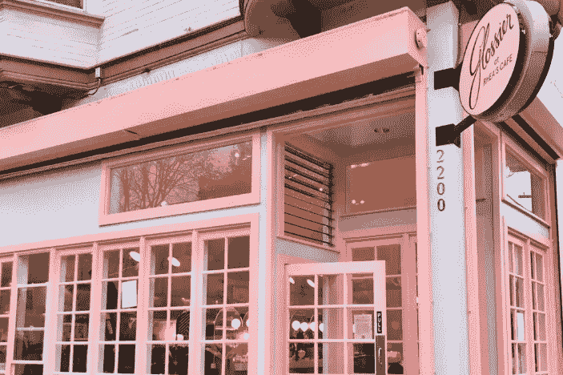

# 沉浸式零售体验阻碍了购买

> 原文：<https://medium.com/swlh/the-immersive-retail-experience-is-getting-in-the-way-of-the-purchase-e4a71a9afb32>

*此片原载于* [*格言 2019 年 6 月 11 日*](https://adage.com/article/opinion/opinion-immersive-retail-experience-getting-way-purchase/2177271)

前几天，我去了一家 Soho 商店。我的访问本打算很快结束，但却变成了一场磨难。我花了很长时间才找到一个合适的店员，仅次于取回我买的东西的时间。这在凯马特没有发生。这发生在苹果公司。