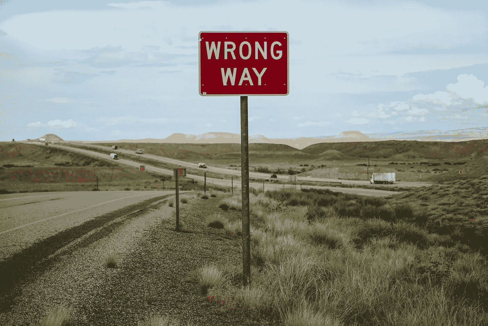

# 犯错的重要性

> 原文：<https://medium.com/swlh/the-importance-of-being-wrong-ae30adad5691>

Photo by [Free To Use Sounds](https://unsplash.com/photos/zXn-zUztOhU?utm_source=unsplash&utm_medium=referral&utm_content=creditCopyText) on [Unsplash](https://unsplash.com/search/photos/wrong-way?utm_source=unsplash&utm_medium=referral&utm_content=creditCopyText)

很容易陷入套路。任何套路，真的。我们是习惯的生物，我们养成的习惯在我们的生活中起着很大的作用。不管他们是好是坏，或者介于两者之间，我们都有自己做事的方式。我们自己的思考方式。

我们会和我们的伙伴、朋友、孩子、熟人、同事，甚至是我们经常接触的陌生人形成习惯。我们…