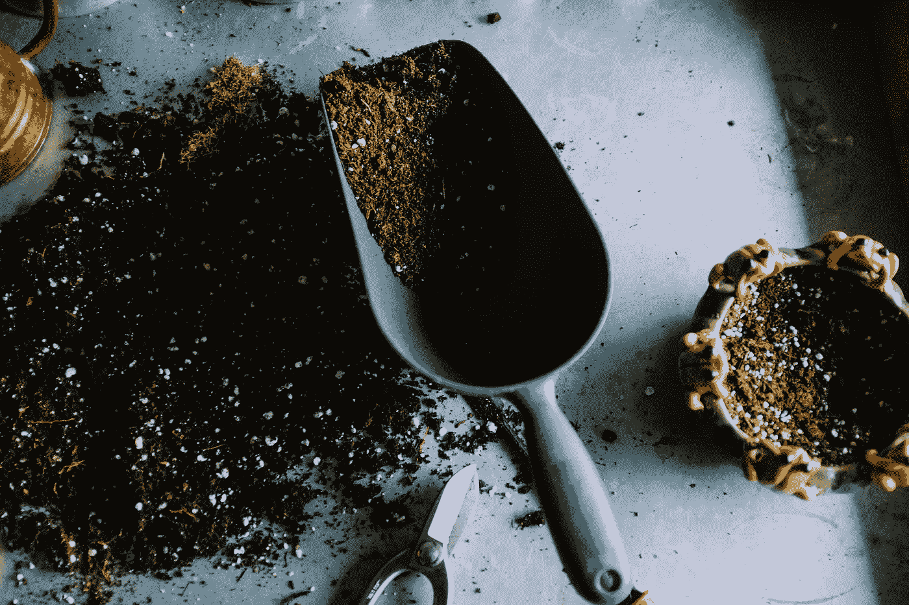

# 爱好或“严肃休闲”的重要性

> 原文：<https://medium.com/swlh/the-importance-of-hobbies-or-serious-leisure-3d30f83816a8>

Photo by [Neslihan Gunaydin](https://unsplash.com/photos/BduDcrySLKM?utm_source=unsplash&utm_medium=referral&utm_content=creditCopyText) on [Unsplash](https://unsplash.com/search/photos/gardening?utm_source=unsplash&utm_medium=referral&utm_content=creditCopyText)

每当有人问我空闲时间喜欢做什么，最诚实的回答是这样的，“你知道，通常，主要是看电视和看手机。”相反，我绞尽脑汁寻找任何有一点技巧或个性的东西。有一些独特的、积极的、有趣的消遣是很重要的。但是，除了让陌生人对我的生活印象更深刻之外…