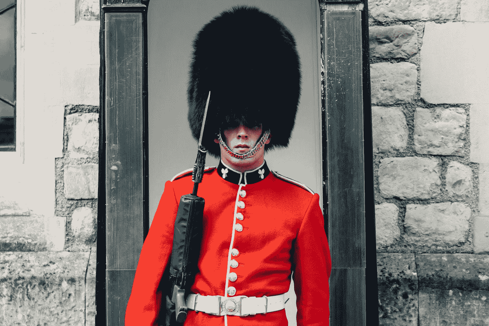

# 自律在领导中的重要性

> 原文：<https://medium.com/swlh/the-importance-of-self-discipline-in-leadership-1db653e997c9>

Original photo by [Aldo De La Paz](https://unsplash.com/photos/qTLyiHW1nIc?utm_source=unsplash&utm_medium=referral&utm_content=creditCopyText) on [Unsplash](https://unsplash.com/search/photos/royal-guard?utm_source=unsplash&utm_medium=referral&utm_content=creditCopyText)

纪律对于信仰来说是一个复杂的词。

今天早上，我 6:15 醒来，起床，写日记，冥想，去海边跑步，开始健身。

我为什么要这么做？毫无意义。

整个过程花了一个小时，结束时我感到很累。
好吧，我有点觉得精力充沛…