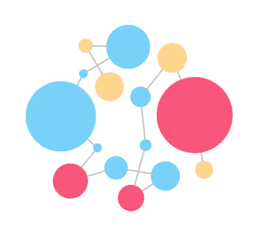
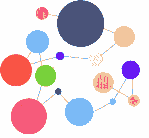
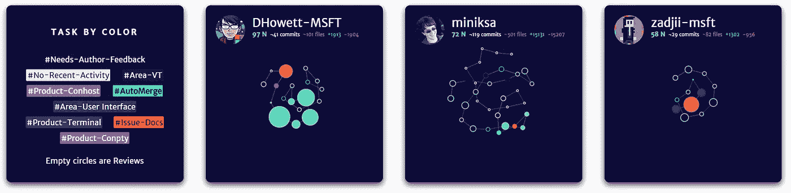
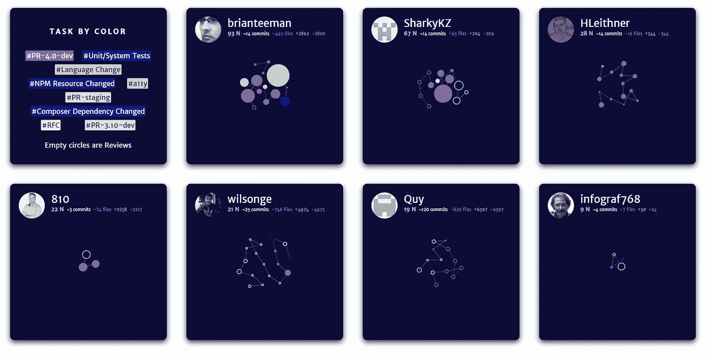
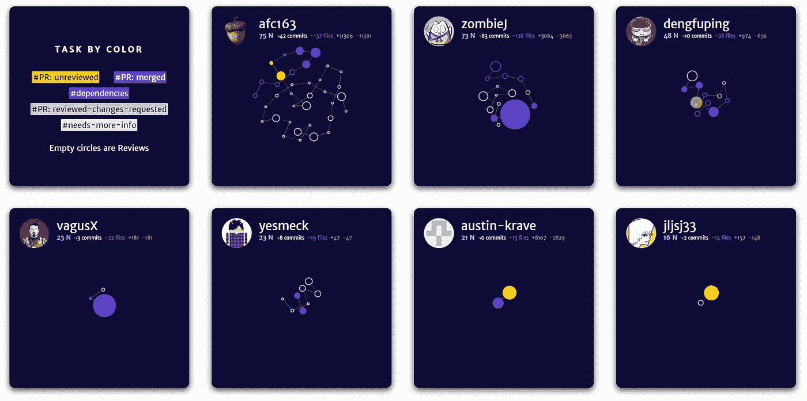

# 使用良好编码实践的重要性

> 原文：<https://medium.com/swlh/the-importance-of-using-good-coding-practices-343c5a91e570>

## 改进您的流程。

在代码开发中，就像在任何其他类型的工作中一样，组织工作、安排工作和区分任务的优先级非常重要，唯一的目的就是获得更好的结果。

虽然一套编程语言确实有几种不同的既定实践，但它们并没有在程序员和工程师之间通用化，以建立一系列准则并使流程遵循逻辑结构——至于手工流程*本身*。

通常情况下，工程团队只有在产品发布后才发现问题；主要是由于缺乏**同行评审**和在到达整个用户群之前缺乏测试资源等因素。

这时，好的实践出现了。虽然它们似乎被社会普遍接受和了解，但它们也确实是非正式的规则，很多人都知道，但很少有人遵守。这通常是初级开发人员与经验丰富的开发人员的区别。

> 许多问题的发生是由于在整个过程中没有遵循良好的实践:从假设一个项目到它的启动。

更重要的是，研究结果[什么能预测软件开发人员的生产力？来自谷歌团队的](https://ai.google/research/pubs/pub47853) (Emerson Murphy-Hill 等人，2019)指出，响应方差最高的因素之一恰恰是“使用最佳工具和实践”。

在 [**范围内**](https://scope.ink) 🔬，将良好实践定义为甚至在开始编写代码之前就要遵循的指导原则的建立。它们是在整个创作过程中必须遵循和使用的要求。

# 哪些是好的做法？

—

基于我们的经验和琐碎的知识，这里有一个推荐的良好实践的非排他性列表:

同行评审:评审系统是软件行业的基础。有时我们忽略了我们属于一个集体，作为一个个体，我们会犯一些错误，这些错误会影响到最终的产品，而简单的防读就可以避免这些错误。

其他时候，对队友的盲目信任会让我们比预想的更头疼。同行评审是确保产品正确和功能性的最简单和最有效的方法。在合并到 master 之前，至少要有一个代码所有者的批准。

在那个阶段，我们可以快速识别出可能会降低我们的产品、用户体验或技术债务的错误或问题，而只需要很少的成本。

**评论:**随时欢迎评论；它们是评审做得很好的信号，更重要的是帮助其他读者而不是作者看到隐藏在代码结构中的隐含信息。尽管它们并不总是必要的，但是有一个关于*如何做事情*的非正式文档是一个好方法，可以改进功能或者为不同种类的错误提供解决方案。

同行评审和评论是教会新员工做事方式的主要方式，也是相互学习的主要方式。好的建议是按主题(这将取决于您的组织做什么)标记您的 PRs，即*登录*、*购物车*、*结账* …这样开发人员可以通过这些标签导航您的存储库，并找到如何实现特定结果的公式。

[**拉式请求系统**](https://help.github.com/en/articles/about-pull-requests) **:** 如果我们同时分析和评论呢？pull-request (PR)系统是进行代码评审的完美方式，因为您是在警告您的团队，您已经对代码进行了更改或修改了某些内容，并且这些更改需要在合并之前进行评审。PRs 是可以遵循的最佳实践之一，因为它们强制使用了前两种实践。

标签:通常我们会忘记它们。在一个准时的时刻有一张便条会有很大的帮助。在这种情况下，标签就像是我们添加到文件中的便利贴，我们用它来识别文件。它们简化了工作流程，有助于识别每个功能、错误修复或增强，从而简化流程。此外，正如之前在*注释*部分所述，标签是索引非正式文档的好方法，我们的回购实际上就是这样。

# 使用良好实践的好处

—

改进工作流程:通过使用良好的实践，流程大大简化，降低了时间和金钱成本。团队之间可以更好地沟通，他们了解其他人在做什么，并根据项目的需求对目标进行优先排序。

**效率和生产力的显著提高:**如果指南被所有人接受，从逻辑上讲，流程的工作流和敏捷性将会提高，开发人员和整个团队的效率和生产力也会提高。

**降低成本:**更高的生产率、更高的效率、动态流程→保证时间和金钱。

通过标签和拉式请求系统，开发人员可以对一个项目中正在进行的所有过程有一个广阔的视野。

**更低的风险，更高的安全性:**我们使用评审来确保代码在部署前构建良好。有了这个，我们在面对 bug 时显著降低了风险水平。投入评审的时间是通过避免面对问题而获得的。更高的稳定性和性能也是一个结果。

**无层级组织:**标签对于更好地组织工作非常有用。我们努力寻找能帮助我们组织工作的工具，比如特雷罗、吉拉或其他工具。通过使用标签，我们有了另一种方式来访问我们的目录和文件，直接链接到我们的任务和功能，而不是任意的层次结构。

# 一些有范围的例子🔬

—

在[的**范围内**的](https://scope.ink)🔬，我们希望大力鼓励使用良好的实践。这是一种强烈的价值观，也是我们创业的精髓。我们的一个名为“按颜色切换”的可视化工具向我们展示了一个基于开发人员在标签功能中所做工作的图形。

让我向您展示一些使用标签的公共存储库的例子！

***微软/终端*** *知识库*

***Joomla/Joomla-CMS****资源库*

***蚂蚁设计/蚂蚁设计*** *知识库*

> 请随意自行分析存储库，向我们索取 Scope 的[演示🔬](https://scope.ink/demo)

# …

这篇文章并不假装说教，而是基于我自己的经验和学习的反思。希望这对你有用！

在推特上找到我🐦