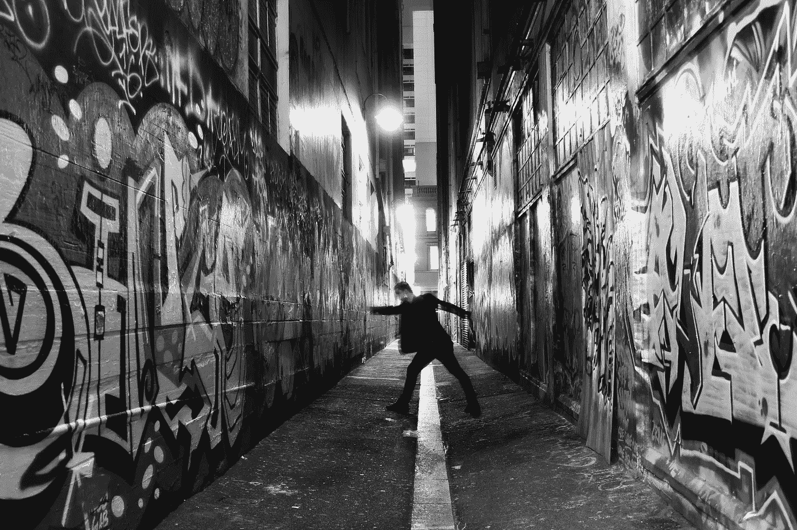
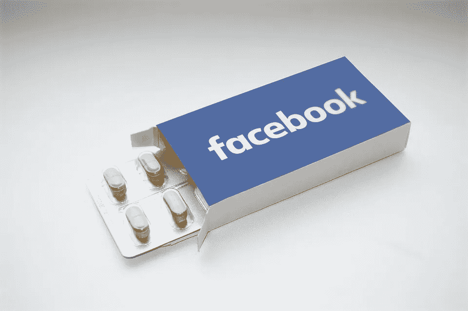

# 成瘾的不方便疗法

> 原文：<https://medium.com/swlh/the-inconvenient-cure-for-addiction-f83efb434062>

21 世纪可能仍然年轻，但它已经赢得了相当的声誉。

科技时代。科学一代。橙色自大狂处于不受约束的政治权力地位的时代。

但最重要的是，有一个特征似乎是现代生活最突出的特征。

**方便**。

在网飞/网购/优步吃的时代，我们的每一个胃口都可以用手指轻轻一点来满足。在一个屏幕上，这个屏幕恰好就在手边，或者至少近在咫尺。

徒步走到当地音像店挑选电影的日子已经一去不复返了。为午餐或晚餐做准备的必要性不复存在了。如果我们希望的话，离开房子或者再次遇见另一个人的需要已经消失了。

对于那些有广场恐惧症倾向的人来说，这是一个特别的胜利，但对于那些有点懒惰或有点忙碌的人来说也是如此(阅读:大多数人类目前居住在地球上)。

当代从努力到方便的转变意味着我们可以节约宝贵的(越来越有限的)时间和精力，并将它们用于生活中其他更重要的方面。比如看着陌生人在 YouTube 上拆箱杂品。或者浏览易趣为我们的猫的下一个万圣节服装。

当然，这个世界上没有免费的东西。就像几乎所有好得令人难以置信的事情一样，便利隐藏着一种隐性成本。

上瘾。

当东西很容易得到时，我们不仅会无意识地消费它们，而且会比平时多得多。

快餐。电话铃响了。看电影时放在触手可及的地方的美味咸点心。

毫无疑问，获取的便利鼓励我们自动地吸收。

但也许更令人担忧的是，它也超越了我们对消费做出有意识选择的需要。因此，我们很多人都很难理解——甚至思考——我们到底有多着迷。

但是，尽管我们可能对我们的依赖一无所知，但事实是，我们大多数人都极度沉迷于某些东西。通常**许多**某事。而且几乎都是比较方便取用的。

走廊尽头自动售货机里的罐装可乐。查看电子邮件和信息，这些邮件和信息可以在我们的任何设备上随处查看。直接送到我们家门口的晚餐。基于屏幕的被动娱乐。看到我们的帖子和图片在脸书或 Instagram 上被“赞”。

所以现在你已经意识到你是一个超级瘾君子(就像我们其他人一样)，让我们谈谈戒毒吧。

我们知道便利支撑并延续了我们如此多的渴望。因此，从逻辑上来说，**的不便**可能就是挣脱束缚的关键。

我与不健康的脸书上瘾症斗争了多年，最终决定从我的手机上彻底删除这个应用程序。它非常有效。没有现成的方法来不断检查它，我变得越来越对我的新闻提要和通知漠不关心。

在短短的几周内，浏览脸书从一种迫切的冲动变成了一种我可以选择或离开的东西。我被治愈了。

直到有一天，我意识到我可以通过手机的网络浏览器访问脸书。我登录了，做了我在脸书做的事情，懒得注销。从那一刻起，一个快速点击重新打开浏览器备份，脸书已经准备就绪，等待着。

不用说，我退步了，故态复萌了，并意识到要重新从众需要更激烈的措施。

所以我把我的脸书密码改成了一个麻烦又不容易记住的东西，然后注销了。

下一次社交媒体的警笛之歌打来的时候，简直太难想出怎么回去了，瞧！我病情好转了。

不便作为成瘾的解药的力量是不可否认的。这不仅仅适用于我。

我的一个朋友迷上了糖，他把所有的糖都锁在一个特殊的橱柜里，用锁和链子锁起来，需要很多密码和钥匙才能打开。

另一个人选择把她的电视遥控器放在房子远处的一个房间里，以抵消每当她的屁股接触到沙发时就打开电视的自动反射。

在一个便利的时代，我们大多数人都不会因为主动给自己制造不必要的麻烦而感到兴奋。但是当便利成为让我们上瘾的不健康习惯的罪魁祸首时，就必须做出一些让步。

当然——这似乎有悖直觉。但也许是敞开的大门把我们锁在了里面。

为了挣脱束缚，我们需要障碍和封锁。

在 https://flitmusings.wordpress.com/*阅读更多莎伦·弗立特曼的帖子*