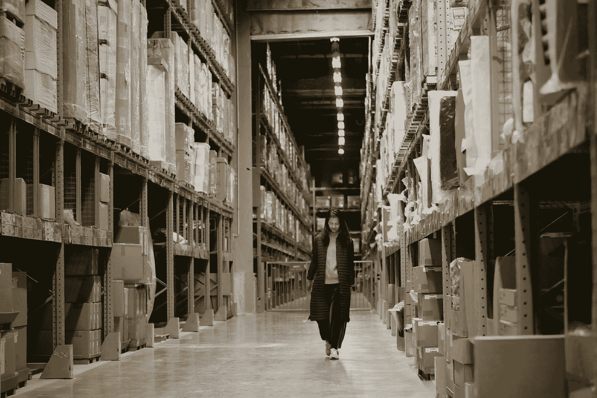
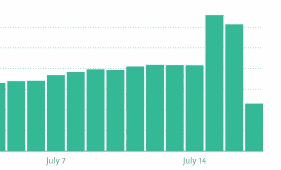

# 黄金日不可避免的到来

> 原文：<https://medium.com/swlh/the-inescapable-reach-of-prime-day-4e179b904e57>

## 我什么都没买，但还是无意中帮了亚马逊一把

Photo by [Bryan Angelo](https://unsplash.com/@bryanangelo?utm_source=medium&utm_medium=referral) on [Unsplash](https://unsplash.com?utm_source=medium&utm_medium=referral)

mazon Prime Day 是本周的前两天，这个声明没有任何意义。但是我们在这里。

根据你旅行的圈子，这要么是一个很好的一天，在一些你想要的东西和许多你不想要的东西上获得一些交易，要么是一个支持亚马逊仓库工人在几个关键地点罢工的机会。

**做第二件事并不像看起来那么容易。**

Photo by [Sikai Gu](https://unsplash.com/@gentle_kay?utm_source=medium&utm_medium=referral) on [Unsplash](https://unsplash.com?utm_source=medium&utm_medium=referral)

我决定在今年的 Prime Day 暂停购物，一方面是因为我认为亚马逊仓库工人拥有某种形式的工会代表权可能是个好主意，另一方面*也*因为我真的不需要任何东西。

仅仅因为便宜就买打折的东西是一条不归路。

真正避免亚马逊在他们的大销售日不仅仅是**不买任何东西。为仓库工人而战的人们还要求人们避免使用亚马逊拥有的网站，如互联网电影数据库和 Twitch，并停止使用他们的流媒体服务。**

然而…

远离亚马逊的卷须甚至没有那么简单，你们中最有意识的人可能已经尝试过离开互联网一整天了。

Photo by [Pero Kalimero](https://unsplash.com/@pericakalimerica?utm_source=medium&utm_medium=referral) on [Unsplash](https://unsplash.com?utm_source=medium&utm_medium=referral)

**你日常使用的许多网站都依赖亚马逊的 AWS 云系统运行**，有人估计[它们的市场份额高达 40%。](https://www.theverge.com/2018/7/28/17622792/plugin-use-the-internet-without-the-amazon-cloud)

使用 AWS 驱动的网站从技术上来说意味着你在支持亚马逊。

我个人对此没意见，因为这就是我们生活的世界，我愿意划出自己的底线，不买任何东西，而不是不使用几乎一半的互联网。

但是如果你想一直走下去，你必须避开他们的云。

我完全不怪公司用 AWS。事实上，大多数大型网站都需要某种基于云的后端基础设施来满足现代用户的流量和功能需求。无论好坏，AWS 都是最好的供应商之一。

对我来说更奇怪的事情是看着我的中等数字得到戏剧性的提升。

Those two bigger bars are Prime Day. They should change the name to Prime Days.

在每个“零售假日”前后，我都会看到旧耳机评论上的数字飙升。“黄金日”没有什么不同，只是这次的颠簸比以往要大得多。

通常我的旧评论读者会增加 33 %,但这次我的数字几乎翻了一倍。

我想人们真的很想了解正在打折的耳机。

就这样，我无意中帮助了很多人在亚马逊上买东西，而我自己却没有在亚马逊上买东西。与我自己的购买不足相比，我对亚马逊数字的净积极推动可能是巨大的。

我不是最积极的人，所以我不会对这些结果感到沮丧，我也不会坐在这里对我的读者买东西大喊大叫。

做让你开心的事！

但是*是*一个有趣的教训，告诉我们现在我们是如何相互联系的，以及我们简单的决定有多深远。

Photo by [Icons8 team](https://unsplash.com/@icons8?utm_source=medium&utm_medium=referral) on [Unsplash](https://unsplash.com?utm_source=medium&utm_medium=referral)

只是在网上发表了一些关于耳机的想法，帮了亚马逊一把。但是我*也*帮助了一些只想买耳机的人。

这还是净积极的吗？

这个世界很复杂，有时候站在意识形态的立场上也是好的。但是如果不充分考虑我们决策的范围，它们就不可能完全有效。如果你个人对亚马逊不满意，也许更直接的行动会更合适，而不是试图逃离一半的互联网。

在资本主义世界里，最有效的直接行动是什么？**花钱。**

如果需要行动，*行动。在当地零售商和非亚马逊服务上花钱。记住，你不需要靠自己去改变世界。*