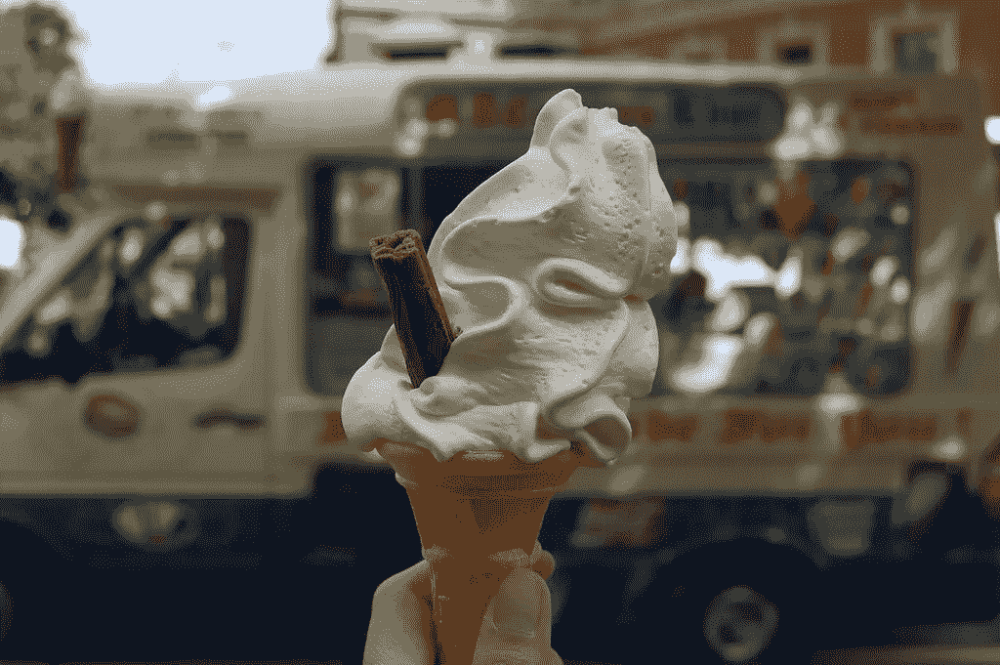
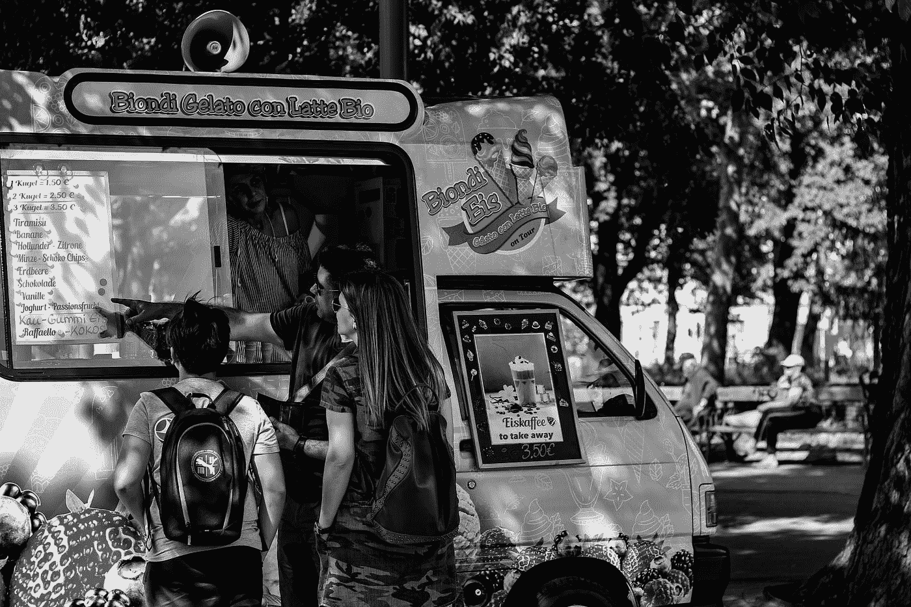
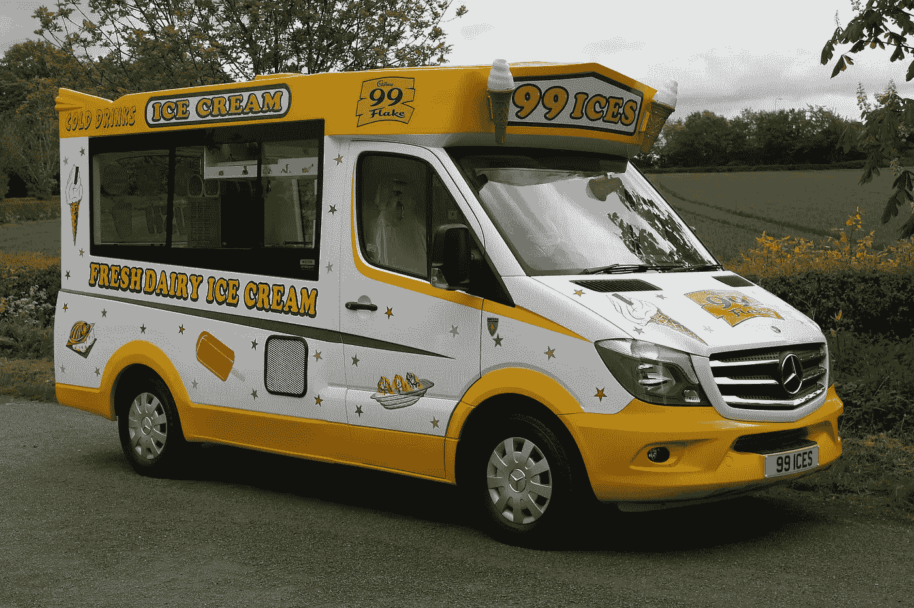

# 冰淇淋车叮当作响的欢乐声音

> 原文：<https://medium.com/swlh/the-ingenuity-of-the-ice-cream-van-jingle-8e53e27276e7>

## 音乐(和冰淇淋)激发怀旧情绪的力量

我在工作。坐在我的办公桌前，敲着一些(当然是非常重要的)电子邮件、电子表格或文件。很安静。然后，熟悉的冰淇淋车叮当声划破空气。

“冰淇淋！”

一瞬间我就不在座位上了。我 7 岁了，现在是 7 月中旬，那个短暂的英国夏天。暑假就在我面前展开，漫长而无忧无虑的日子，和住在我那条街上的朋友一起出去玩。

我们听到冰淇淋车叮当作响，我们就冲到离我们最近的人家，向他们的父母讨钱买冰淇淋。我们每人有 1 英镑。我的头脑在飞速运转，决定我应该买哪种冰淇淋。经典的 99 薄片？灯笼裤的荣耀？一个苹果酒棒棒糖作为反叛的额外刺激？

我选了一个怪人，我最喜欢的一个:冰激凌底部的泡泡糖意味着冰激凌车的快乐可以持续更久一点。当然，我会在上面放覆盆子酱和冰冻果子露。

但是我们花了太长时间才拿到钱。冰淇淋车已经开到下一条街了。我们再次冲刺——我们能在货车再次离开前赶到吗？我们当然知道他的路线。卖冰淇淋的文尼是当地社区的一个机构。我们及时赶到那里，下订单，然后去操场荡秋千享受奖励。

这是一个完美的夏日。

冰淇淋车叮当声瞬间怀旧。不被带回到那个地方，那个夏天的一天，就听不到了。作为一种广告技巧，它是天才。那么它是如何工作的呢？

# 冰淇淋车叮当声的由来

Photo by [Joanna Kosinska](https://unsplash.com/@joannakosinska?utm_source=medium&utm_medium=referral) on [Unsplash](https://unsplash.com?utm_source=medium&utm_medium=referral)

冰淇淋车叮当声始于一套铃铛，附在早期的冰淇淋车上。来自俄亥俄州的糖果制造商哈里·伯特被公认为是第一个给自己的冰淇淋车加上叮当声的商人，他在自己的卡车上挂上铃铛，以此来宣告他在所经过的街区的存在。

很明显它们起作用了，因为他随后将这些铃铛添加到了他车队中的另外 12 辆冰激凌车上。

到 20 世纪 50 年代，这些铃铛变成了一个机械音乐盒，这是大多数冰淇淋车的一个特点。电气工程师鲍勃·尼科尔斯甚至把冰淇淋车叮当声当成了生意和生计。他专门为冰淇淋车制造音乐盒，有一套广告歌供供应商选择。

# 为什么冰激凌车叮当响

Photo by [Guillaume Gryn_DVS](https://unsplash.com/@guillaume_gryn_dvs?utm_source=medium&utm_medium=referral) on [Unsplash](https://unsplash.com?utm_source=medium&utm_medium=referral)

冰淇淋车叮当声主要以两种方式工作。很有特色，令人难以置信的怀旧。

音乐已经被证明可以提高记忆力。这就是为什么广告歌，或者是随着音乐的口号，在市场营销和广告中如此普遍。打开收音机，你的脑海中一定会出现某个保险公司的广告歌曲。《今夜鸡》杂志进行的研究发现，平均要花 17 分钟才能把一首曲子从脑海中抹去。甚至有一个词专门用来形容这个:耳朵虫。

麦当劳有“我爱它”。Vimto 有 V-I-M-T-O。当听到有人提到他们的 Go Compare 购买时，不可能不立即在脑海中爆发出歌声。

它们朗朗上口，短小精悍，令人难忘。它们会印在你的脑海里，这使得它们成为推广品牌或产品的绝佳技巧。你听到冰淇淋车叮当作响，即使冰淇淋是你最想不到的东西，现在你也想要那 99 片。

另外，它让你微笑——这是怀旧因素。

> “冰邦，冰邦。惠普比先生打电话来了，而我们这些穿着短裤，被蛇缠着皮带，膝盖脏兮兮，流着鼻涕的人，想要他的东西。我们想要一个 99，上帝，我们多么想要它。”
> 
> —西蒙·沙玛，作家和历史学家

研究表明，嗅觉和触觉特别善于唤起怀旧情绪，音乐和天气紧随其后。一首歌或一段音乐提醒我们特定的时间或记忆是很常见的。我们带着玫瑰色的眼镜深情地回首往事。

这种对过去的喜爱是营销者和广告商长期以来用来销售产品的东西。

就冰淇淋车而言，顺口溜带来了对童年夏天和阳光灿烂日子的怀念。这让我们想起了我们成长的地方，冰淇淋车是当地社区的一部分。

# 叮当万岁

令我惊讶的是，我们在 1982 年发现，实际上有一个关于冰激凌车噪音的行为准则来限制这些叮当声。最初，它将冰淇淋车的叮当声限制在每三分钟四秒钟，而不是在晚上 7 点以后。

2013 年，行业规范有所放松，这意味着冰淇淋车可以一次播放 12 秒的广告歌，每两分钟播放一次。

作为一个行业，冰淇淋车正在衰落。20 世纪 60 年代，英国有超过 3 万辆货车。今天，估计只剩下 2500 到 5000 辆面包车。这主要被认为是由于更便宜的超市冰淇淋的兴起。

但是行为准则的放宽表明，即使今天的冰淇淋车少了，我们仍然重视那句顺口溜。在我们今天生活的快节奏的世界里，保存对过去夏天的集体记忆和怀念似乎很重要。