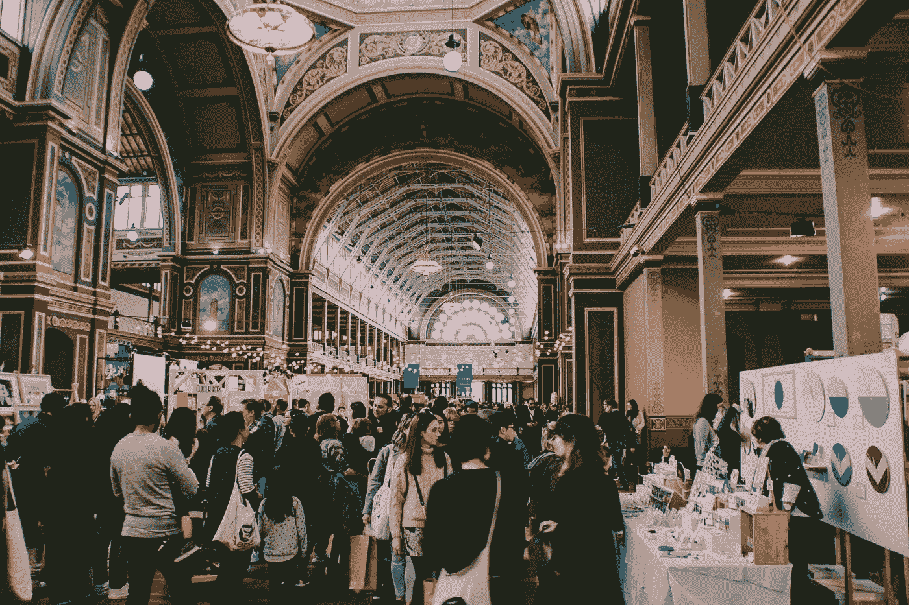
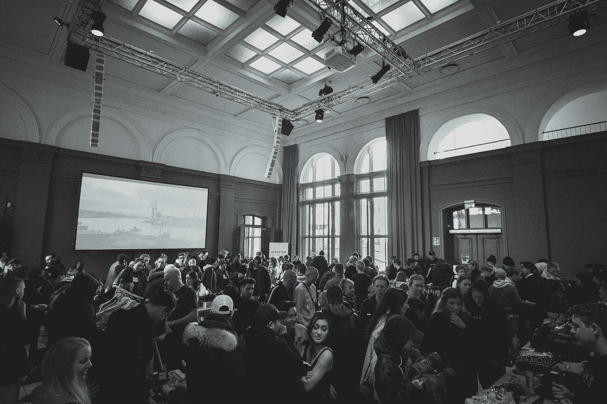
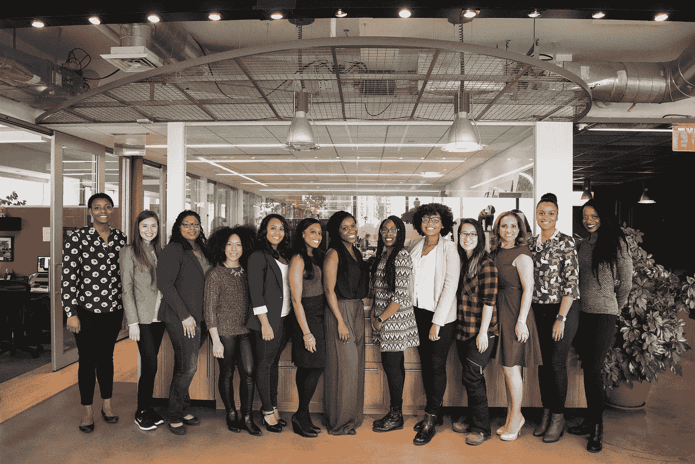

# 内向者在会议和行业活动中生存指南

> 原文：<https://medium.com/swlh/the-introverts-guide-to-industry-events-conferences-1eab9fad297c>

我是一个友好的人。我经常微笑，和饮水机旁的人聊天，和电梯里的人讨论天气。与密友的小聚会是我最喜欢的。

但是把我放在一个超过 5 个人的社交聚会中，我会开始表现得像一个社交麻风病人，希望我可以选择在用棍子刺出我的眼睛的同时走过热煤，而不是在试图与满屋子的陌生人社交时遭受痛苦。

在设计行业会议上，我的解决方案曾经是抓起一杯伏特加，躲在角落里快速喝掉。我想一旦我喝了一杯酒，我就可以从我的列表中取消“在活动中与他人交往”并退出现场。

作为一名设计师，这是有问题的，因为我喜欢和其他设计师交流，听听他们在做什么。

但几年前，我参加了一个会议小组会议，从活动网络的角度来看，它改变了我的一切。我想和大家分享我学到的一些小窍门，这些小窍门从那以后对我特别有效——没有一个是和伏特加有关的。

# 在人群中寻找你自己

小组成员建议你环顾房间，找一个看起来和你一样不舒服的人，去和他们说话。

一位与会者举手问道，“但是如果那个人不想说话，他们认为我接近他们是个怪人怎么办？”

专家的回答是:

“这样想吧。可能会发生以下四种情况之一:

1.  这个人也是一个内向的人，会因为有人倾诉而感到宽慰和感激
2.  这个人不是一个内向的人，但仍然会聊天，并成为一个新的专业联系
3.  这个人需要离开现场，并请求原谅
4.  这个人会令人讨厌和粗鲁

如果第四条发生，*谁在乎*？你不了解这个人。你可能再也不用和他们说话了。你没什么可失去的。"

从那以后，我在参加的每一次社交活动中都采用了这个建议，它总是非常有效。我甚至有几个人感谢我救了他们！

# 在现实生活中使用你的社交网络进行联系

在 LinkedIn 和 [Twitter](https://www.twitter.com/invisionapp) 上发布最新消息，询问是否有人参加活动，如果有人，询问他们是否愿意一起喝杯咖啡/吃点东西/在休会期间击掌庆祝。人们非常容易接受这种方法。

在公共场所见面，很明显，以防这个人白天是设计师/晚上是连环杀手。

在我参加的最近两次会议上，我这样做了，得到了很大的反响。我遇到了几位设计师，他们一直保持着联系。

Image Courtesy of [WOCInTech Chat](https://www.flickr.com/photos/wocintechchat/25168440514/in/album-72157665958495865/)

# 不要把自己逼得太紧，否则你会精疲力尽，享受不到活动的乐趣

需要休息的时候就休息一下。当你参加一个会议时，你没有理由把醒着的每一秒钟都花在社交上。偶尔跳过一节课，去酒店房间休息一下，给你的社交电池充电也没关系。

# 作为一个内向的人不应该阻止你展示自己

我花了好几年才冒险在一个会议上展示。

为什么我最终选择了它？一个朋友告诉我，当我有可能对他人的工作产生积极影响时，把我所有的经历都藏在心里对[社区](https://www.invisionapp.com/inside-design/biggest-problem-in-design-industry//)是不公平的。那一推(或内疚之旅，无论你想怎么看)是让我从笔记本电脑后面走出来的催化剂。

我还是会很紧张，需要在演讲后休息一个小时。事实上，在一个特别长的会议后，我抓起我的午餐和 legit 去藏在我的车爆炸一些音乐和减压。

尽管我在演讲后感到筋疲力尽，但我已经开始喜欢在活动中演讲了。有人在会议结束后走过来说，他们迫不及待地想采用我介绍的[研究](https://www.invisionapp.com/inside-design/keeping-ux-research-lean/)方法，或者告诉我，他们相信我描述的内部流程也将改善他们的跨部门关系，这一切都是值得的。

我想说的是:当涉及到事件时，不要因为你是一个内向的人就把你自己排除在外。

你所知道的事情真的可以帮助这个行业的其他人。

这是我给你的和我朋友给我的一样的压力/内疚之旅。开会吧。

> 原载于[《内部设计》2016 年 5 月 26 日](https://www.invisionapp.com/inside-design/surviving-design-industry-events/)