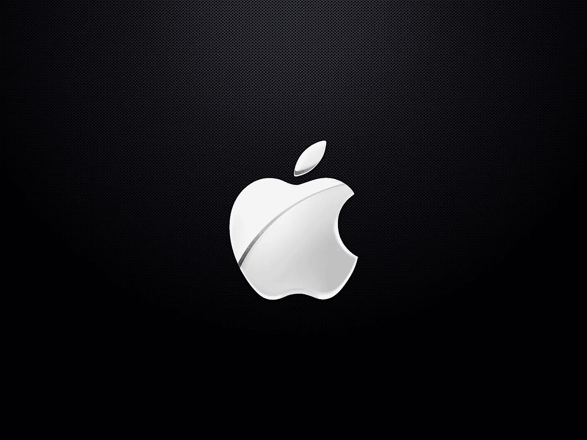

# 苹果生态系统不可抗拒的诱惑

> 原文：<https://medium.com/swlh/the-irresistible-lure-of-the-apple-ecosystem-81bf8d66294a>

很明显，苹果是西方世界许多消费者的首选品牌。在英国，每月活跃的智能手机用户数量预计到今年年底将超过 5000 万，其中[几乎一半的设备是 iphone](http://gs.statcounter.com/vendor-market-share/mobile/united-kingdom)。这明显高于第二大最受欢迎品牌三星的 29%。