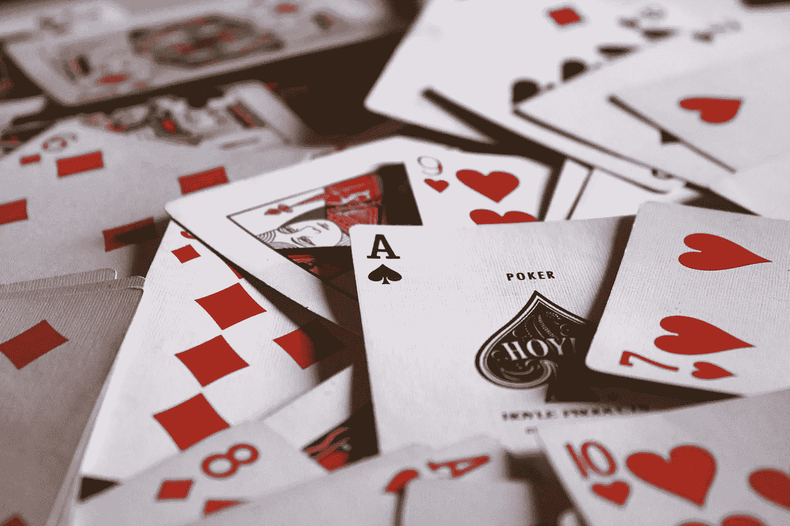

# Javascript 洗牌

> 原文：<https://medium.com/swlh/the-javascript-shuffle-62660df19a5d>



Photo by [Jack Hamilton](https://unsplash.com/photos/9SewS6lowEU?utm_source=unsplash&utm_medium=referral&utm_content=creditCopyText) on [Unsplash](https://unsplash.com/search/photos/playing-cards?utm_source=unsplash&utm_medium=referral&utm_content=creditCopyText)

我总是对纸牌游戏着迷，尤其是那些需要技巧而不是运气的游戏。我把这种对纸牌游戏的热爱传递给了我的孩子们，并教给他们许多流行的标准，包括金拉米(涉及一个小丑)和二十一点的修改版本。我们玩过战争、钓鱼、疯狂 8 和红心大战，但扑克是我最喜欢的游戏，尤其是无限注德州扑克。我参加过许多扑克锦标赛，在许多赌场和家庭游戏中玩到凌晨。

那些游戏有什么共同点？在发牌之前，应该先洗牌。几十年前我开始职业生涯时，我开发的第一个模拟纸牌游戏是 21 点。它是用 BASIC 编写的，我可能已经用多种语言重写了十几次:Java、C#、C、汇编、PHP、Perl、Python、Shell 脚本，甚至用 FileMaker。最具挑战性的版本是在科学惠普计算器上。

我现在最喜欢的编程语言是 Javascript，使用服务器端 Node.js 和客户端 Vue.js，实现 VENoM 这样的技术栈，去掉了其他栈固有的上下文切换；通过利用整个 Javascript 生态系统来减少语言碎片。

使用 Javascript，有许多方法可以模拟一副洗牌的纸牌。所以让我们来看看代码。

## 甲板

首先，我们需要一副牌。一副牌最简化的版本只是一个从 0 到 51 的简单数组，代表一套标准扑克牌中的 52 张牌。为此，我们需要一行代码:

```
let deck = Array.from(new Array(52), (x, i) => i);
```

牌组结构的真实模式将包括实际的花色(梅花、方块、红心、黑桃)和等级(2、3、4、5、6、7、8、9、T、J. Q、K、A)，但现在，我们将保持简单。

## 不洗牌

洗牌的最少用途是不洗牌。你说不洗牌是什么意思？洗牌不就是这篇文章的主旨吗？这取决于你的程序如何使用这副牌。如果你正在发牌，也许不需要洗牌。这是计算机模拟。你可以从有序的牌组中随机抽取牌，并以这种方式发牌。在现实生活中，如果你从牌堆中间抽牌，你至少会引起其他玩家滑稽的表情，更糟的是，可能会被痛打一顿。下面是一个如何在未洗牌的情况下发牌的例子:

```
hand.push(deck.splice(Math.floor(Math.random() * deck.length), 1)[0]);
```

使用 *Array.splice()* 有双重目的:1)通过移除元素直接影响数组，2)将元素返回给调用者。这条线将包含在一个循环中，该循环将遍历所有玩家，并根据游戏规则向每个玩家分发 N 张牌。同样的代码也可以用于洗牌。示例交易函数如下所示:

```
function deal(deck, players, numCards) {
  players.forEach(player => {
    while(player.hand.length !== numCards) {
      player.hand.push(deck.splice(Math.floor(Math.random() * deck.length), 1)[0]);
    }
  });
}
```

为简单起见，deal 函数不包含错误处理代码。它不能确保是否剩余足够的牌来完成对玩家的全部分发。因为这是从一副未洗牌的牌中发牌，所以如果发牌的顺序忽略了典型的循环模式，也没有关系。该循环将一次向每个玩家分发正确数量的牌。

现在开始洗牌。

## 天真的洗牌

让我们从我认为的“幼稚”洗牌开始。下面的代码代表了大多数程序员都会发现的洗牌算法的第一个初始版本。该机制将切换两张随机牌的值:

```
function naiveShuffle(deck) {
  let randomCardA;
  let randomCardB;
  let tempX;
  for (let index = 0; index < deck.length; index += 1) {
    randomCardA = Math.floor(Math.random() * deck.length);
    randomCardB = Math.floor(Math.random() * deck.length);
    tempX = deck[randomCardA];
    deck[randomCardA] = deck[randomCardB];
    deck[randomCardB] = tempX;
  }
}
```

这段代码有一个重大缺陷。你能发现它吗？因为不能保证两个随机数会不同，所以有可能一张卡与自己交换，而一些卡永远不会被交换。让我们通过在这副牌中的每张牌上强制交换并消除生成两个随机数的需要来改进此代码:

```
function altNaiveShuffle(deck) {
  let randomCard;
  let tempX;
  for (let index = deck.length - 1; index > -1 ; index -= 1) {
    randomCard = Math.floor(Math.random() * deck.length);
    tempX = deck[index];
    deck[index] = deck[randomCard];
    deck[randomCard] = tempX;
  }
}
```

这个替代方案更好，代码更少，但是不能保证 ***randomCard*** 的位置不等于索引。我们可以做一个小的改动来匹配修复这个问题的算法。

## 费希尔-耶茨洗牌

上面函数中的一行代码变化将使其实现 [*Fisher-Yates*](https://en.wikipedia.org/wiki/Fisher%E2%80%93Yates_shuffle) 算法。这个改变会随机选择没有迭代过的牌，避免了一张牌跟自己交换的可能。

```
randomCard = Math.floor(Math.random() * index);
```

由于 Math.floor 的机制，可供选择的随机牌池将比当前索引少一张。换句话说，它的目标是符合交换条件的剩余牌集。

## 价值与位置

上面的代码非常好用。它是高性能的和最佳的。但是有一个方面让我很困扰。不是移动每张卡片的位置，而是交换数值。在现实世界的娱乐中，它相当于这样:

```
1\. Remember the value of the card in position A
2\. Draw over the card in position A with a value from position B
3\. Draw over the card in position B with the remembered value
4\. Repeat this process for the duration of the shuffle
```

对我来说它似乎有点脏。通过改变牌的面值来洗牌，就像移动魔方的标签来解决一样。让我们使用前一节中的一点代码，按照位置而不是数值来洗牌，使用 *Array.splice()* ，但是遵循 Fisher-Yates 算法:

```
function spliceShuffle(deck) {
  let count = deck.length;
  let tempX;
  while(count) {
    tempX = deck.splice(Math.floor(Math.random() * count), 1);
    deck.splice(count, 0, tempX[0]);
    count -= 1;
  }
}
```

这种解决方案感觉更干净。但是等等，现在有两个拼接操作。这还能改进吗？是的，让我们试试不同的机制。

## 堆栈洗牌

我一直在寻求改进我的编码，包括重构，以减小尺寸或优化性能。通过使用内置于数组模型中的本机原型函数，如 *Array.push()* 和一些实验，可以进一步减少 shuffle 函数:

```
function stackShuffle(deck) {
  let count = deck.length;
  while(count) {
    deck.push(deck.splice(Math.floor(Math.random() * count), 1)[0]);
    count -= 1;
  }
}
```

堆栈推送将牌移动到阵列的底部(按顺序)，这将它与随机选择隔离开来，使其符合 Fisher-Yates 算法。

## 里夫勒洗牌

堆栈混洗代表了 Fisher-Yates 算法的最佳实现之一(在代码大小方面),但它并不遵循现实世界中混洗的方式。这是一种模拟，其结果呈现为一副洗牌的纸牌。它没有模仿 riffle 洗牌的机制，riff le 洗牌是最广泛使用的洗牌技术。以下是 riffle shuffle 在现实世界中的工作方式:

```
1\. Split the deck approximately in half
2\. One half in the left hand, the other half in the right hand
3\. Riffle the edges of both sets so they intermingle
4\. Push the cards together
5\. Repeat the process for 6 more times
```

我们如何改变 *stackShuffle* 函数来表示物理随机播放？假设一副牌不会总是正好 26 张，我们将在一半牌上引入-4 到+4 的随机变量。当洗牌时，它们不会恰好相隔一张牌；因此，应该引入另一种 1-3 张卡的变体。然后两边从下往上重新啮合在一起。也有百分之五十的机会，左侧将开始之前的权利。实际上，我假设庄家的优势手会领先。让我们将所有这些变体编入随机播放函数:

```
function riffleShuffle(deck) {
  const cutDeckVariant = deck.length / 2 + Math.floor(Math.random() * 9) - 4;
  const leftHalf = deck.splice(0, cutDeckVariant);
  let leftCount = leftHalf.length;
  let rightCount = deck.length - Math.floor(Math.random() * 4);
  while(leftCount > 0) {
    const takeAmount = Math.floor(Math.random() * 4);
    deck.splice(rightCount, 0, ...leftHalf.splice(leftCount, takeAmount));
    leftCount -= takeAmount;
    rightCount = rightCount - Math.floor(Math.random() * 4) + takeAmount;
  }
  deck.splice(rightCount, 0, ...leftHalf);
}
```

如图所示，与 stackShuffle 相比， *riffleShuffle* 函数相对复杂。它需要多次洗牌，因为根据牌组的切割方式和哪一面开始重复洗牌，牌组两边的第一张或最后一张牌可能会保持不变。使用 riffle 技术时，洗牌七次是产生一副基本上随机的牌的建议洗牌次数。

有时候，尝试不同的解决方案会放大之前的方案，并使其成为明显的赢家。

对于我未来的任何与卡片相关的项目，我会坚持使用 *stackShuffle* ，因为它是最紧凑的版本。更少的代码相当于更低的缺陷数。

## 迭代和改进

可能有许多方法来编码一个随机播放函数。只要它符合你的需要，并创造了一套洗牌项目的效果，然后继续使用它。但是，挑战自己，想出替代的策略和方法来提高您的编码技能，减少代码行，同时优化性能。重温过去的项目可能有助于从现有的代码库开始。通过迭代小的变化和利用编程语言的全部功能来重构代码。通过迭代小的变化来改进代码的持续方法最终会产生一个最优的解决方案。