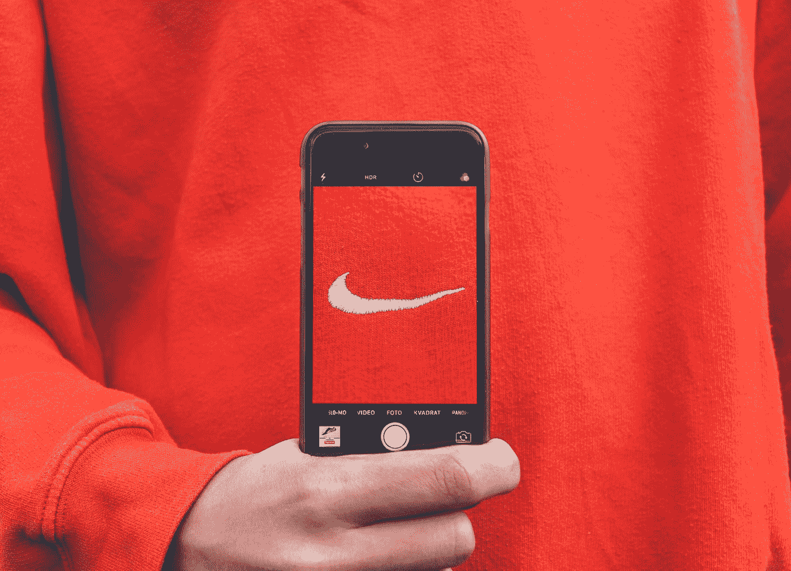

# 品牌整合的关键

> 原文：<https://medium.com/swlh/the-key-to-brand-alignment-fb8da8c7edd6>

## 你的品牌不是你所说的那样，而是顾客对你品牌的评价。

Photo by [Kristian Egelund](https://unsplash.com/@kristianegelund?utm_source=medium&utm_medium=referral) on [Unsplash](https://unsplash.com?utm_source=medium&utm_medium=referral)

你的品牌就是你的声誉。这是人们在背后对你的评价。让你的品牌保持一致就是让你的客户体验符合他们的期望。