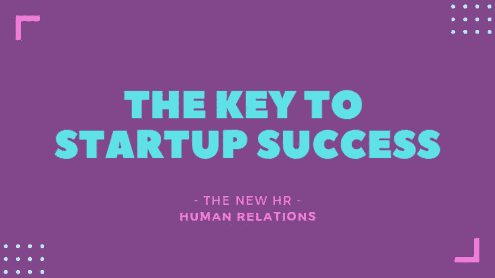

# 创业成功的关键

> 原文：<https://medium.com/swlh/the-key-to-startup-success-d8eecc652442>

放眼望去，到处都涌现出如此多的创新领域。以色列正在成为与人工智能和自动驾驶汽车有关的一切的中心，有许多新的食品初创公司彻底改变了我们的饮食方式。

在游戏的这个阶段，我们应该足够聪明地认识到，改变我们的饮食，或者我们如何从一个地方到另一个地方，不会让我们更快乐。诚然，有了这些新的小吃，我们可能会感觉更健康，人工智能让我们的生活变得更轻松，压力也更小，但我们不要欺骗自己。

事实是，我们将无法享受所有这些创新和人类生活的新福利，除非我们在作为人类的最基本要素——我们如何对待彼此——上做出非常重大的转变。

在过去的几周里，我发现有许多高层业务和人力资源领导在谈论这个核心问题。有些人来自传统商业领域，有些人则站在这场消费习惯大变革的前沿。这些首席执行官和副总裁真的明白—我们需要以一种良好的方式共同前进。这是在我们进入的这个新的全球舞台上创造价值的关键。

> “因此，初创公司本质上是这些非常积极的良好人力资源，人们通常相处得相当好。”

我们需要将所有这些创新作为平稳过渡到下一阶段的平台。

我们需要向自己承认，世界上的一切都在完美地发展，除了一个小细节——人类的贪婪让整个世界失去了平衡。我们可以站在那里指责谁是罪魁祸首，或者我们可以彻底改造我们的社会，让它恢复正常。

创业公司实际上是一个完美的例子，说明如何从零开始，正确地构建它，并与世界分享；并不断扩大规模，为公司、客户和合作伙伴创造更多价值。初创公司在公司员工之间有一个非常明确的共同目标，他们敏锐地意识到需要共同进步才能取得成功。公司里的每个人都非常积极，并参与到这一过程中，因为很明显，他们的共同好运取决于此。

所以创业公司本质上是这些非常积极的人的能量的口袋，在那里人们通常相处得相当好。当然，有些初创公司的所有者无法和睦相处，他们通常最终会将资金返还给投资者。

不幸的是，人类已经发展到了这样一个地步，我们已经失去了做人的最基本原则，并且忘记了我们的可持续发展是如何相互依赖的。我们在社交媒体上有成千上万的朋友，但从未见过住在我们隔壁的人。

所以我们不应该对人们在社会的各个层面都存在相处问题感到惊讶。如果人们没有动力在关系上投资，那么任何关系都无法经受时间的考验。在一个一切都变得如此透明的世界里，很难隐藏这一点。

那么，创业成功的关键是什么呢？人际关系的力量。

在这一点上，我们已经足够成熟，能够意识到什么才是真正让我们快乐的。是的，我们可以让乘坐更加方便和有趣，但如果不不断地向系统中注入一种新的燃料，我们不会走得很远。什么是新燃料，它到底有什么作用？我们的自我越来越多，我们需要用一些产生积极能量的东西来抵消它。我们需要确保我们的环境中始终有稳定的好东西流，并且我们都在同一页上。当团队分布在世界各地的办公室，并且有语言和文化障碍需要克服时，说起来容易做起来难。幸运的是，有一种方法可以做到这一点，我们称之为联系研讨会。

关于研讨会，我能告诉你些什么？这很难描述，因为人们经历了如此强大的人际关系体验。我们真的无法用语言来描述它。

我看到很多初创公司有很多机会以这种方式同步和激励他们的团队，但这些机会没有被用来让每个人更上一层楼。当然，每当一个团队在非工作活动中走到一起，都会有联系和乐趣。但我说的是一种经历，它让我们能够稍稍超越自我，获得一种全新的视角来看待一切！这就像跳上电梯直奔顶楼，然后发现根本没有顶楼。那是因为我们进入了一个超越时空的地方。

我们可以利用个人之间的任何会议，将人类联系提升到一个全新的水平。这是一个非常高的水平，影响着公司的方方面面——增进了员工之间的关系，取得了更好的业务成果，人们真正被点燃了热情，每天都有动力去工作。

许多创业公司和成功的公司都在雇佣非常特殊的人来负责他们的团队，他们正在做很多不可思议的事情。我希望他们会想了解 Connection Workshop，以及在他们的公司中实现它有多容易。如果你想让我向你解释它是如何工作的，请与我联系。这种方法的美妙之处在于与尽可能多的人分享！

你可以通过 josia (@)goodvibeagency.com 联系到我

*请注意:*

我只想澄清一下，我不是人力资源专业人士——我是人际关系专业人士——这是一个即将疯狂起飞的新领域。

希望你喜欢看这篇文章，请在下面留言告诉我你的想法。

*   本文是创业成功系列三篇文章中的第二篇。我这个系列的第一篇文章是关于 [*哪些创业公司会成为*](/swlh/which-startups-will-make-it-f8352fe469d8) *。(*我注意到我 2014 年的帖子 [*哪些企业家会成功，所以选择了这个标题？*](https://www.linkedin.com/pulse/20140608081233-95950-which-entrepreneurs-will-make-it/) 是我有史以来最成功的帖子…)
*   *本系列的第三篇文章将展示你的营销传播如何在这个世界上每个初创公司都必须经历的重要转变中发挥重要作用。*

## 这篇文章发表在 [The Startup](https://medium.com/swlh) 上，这是 Medium 最大的创业刊物，拥有+439，678 名读者。

## 在这里订阅接收[我们的头条新闻](https://growthsupply.com/the-startup-newsletter/)。

