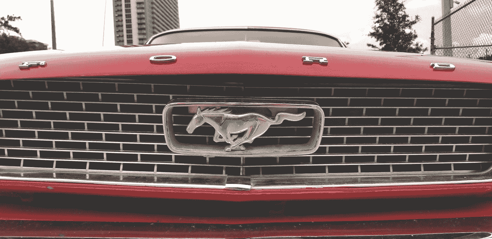

# Logos 的语言

> 原文：<https://medium.com/swlh/the-language-of-logos-c74406cd608>

Photo by [George Pagan III](https://unsplash.com/@gpthree?utm_source=medium&utm_medium=referral) on [Unsplash](https://unsplash.com?utm_source=medium&utm_medium=referral)

## 你的 3 秒电梯推销最好是正确的

徽标是你 3 秒钟的电梯推销。做对了就降低了获取客户的成本；消除销售漏斗中的摩擦。让他们错了…好吧，让我们不要去那里。

创建徽标是为了在视觉上传达品牌的关键属性(不，徽标是*而不是*品牌)。一眨眼的功夫，带着或者…