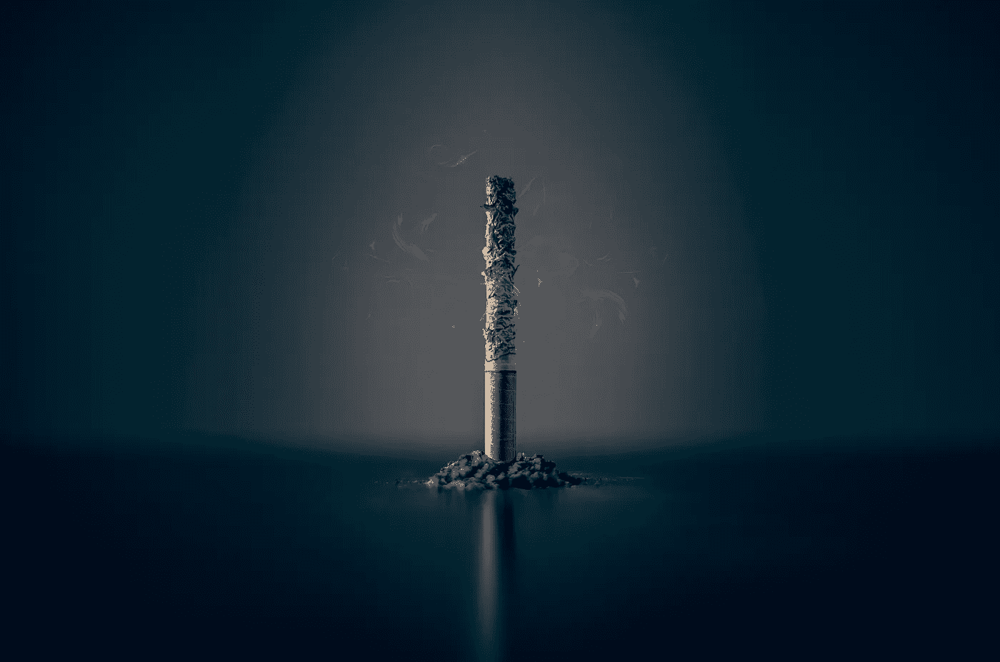

# 最后一口烟

> 原文：<https://medium.com/swlh/the-last-puff-42c59c27efdc>

Photo by [Mathew MacQuarrie](https://unsplash.com/@deskfire?utm_source=unsplash&utm_medium=referral&utm_content=creditCopyText) on [Unsplash](https://unsplash.com/search/photos/smoking?utm_source=unsplash&utm_medium=referral&utm_content=creditCopyText)

我是如何最终戒烟的

从孩提时代起，我就喜欢吸烟者的魅力。一个穿着闪闪发光的衣服，嘴里叼着一根细长香烟的时髦女孩，或者是弗吉尼亚苗条模特，裹着一件长貂皮大衣，标语是*宝贝，你已经走了很长的路*。对我来说，吸烟不仅仅是酷；这是一个坚强、优雅的女人的缩影。