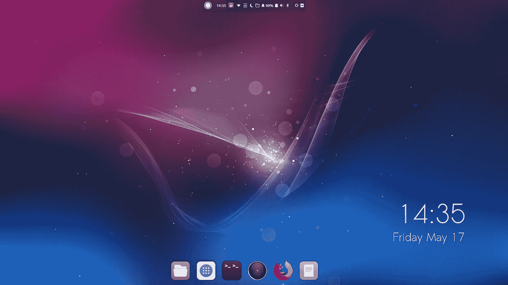

# 外行人对 Linux 的看法

> 原文：<https://medium.com/swlh/the-laymans-case-for-linux-e383730ee369>

雷蒙德·特拉布尔西

Ubuntu Budgie

我在 Windows 生态系统中长大。我们的第一台家庭电脑运行的是 Windows XP。我的第一台笔记本电脑运行的是 Vista，我还有两台运行 Windows 10 的电脑。当谈到可访问性和熟悉性时，毫无疑问是 Windows 的优势。

我明白了。从工作场所转移到家里玩，有相同的界面，这让人感到安心。这是…