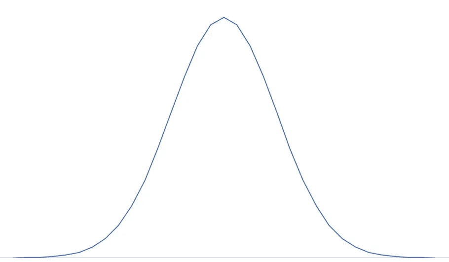

# 科学的左翼和右翼

> 原文：<https://medium.com/swlh/the-left-and-right-of-science-90670c8ff8e0>

The Left and Right Wing of Science

当我和人们谈论科学时，他们经常认为我在政治上是左派或右派。当我想知道大气中二氧化碳的各种来源时，他们认为我是对的。我不是；这只是科学。当我告诉他们上瘾是一种大脑疾病，需要治疗而不是惩罚时，他们认为我是左派。我不是；这只是科学。

在科学上，左和右的含义不同于它们在政治上的含义。没有意识形态的暗示，没有能力预测你会怎么想。在科学中，左和右不是指思想。左和右是分布的尾部。

一切都存在于分布中。如果你测量你认识的每一个人，并把他们的身高画在一张图上，你会发现一个近似“正态曲线”的身高分布。这就是我们很多人都熟悉的钟形曲线。在这样的曲线中，左翼是比“正常人”小的人，右翼是比正常人高的人。但是因为这些曲线向外变得越来越紧，因为科学没有提出双翼建筑中的左和右，这些被称为分布的尾巴，而不是翅膀。

分布有很多种。正常不是唯一的。这是卡方分布。这是泊松分布。有指数分布。你明白了。但不管分布如何，左和右在科学上都有意义。它们是分布的极端。

作为一个国家，我们的政治越来越极端。皮尤研究中心做了一篇很好的文章，展示了认同保守主义和自由主义的分布是如何随着政党关系的变化而变化的。美国过去看起来像是一个意识形态单一分布的国家。这开始看起来像是两个不同分布的国家。

关于极端的事情是他们很少在科学上持续很久。如果化学反应进行得太快，它会很快结束——有时会发生爆炸。如果兔子以极快的速度繁殖，它们就会超过食物供给，数量就会减少。如果狼吃掉所有的兔子，它们就会挨饿，它们的数量就会减少。大自然保持事物平衡发展。当钟摆摆向一边或另一边时，事情往往不会持续很久。科学告诉我们，极端代价太大。它们需要太多的能量才能跟上。

不管我们是右派还是左派，我们仍然是美国人。当我们试图比我们的邻居更右或比我们的同事更左时，我们必须发挥作为美国人不再能发挥的能量。我们开始失去美国身份，获得左派或右派的身份。因为这样的事情在正常的环境下很难维持，所以我们必须改变我们的环境，使这种新的平衡不那么昂贵。为此，我们只和与我们意见一致的人交往。因此，在皮尤的文章中可以看到曲线的变化。

与世界上任何国家相比，美国拥有最好的粮食产量，最易防守的边界，以及最好的内陆通讯和导航系统。世界上唯一能搞垮美利坚合众国的力量是美国人。我们最近似乎在尽最大努力。

********************

Wetsman 博士已经从成瘾精神病学领域退休，目前正在研究数据科学。他已经发布了他的系列[结束瘾](https://www.youtube.com/watch?v=K4jkgpvQwN4)。他还准备了其他东西——更多。他写的都不是金融建议。不要做他建议的任何事情；看看其他来源，自己拿主意。