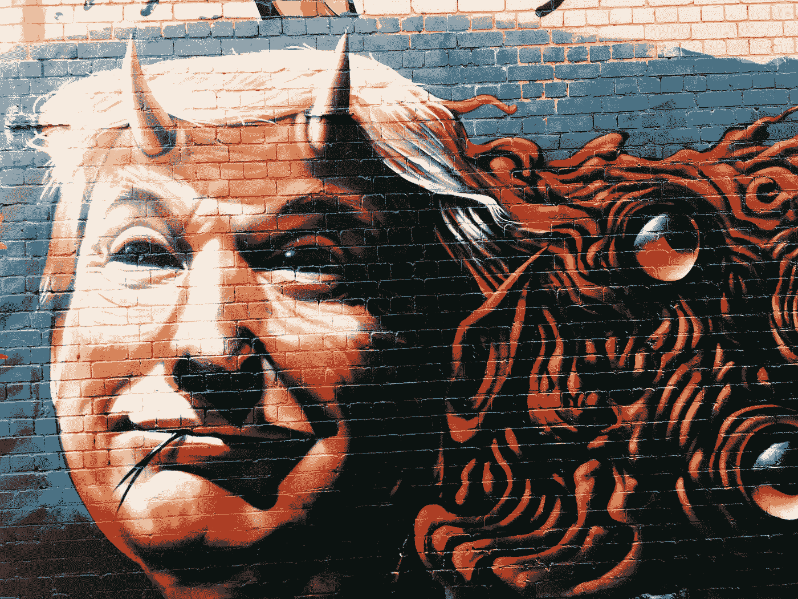

# 阿拉巴马州塞尔玛的教训，是民主党需要学习的

> 原文：<https://medium.com/swlh/the-lesson-of-selma-alabama-that-the-democratic-party-needs-to-learn-eeb3810a6eda>

暗示佩洛西议长是种族主义者，民主党人能指望得到什么好处？

Photo by [Jon Tyson](https://unsplash.com/@jontyson?utm_source=medium&utm_medium=referral) on [Unsplash](https://unsplash.com?utm_source=medium&utm_medium=referral)

20 世纪 80 年代末，当我还是一名年轻的大学生时，我记得去阿拉巴马州塞尔玛的一个兄弟会成员家拜访他。他的家庭是典型的“老南方”白人家庭。他们是这个社区非常富有的支柱。的…