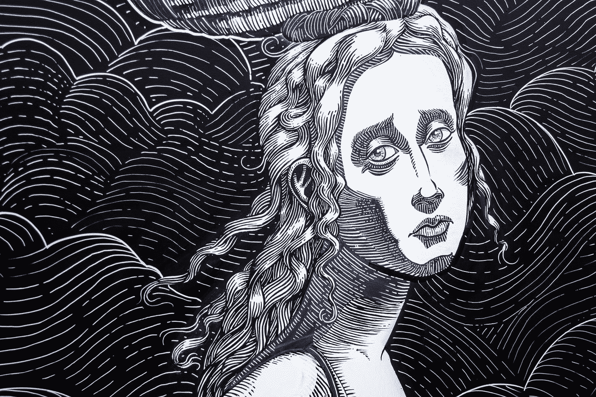

# 我们告诉自己的谎言是我们痛苦的最大来源。

> 原文：<https://medium.com/swlh/the-lies-we-tell-ourselves-are-our-greatest-source-of-suffering-85c0f283c3da>

Photo by [Diogo Nunes](https://unsplash.com/@dialex?utm_source=medium&utm_medium=referral) on [Unsplash](https://unsplash.com?utm_source=medium&utm_medium=referral)

即将走上舞台中央的人不需要介绍。

每个读到这篇文章的人都对他了如指掌。他的资格来自多年来辛苦获得的经验。当他说话时，我们跪下表示忠诚。以下是他最喜欢的几行—