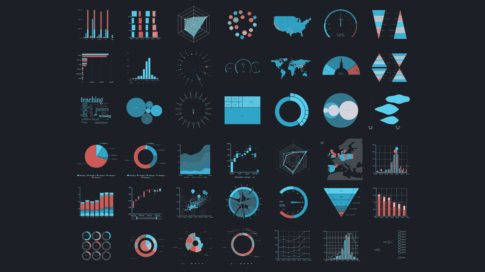
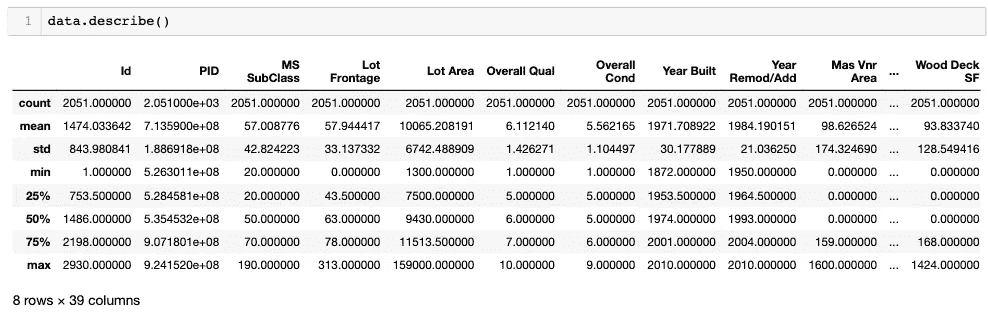
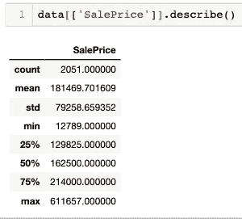

# 整理数据改变生活的魔力

> 原文：<https://medium.com/swlh/the-life-changing-magic-of-tidying-up-data-28f72654a588>

作为一名数据科学家，我注意到人们往往很容易对所有通过数据表达故事的迷人机会产生热情。即使我们抛开建模的选项，可能的视觉解释(多色散点图，简单但信息量极大的箱线图，完美的阴影重叠直方图，精心微调的热图，等等。)都是。



source: Google images

尽管如此，无缝的代码和真正有效的可视化通常是在最初的分析和建模过程开始之前在幕后大量辛勤工作的产物。它让我想起了许多每隔几年就会出现的家居清洁方法和装饰技术，比如风水艺术*、*极简主义、松本寿圭的“整洁的房子，整洁的头脑”观，以及最近由玛丽·近藤的*改变生活的整理魔法*而闻名的 KonMari 方法(该方法甚至已被推出其自己的[网飞系列](https://www.netflix.com/title/80209379))。就像当你走进一个华丽的家，立即感受到一种和平与平静的感觉，这很可能是精心规划和深思熟虑的选择的最终结果，这些选择是关于保留什么和在哪里放置东西。

作为数据科学家，我们必须尊重我们的财产，理解怀旧不是我们的朋友，并对数据集的重新发现持开放态度。

## 空值

第一步是决定如何处理空值——不管是什么原因(数据输入错误、用户误解、研究团队没有时间等等)。)，这些单元格是空白的，因此在后面的评估和建模步骤中对我们没有帮助。想想那些不成对的袜子，那些有洞的你永远也不会缝回去的东西，或者那件到处都找不到的超级舒适的毛衣。

为了解释下面的代码示例，我们将使用“数据”来表示我们的数据集。首先，我们可以获取整个数据集中存在的空值的总数:

```
data.isnull().sum()
```

如果这个数不是 0，我们想知道它们是从哪里来的。然后，我们可以使用下面的代码返回一个列表，该列表仅包含包含空值的列的名称，以及与每个列相关的特定数字。从那里，我们可以开始注意任何趋势，并查明是否有特定的列具有不成比例数量的空值。

```
data.isnull().sum()[data.isnull().sum()!= 0]
```

检查完每一列后，我们可以选择删除具有空值的一列或多行(下面将详细介绍)，或者简单地用特定的填充值填充这些单元格，如下所示。最后一行中作为**' _ _ _ _ _ _ _ '【T1]留下的空间是我们填写实际数字 0、新字符串(如“Unknown”或“N/A ”)或我们认为合适的任何其他值的地方。我们可以在没有 **inplace=True，**的情况下先测试一下，但是一旦我们包含了这个，它就会对数据集做出永久的改变。**

```
data_replace = data_original[['column_name_2', 
                   'column_name_4', 
                   'column_name_7', 
                   'column_name_11', 
                   'column_name_etc']]
for column in data_replace:
    data[column].fillna('____', inplace=True)
```

我们还可以对不同的列运行额外的循环，并根据需要多次替换为其他值:

```
data_replace_string = data_original[['column_name_22', 
                   'column_name_27', 
                   'column_name_etc']]
for column in data_replace_string:
    data[column].fillna('not null anymore!!', inplace=True)
```

这是一个好主意，在每次替换后，再次运行下面的代码，以确保更改正在实施…另外，当数字最终为 0 时，这是超级令人满意的！

```
data.isnull().sum()
```

## 观察/转换数据类型

清理主目录或数据集时，还需要考虑其他因素。例如，我们不希望衣服折叠起来放在抽屉里，在那里它们会变皱，试着把袜子放在衣架上对我们没有太大好处。把东西放在同一区域也是一个很好的经验法则，比如睡衣放在一个区域，职业装放在另一个区域。数据是相似的，因为如果每一列的所有值都是相同的类型，那么在我们的函数中，数据会更加紧密。这可能很棘手，因为有时看起来所有的值都是整数，但实际上它是作为字符串存储的。有时我们可以不去管它，它永远不会引起问题…直到我们的代码中的第 72 行，我们得到一个错误，一个函数不能在一个字符串上执行，因为它应该是一个整数，让我们一路回到数据清理过程(就像在滑道和梯子中撞到一个滑块，让你一路回到开始)。

在 Pandas 中，下面的代码可以用来显示每一列的数据类型:

```
data.dtypes
```

熊猫数据类型有:

*   浮点型(带小数点的数字)
*   整数(整数)
*   日期时间(日期和时间)
*   对象(字符串)

注意:如果同一列中有不同类型的组合，则该列的 dtype 将显示为“object”要将列的所有值转换为特定的数据类型(例如，从，我们可以使用以下方法:

```
data['column_name'].astype('str')
```

最后，我们可以使用一个简单的工具来检查我们为纠正空值和数据类型所做的所有努力:

```
data.info()
```

这将再次生成数据集的每一列的列表，并显示 null 值的总数及其数据类型。

## 极端值

查看数据中的异常值也很重要，它们并不总是表明有错误，但应该正确分析并加以考虑，因为它们会影响我们用来进行预测的平均值和其他计算值。这可以比作一件你知道不经常穿的漂亮衣服，但它仍然是你衣柜里的一件有效的衣服，你有意决定保留它。另一方面，也有可能是 7 条你从未见过的围巾，你甚至无法解释它们是如何出现在那里的……也许这要感谢你的姐姐几年前来过，但我们永远不会真正知道。

识别异常值的一个好方法是使用**。**描述()工具如下所示。这将返回整个数据集，并显示每一列的计数、平均值、最小/最大值和标准偏差值。这是一种很有帮助的方法来识别那些不应该是负数的价值(价格、年龄、面积、浴室数量等等。)和其他明显不正确的问题(如某人的年龄为 200+，某人的出生日期为未来日期，当调查问题旨在排名为 1-5 时输入“7”等)。

```
data.describe()
```



我们还可以使用以下代码提取并观察各个列的 describe()值:

```
data[['column_name']].describe()
```



## 删除列和行

在调查了空值和异常值的来源和原因后，数据科学家经常面临这样的决定:简单地从分析中完全排除某些数据，因为这可能会造成弊大于利或分散注意力。对一些人来说，这是一个困难的部分，会引起一些焦虑——什么时候该放手。这就像那条你几乎十年都没戴过的围巾，但你把它放在身边“以防万一”，但实际上它塞满了你的衣柜，甚至引起了情绪反应，因为它是你前任送的礼物，你确信如果他知道你扔掉了它，他会很受伤……但你内心深处知道最好继续前进，只关注你经常穿的衣服。有很多种删除列和行的技术；以下是一些最常见的:

要删除至少还有一个空值的任何行，请执行以下操作:

```
data.dropna()
```

要删除至少还有一个空值的列，请执行以下操作:

```
data.dropna(axis = 'columns')
```

要删除特定列:

```
data.drop(['column_a', 'column_b'], axis=1)OR data.drop(columns = ['column_a', 'column_b'])
```

要删除特定的行，我们可以使用它的索引号:

```
data.drop([2])OR multiple:data.drop([7, 11, 14])
```

## 保存新数据帧

这是有趣的部分——您可以保存全新的闪亮数据集，并完全重命名它，这样您到目前为止的所有努力都不会被撤消。它就像一个新的梳妆台或箱子或架子(或者只是架子上的一个盒子！)它有自己的指定用途……具有气密密封，可以有效阻止额外的杂物进入。

```
clean_data = pd.DataFrame(data)
```

一个额外的步骤是将该数据帧保存为一个全新的 csv 文件本身，可以导入到未来的笔记本或项目中。 **index=False** 用于避免使用数据集的索引值创建“未命名”列，因为新的 csv 已经有了索引。

```
sparkly_new.to_csv('../sparkly_new.csv', index=False)
```


source: Google images

一些 KonMari 例外…

我想说，我们可以继续前进，跳过沉默片刻来介绍数据集的步骤，并对 Jupyter 笔记本表示感谢，感谢它允许我们在读取文件或其他数据之前运行代码。也可能没有必要(更不用说糟糕的时间管理技能的例子)在拥抱我们的笔记本电脑并感受每一台笔记本电脑是否给我们带来快乐的同时，单独查看每一列和每一行，以确定我们是否要扔掉它(当然是在感谢它对我们生活的贡献之后)。然而，对于以全新的心态和干净的石板来对待每一个新的数据科学项目，还是有话要说的。并非所有数据集都是平等创建的——有些只需要一点点小心，而有些则有顽固而难以触及的污点，你必须不停地挖掘和擦洗，直到你的大脑快要爆炸。这可能是一个令人疲惫的过程，但最终是值得的，因为这将对你的整体工作质量产生积极的影响。正如松本所说，

> “如果你认为打扫卫生是一件苦差事，是可以避免的事情，那么在你看来，这是一件对你不好的事情。但是如果你能把对清洁的认知从消极的转变为积极的，那么你的生活质量就会提高。”
> ——*松本寿圭，*一个修道士的清洁房子和心灵的指南

整理我们的数据是数据科学过程中不可避免的关键步骤，我们越是学会接受，或者我敢说，甚至享受拼图的这一部分，我们的耐心和项目质量就会提高。也许我们可以实施一个新的例行程序，在整个数据清理过程中间歇地重复咒语“…整洁的数据集，整洁的头脑…”，同时燃烧一些鼠尾草，啜饮热茶。好消息是(和其他事情一样),你得到的练习越多，你对采用哪种方法和保留哪些特性的直觉就越准。更重要的是，您的勇气和决心将会带来回报，让您的代码和可视化显示中出现更少的错误，使您能够找到联系并解决现实世界的问题…这就是真正激发数据科学家纯粹的**快乐**的魔力！