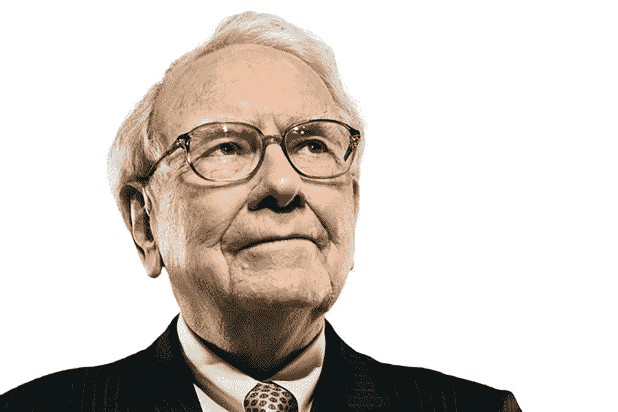
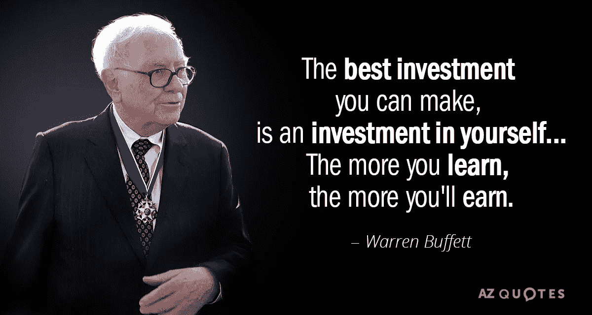
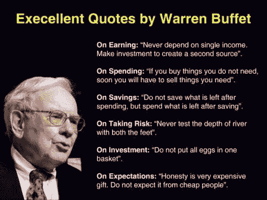

# 沃伦·巴菲特的一生:他如何成为世界第三大富豪

> 原文：<https://medium.com/swlh/the-life-of-warren-buffet-how-he-became-the-3rd-richest-man-in-the-world-446c9499e246>

毫无疑问。沃伦·巴菲特是这个星球上最聪明的商人之一。他的身价约为 870 亿美元，这使他成为仅次于杰夫·贝索斯和比尔盖茨的世界第三富豪，那么他是如何成为今天的他，又是如何变得如此富有的呢？

沃伦·巴菲特实际上在很小的时候就把目光投向了股市，早在 11 岁的时候，当时他所有的同学和同龄人都在公园里忙着玩耍或学习骑自行车。他 11 岁开始在父亲的经纪公司工作，并接手其他一些小工作，比如帮助打理家族生意；他整天观察投资者在做什么，听他们说什么。到他 15 岁时，他已经拥有 6000 美元的净资产，相当于今天的 53000 美元。

尽管他在很小的时候就取得了成功，但他想上大学，所以他去了宾夕法尼亚大学攻读学士学位，在被哈佛商学院拒绝后，他后来继续在哥伦比亚商学院学习。他是本杰明·格拉哈姆的学生，通过格雷厄姆的证券分析课，巴菲特学到了价值投资的基本原理。

今天的沃伦·巴菲特，所有股票经纪人都钦佩的人，几乎选择了他职业生涯中的另一条道路，一开始他想在华尔街工作，就在那时，他的导师格雷厄姆说服他做出另一个职业选择。回到奥马哈后，巴菲特成了一名股票经纪人，并创建了几个投资合伙企业。合伙企业的规模大幅增长，到他 31 岁时，他已经是百万富翁了。在那之后，1961 年，巴菲特的目光转向了商业投资，当时他通过投资一家风车制造公司赚了 100 万美元，到 1965 年，他通过购买一家纺织公司的股份控制了这家公司，今天这家公司就是著名的伯克希尔哈撒韦公司。如今，伯克希尔·哈撒韦公司通过铁路运输货物、投资分红、公司出售电力、钻石、房地产、刀具、百科全书、工具、冰淇淋、电池……等等来获取收入。

沃伦·巴菲特认为，他在股票市场和整个资本主义中取得成功的原因是耐心、灵活，不要让机会从你的手中溜走，因为机会只有一次，他的原话是，“从长期来看，股票市场将会更高，我已经写了很多次，”巴菲特说。“就明年或明天会发生什么而言，我不知道。我们在选举前一天买卖的股票和我们在选举后一天买卖的股票是一样的。”展望 2010 年，根据彭博亿万富翁指数和福布斯的另一份报告，巴菲特在 2016 年的财富增加了约 120 亿美元，使他成为美国富人中最大的赢家。

然而，他不像一般的商人或“1%”的人，他们只关心他们的利润，巴菲特被认为是这个星球上最慷慨的人之一。虽然巴菲特直到与第一任妻子结婚后才开始捐款，但他现在被认为是世界上最慷慨的慈善家之一，在过去十年中，他向慈善事业捐赠了超过 270 亿美元。如上所述，毫无疑问，沃伦巴菲特是一个天才，走在我们这些肮脏的世界里的农民中间，我们配不上一个像他那样聪明和慷慨的人。

"股票市场是一种把钱从没有耐心的人身上转移到有耐心的人身上的工具."—沃伦·巴菲特

*如果你想了解更多，请访问 BIDITEX 页面并提出你的问题，关注我们的* [*推特*](https://twitter.com/biditex_com) *，* [*脸书*](https://www.facebook.com/biditex/) *，* [*中型*](/@biditex) *，* [*电报*](https://t.me/biditex%20%28edited%29) *，*[*LinkedIn*](https://www.linkedin.com/company/biditex)*。投标变更用* [*投标变更用*](/@biditex/biditex.com) *。*

## 这篇文章发表在 [The Startup](https://medium.com/swlh) 上，这是 Medium 最大的创业刊物，拥有+414，678 名读者。

## 在这里订阅接收[我们的头条新闻](http://growthsupply.com/the-startup-newsletter/)。

