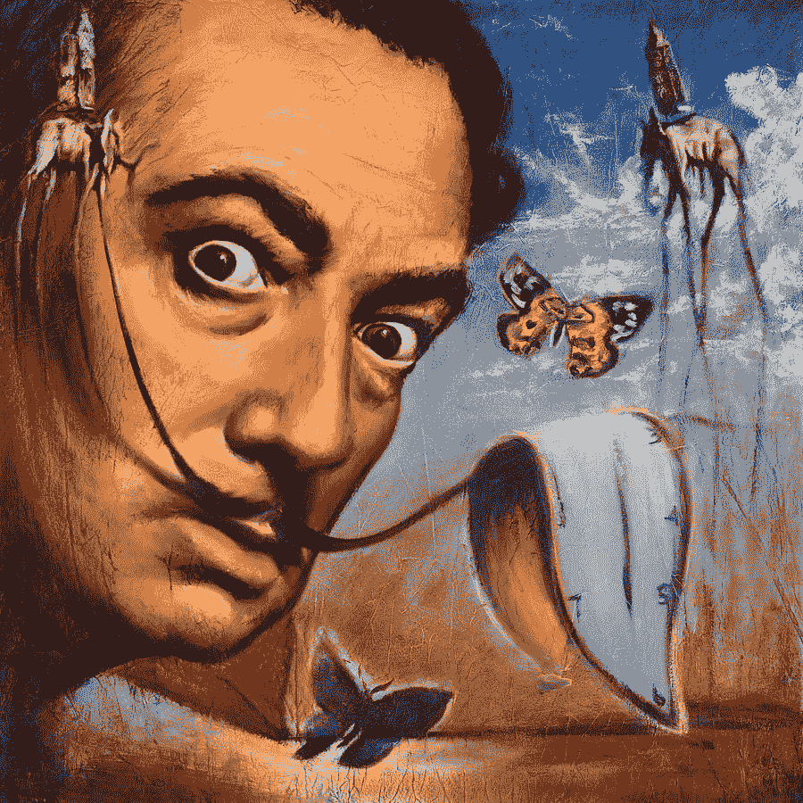

# 创造力和疯狂之间的联系

> 原文：<https://medium.com/swlh/the-link-between-creativity-and-madness-539b58ea3f9b>

## 神话还是真相？

Copyright Travis Knight

> “创造力不是害怕与众不同。欣然接受一个没有人相信的想法需要疯狂”——芭芭拉·雅努斯基维卡
> 
> “对诗人来说，疯狂似乎比死亡更接近神性”——阿奈斯·宁