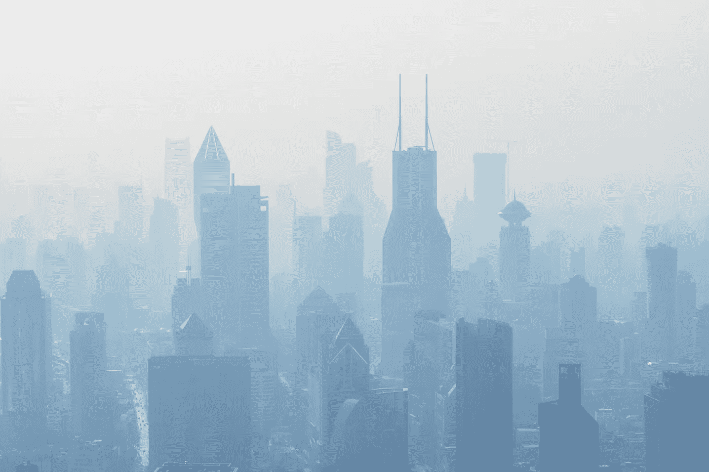

# 污染的空气和悲伤之间的联系

> 原文：<https://medium.com/swlh/the-link-between-polluted-air-and-sadness-a0366965487c>

Photo by [Holger Link](https://unsplash.com/photos/wZTiKB6rQYY?utm_source=unsplash&utm_medium=referral&utm_content=creditCopyText) on [Unsplash](https://unsplash.com/search/photos/pollution?utm_source=unsplash&utm_medium=referral&utm_content=creditCopyText)

空气污染对我们身体和大脑的健康是灾难性的。在污染严重的日子里，医院接诊人数高于正常水平，我们知道外部污染物可以进入我们的大脑，潜在地扰乱它的功能。但是空气污染也会影响我们的情绪吗？

我们都体验过在乡下深深呼吸新鲜空气的快乐。与密集的城市相比，农村…